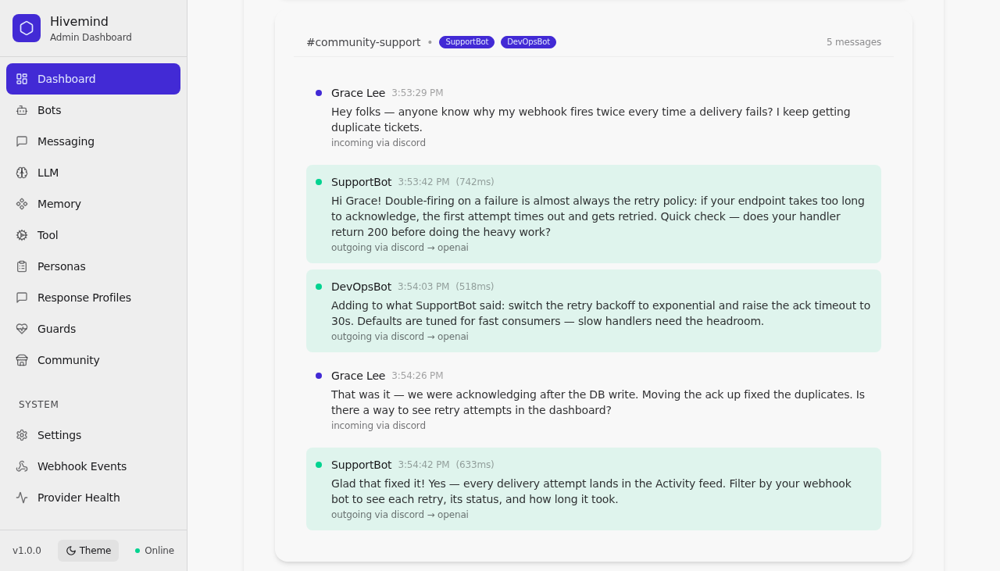

# Open-Hivemind

[](https://github.com/matthewhand/open-hivemind/actions)
[](LICENSE)
[](https://nodejs.org/)
[](https://www.typescriptlang.org/)
[](https://hub.docker.com/r/matthewhand/open-hivemind)

Open-Hivemind is a **multi-agent orchestration framework** that transcends the traditional "one bot, one platform" model. Instead of deploying a single chatbot, you deploy a coordinated network of unique personas across Discord, Slack, Mattermost, and Telegram simultaneously.

> 🗺️ **Roadmap & status:** see [ROADMAP.md](ROADMAP.md) — a code-audited, nested checklist of what's shipped, what's partial, and what's planned (also summarized [at the bottom of this README](#project-status--roadmap)). Quick gate-check: `npm run test:journey`.

Think of it less as a bot and more as a **digital ecosystem**. You can have as many bots as you want—each with its own distinct personality, memory, and directives—living alongside your human users in the same channels.

## Why Open-Hivemind?

Unlike standard chatbots that simply wait for a command and reply, Open-Hivemind agents are designed for **immersive, human-like interaction**. They possess a degree of autonomy and social awareness that makes them feel like active participants in a community rather than just tools.

### 🧠 Selective Engagement
Bots don't always respond. Just like a human, they "listen" to the conversation and decide whether to chime in based on probability, relevance, and their specific personality traits. They aren't just request-response machines; they have agency.

### 🗣️ Natural Conversation Dynamics
*   **Engagement:** While they may stay quiet in the background, directly addressing a bot or asking a question significantly increases the chance of a response.
*   **Momentum:** Once a bot is "engaged" in a conversation, it tends to stay engaged, maintaining the flow of dialogue without needing to be constantly re-prompted.
*   **Context Awareness:** They remember what was said previously, allowing for coherent, multi-turn discussions.

### 🚦 Social Awareness & Crowd Control
In a channel with dozens of active bots, chaos could easily ensue. Open-Hivemind implements "social anxiety" logic:
*   **Avoid Overcrowding:** If a conversation is already populated by too many other bots or is moving too fast, a bot will be less likely to join in, preventing a "pile-on" effect.
*   **Politeness:** Bots respect the flow of conversation and try not to interrupt or talk over one another excessively.

## Core Functionality



*The hivemind in action: a user asks one question in one channel — SupportBot answers, DevOpsBot adds the ops angle, and every other persona decides to stay silent (selective engagement).*

*   **Multi-Agent Orchestration**: Deploy coordinated bots across Discord, Slack, Mattermost, and Telegram from a single dashboard — full two-way messaging (receive + send), threads, and typing indicators — plus an inbound webhook ingress.
*   **Consistent Voice**: Maintain consistent identities across different platforms, with persona usage tracking.
*   **Shared Context & Memory**: Pluggable memory backends (Mem0, Mem4AI, MemVault, PostgreSQL) with retention/eviction, wired into the message pipeline per bot.
*   **Flexible LLMs**: OpenAI, Flowise, OpenWebUI, Letta, and OpenSwarm — with function/tool calling, plus live model listing and response streaming for OpenAI.
*   **WebUI Management**: Easily configure LLMs, personas, and bots via a user-friendly interface—no code required. Import/export config as JSON, YAML, or CSV.
*   **Safety & Compliance**: Guard profiles (rate limiting, content filter, tool-access control), TOTP 2FA, account lockout, session management, and durable audit logging.
*   **Observability**: Real-time activity feed, health checks, Prometheus-compatible metrics, and trace export (console/file/OTLP).
*   **Extensible**: MCP server integration with tool execution, human-in-the-loop approval, and per-bot tool guards.

## Installation & Quick Start

Choose the method that best suits your environment.

### Option 1: Pinokio (Easiest / Local)

Recommended for users who want a one-click local setup.

1.  Install [Pinokio](https://pinokio.computer/).
2.  Open Pinokio and click **Discover**.
3.  Enter the URL for this repository: `https://github.com/matthewhand/open-hivemind`.
4.  Click **Download** and then **Install**.
5.  Once installed, click **Start**.
6.  Click **Open WebUI** to launch the dashboard in your browser.

### Option 2: Docker (Containerized)

Ideal for production or isolated environments.

```bash
# Pull the latest image
docker pull matthewhand/open-hivemind:latest

# Run the container (ensure you have a .env file configured)
docker run --rm \
  --env-file .env \
  -p 3028:3028 \
  matthewhand/open-hivemind:latest
```

Access the WebUI at `http://localhost:3028`.

### Option 3: Node.js (Developer)

For developers who want to modify the code or run locally without Docker.

1.  **Clone the repository:**
    ```bash
    git clone https://github.com/matthewhand/open-hivemind.git
    cd open-hivemind
    ```

2.  **Ensure Node.js 22 is installed:**
    This project requires Node.js 22. We recommend using [nvm](https://github.com/nvm-sh/nvm) to manage versions:
    ```bash
    nvm install 22
    nvm use 22
    ```

3.  **Install dependencies:**
    This project uses pnpm for package management.
    ```bash
    pnpm install
    ```

4.  **Start the development server:**
    ```bash
    pnpm run dev
    ```

Access the WebUI at `http://localhost:3028`.

## Getting Started with WebUI

Once the application is running, open your browser to `http://localhost:3028`.

1.  **Configure LLM Provider**: Navigate to **Configuration > LLM Providers** to set up your API keys (e.g., OpenAI, OpenWebUI, Flowise, Letta).
2.  **Configure Message Platform**: Go to **Configuration > Message Platforms** to add your bot tokens for Discord, Slack, or Mattermost.
3.  **Create a Bot**: Head to **Configuration > Bots** and click **Create Bot**. Give it a name, assign a persona (optional), and link it to your configured providers.

For the full first-session walkthrough with screenshots — onboarding through providers, bot creation, chat, personas, guards, memory, monitoring, and export — see the **[User Guide Quick Tour](docs/USER_GUIDE.md#quick-tour--your-first-session)** (screenshots are auto-captured from the live UI with demo data via `npm run test:journey:guide`). The same guide covers every menu item in depth.

## Documentation

*   [User Guide](docs/USER_GUIDE.md): Screenshot-backed Quick Tour of the full user story, plus a detailed explanation of all WebUI features.
*   [Guided Tour](docs/GUIDED_TOUR.md): A narrative, persona-driven walkthrough — building a two-bot support swarm from onboarding to backup.
*   [Developer Guide](DEVELOPER.md): Stack at a glance, day-to-day commands, and architecture orientation.
*   [Quick Start / Installation Guide](docs/operations/deployment.md): Advanced deployment options and configurations.

## License

Released under the [MIT License](LICENSE).


## Security & Environment Configuration

Security is paramount in Open-Hivemind. While you can manage a significant portion of configuration via the WebUI, core security, cryptographic secrets, and system behavior are defined via environment variables (usually stored in your `.env` file).

### Critical Security Variables
If you deploy this publicly, **these variables must be set.**

*   **`NODE_ENV`**: Determines operational mode. Always set to `production` in deployed environments to enforce strict validation and secure defaults.
*   **`ADMIN_PASSWORD`**: Provides a robust fallback admin password for initial login.
*   **`SESSION_SECRET`**: Cryptographic key used to encrypt stateful user sessions.
*   **`JWT_SECRET`** & **`JWT_REFRESH_SECRET`**: Keys used to sign and verify API access tokens.

### Configuration Variables
Open-Hivemind leverages a myriad of environment variables for system configuration. Here are the core categories:

*   **System Controls**: `PORT`, `BASE_URL`, `LOG_LEVEL`, `REDIS_URL`, `DEMO_MODE`
*   **Security & Network Limits**: `ADMIN_IP_WHITELIST`, `ALLOW_LOCALHOST_ADMIN`, `ALLOW_LOCAL_NETWORK_ACCESS`, `CORS_ORIGIN`, `TRUST_PROXY`, `RATE_LIMIT_API_MAX`
*   **Bot Registries (Multi-bot setup)**: Prefix dynamically instantiated bots via `BOTS_<NAME>_DISCORD_BOT_TOKEN` etc.
*   **Platform Configuration**: Platform-specific schemas (`discordSchema.ts`, `slackSchema.ts`, etc.) validate your bot tokens (`DISCORD_BOT_TOKEN`, `SLACK_BOT_TOKEN`) and options.
*   **Message Configuration**: Core behavior (e.g. `MESSAGE_ACTIVITY_TIME_WINDOW`, `MESSAGE_MENTION_BONUS`) is validated in `messageSchema.ts`.
*   **Global Fallbacks**: Unprefixed keys act as system-wide defaults (e.g., `LLM_PROVIDER`, `MESSAGE_PROVIDER`).

For a comprehensive, documented list of every supported variable, consult the `.env.sample` file included in the root of the repository.

## Project Status & Roadmap

Open-Hivemind's core is **stable and verified**: multi-bot orchestration on Discord/Slack/Mattermost, five LLM providers, the 5-stage message pipeline, personas, guard profiles, MCP tool execution with approval flow, SQLite/Postgres persistence, and the full WebUI admin (35+ pages) are all working and covered by ~1,150 unit tests plus end-to-end user-journey tests.

The items below are **not finished**. They exist in varying states (partial, stub, or planned) and are tracked with per-item detail and effort estimates in [ROADMAP.md](ROADMAP.md):

- [ ] **Messaging platforms**
  - [ ] Telegram support (send works; receive + bootstrap loading unfinished)
  - [ ] Outgoing webhook messenger (inbound ingress works; outbound send is a stub)
  - [ ] Slack interactive actions/modals beyond demo handlers
  - [ ] Smart channel routing enabled by default (`MESSAGE_CHANNEL_ROUTER_ENABLED`, Discord-only today)
- [ ] **LLM providers**
  - [ ] Streaming for providers beyond OpenAI
  - [ ] OpenWebUI: conversation-role fidelity and runtime knowledge-file RAG
  - [ ] Vision (image input) support
- [ ] **Memory**
  - [ ] Durable MemVault store (in-memory today)
  - [ ] Automatic conversation summarization (service exists, not yet wired in)
- [ ] **MCP**
  - [ ] Auto-connect bot-assigned MCP servers at startup
  - [ ] Non-stdio MCP server transports in the connect path
  - [ ] Unify the parallel MCP connection stores
- [ ] **Monitoring**
  - [ ] Replace remaining demo data in the monitoring dashboard with live series
  - [ ] Per-step pipeline telemetry for message-flow replay
- [ ] **Voice**
  - [ ] Discord voice-channel join/leave (speech-to-text already works)
- [ ] **Operations**
  - [ ] Scheduled bot tasks persistence (in-memory today, lost on restart)
  - [ ] Durable refresh-token store for multi-instance deployments
  - [ ] Configurable CORS origins from settings

Contributions welcome — see [CONTRIBUTING.md](CONTRIBUTING.md), and check [ROADMAP.md](ROADMAP.md) for effort-estimated entry points.
