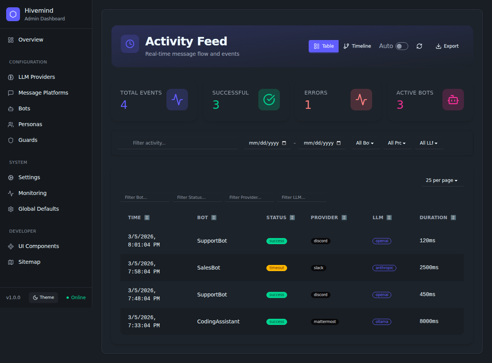
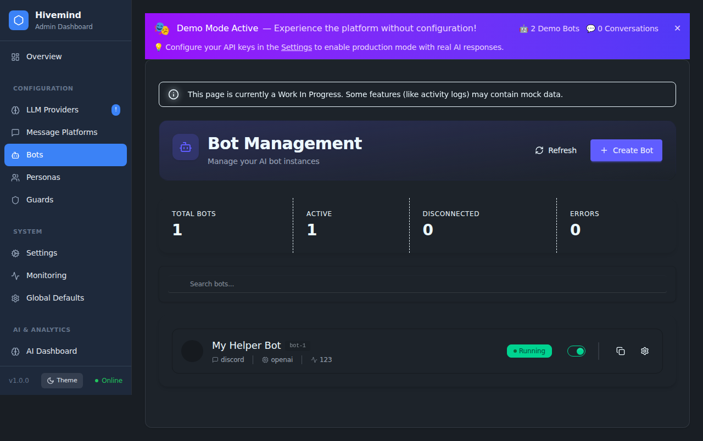
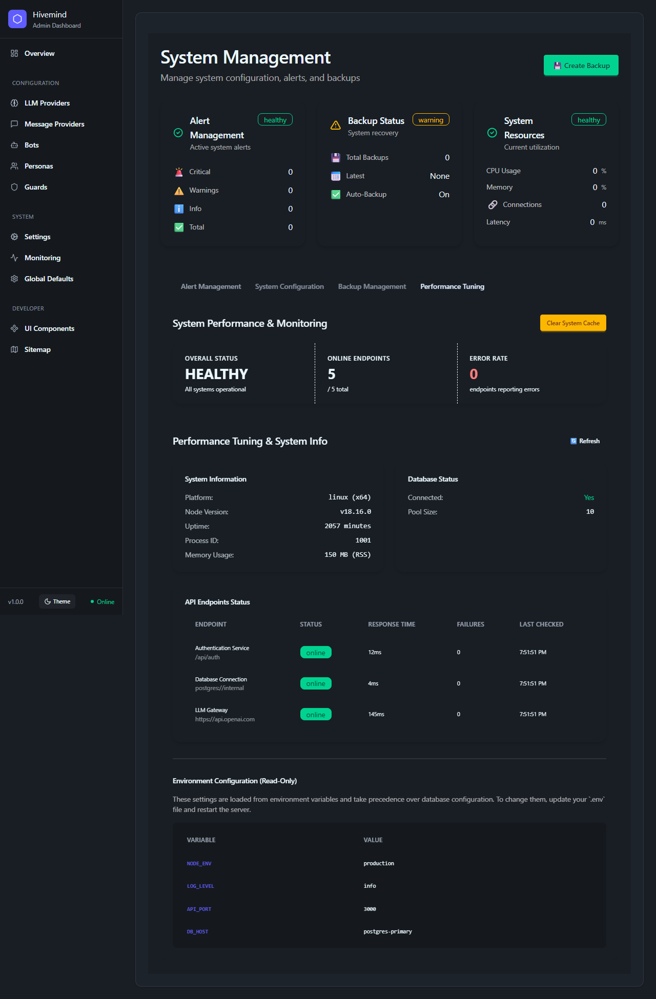

# User Guide

This guide provides a detailed walkthrough of the Open-Hivemind WebUI, organized by the menu structure you see in the application.

## Overview

### [Dashboard / Overview](/admin/overview)
The central hub for monitoring your bot ecosystem.
*   **Bot Status**: View real-time status of all running bots (Online, Offline, Error).
*   **Recent Activity**: See a feed of recent interactions and events.
*   **System Health**: Quick glance at CPU, memory, and uptime.

### [Activity Feed](/admin/activity)
A comprehensive view of all message processing events and system actions.

*   **Real-time Filters**: Filter events by specific Bot, Message Platform, or LLM Provider.
*   **Timeline View**: Switch between a detailed table and a visual timeline of events.
*   **Export Data**: Download the current activity log as a CSV file for external analysis.
*   **Performance Metrics**: View processing duration for each message interaction.

## Configuration

### [LLM Providers](/admin/providers/llm)
Manage connections to Large Language Model providers.
*   **Add Profile**: Configure reusable connection templates for services like OpenAI, Anthropic, Google Gemini, or local models (via Ollama/vLLM).
*   **System Default**: Define the fallback provider for bots without a specific profile.
*   **WebUI Intelligence**: Select a provider to power internal AI features.

### [Message Platforms](/admin/providers/message)
Connect your bots to messaging services.
*   **Discord**: Add your Discord Bot Token and configure server settings.
*   **Slack**: Set up your Slack App Token and Bot Token.
*   **Mattermost**: Configure your Mattermost URL and Bot Token.
*   **Status**: Check connection health for each platform.

### [Bots](/admin/bots)
Create and manage individual bot instances.

*   **Create Bot**: Define a new bot with a unique name.

*   **Duplicate Bot**: Quickly clone an existing bot configuration.

*   **Link Persona**: Assign a specific personality to the bot.
*   **Assign Providers**: Choose which LLM and Message Platform the bot uses.
*   **Active Status**: Toggle bots on or off individually.

### [Bot Templates](/admin/bots/templates)
Quick-start templates to help you create bots faster.
*   **Template Gallery**: Browse pre-configured templates with specific personas and provider settings.
*   **Quick Create**: Use a template to pre-populate the bot creation form.
*   **Filtering**: Find templates by platform, persona, or LLM provider.

### [Personas](/admin/personas)
Define the personality and behavior of your bots.
*   **System Prompt**: Write the core instructions that define who the bot is (e.g., "You are a helpful coding assistant").
*   **Tone & Style**: Adjust the bot's communication style (formal, casual, witty).
*   **Context**: Provide background information the bot should know.

### [Guards](/admin/guards)
Set up safety and security boundaries.
*   **Content Filters**: Block specific words or phrases.
*   **Tool Permissions**: Control which MCP tools a bot is allowed to use.
*   **Input Sanitization**: Configure rules to prevent injection attacks or malicious inputs.

### [MCP Servers](/admin/mcp/servers)
Manage Model Context Protocol servers to extend bot capabilities with external tools.
*   **Server List**: View and manage connected MCP servers.
*   **Add Server**: Connect to a new MCP server by URL.
*   **Tool Discovery**: Automatically discover tools provided by connected servers.
*   **View Tools**: Inspect available tools from connected servers.
*   **Connection Status**: Monitor server health and retry failed connections.

### [MCP Tools](/admin/mcp/tools)
Browse and manage tools available from your connected MCP servers.
*   **Tool Registry**: View all available tools, their descriptions, and server origins.
*   **Schema Inspection**: View input and output schemas for each tool.
*   **Tool Execution**: Test tools directly by providing JSON arguments and viewing the output.
*   **Enable/Disable**: Toggle individual tools on or off.

## System

### [Activity Feed](/admin/activity)
Monitor real-time interactions and events across your bot ecosystem.

*   **Real-time Feed**: Watch events as they happen with auto-refresh.
*   **Filtering**: Filter events by Bot, Provider, or LLM to isolate specific interactions.
*   **Export**: Download the activity log as a CSV file for offline analysis.
*   **Timeline View**: Visualize the sequence of events over time.

### [System Management](/admin/system-management)
Comprehensive controls for system configuration, maintenance, and backups.

*   **Alert Management**: Monitor and resolve system-wide alerts and notifications.
*   **System Configuration**: Fine-tune refresh intervals, logging levels, and resource thresholds.
*   **Backups**: Create manual backups, schedule automatic ones, and restore from history.
*   **Performance Tuning**: Clear caches, view API status, and inspect environment variables.

### [Settings](/admin/settings)
General system configuration.
*   **Rate Limits**: Adjust global message rate limits to prevent spam.
*   **Logging**: Configure log levels and retention policies.
*   **Updates**: Check for system updates.

### [Webhook](/admin/integrations/webhook)
Configure incoming webhooks for external integrations.
*   **Endpoint Management**: specific URLs to trigger bot actions from external services.
*   **Security**: Manage webhook secrets and verification.

### [Monitoring](/admin/monitoring)
A comprehensive dashboard for tracking system health, bot status, and real-time activity.

*   **System Health**: Real-time metrics for CPU, Memory, and API endpoint status.
*   **Bot Status**: Detailed connectivity and health scores for all configured bots.
*   **Activity Monitor**: Live feed of system events with filtering and search capabilities.
*   **Performance Metrics**: Track response times and error rates across the ecosystem.

### [Global Defaults](/admin/configuration)
Set default behaviors for new bots.
*   **Default LLM**: The fallback provider if none is specified for a bot.
*   **Default Persona**: The base personality applied to new bots.

## AI & Analytics

### [AI Dashboard](/admin/ai/dashboard)
Visual insights into your AI usage.
*   **Token Usage**: Track token consumption across different providers.
*   **Cost Estimation**: Estimate costs based on usage.
*   **Model Performance**: Compare response times and quality across models.

### [Analytics](/admin/analytics)
Historical data and trends.
*   **Conversation Volume**: Track message volume over time.
*   **User Engagement**: See active users and interaction frequency.
*   **Topic Analysis**: (If enabled) High-level analysis of conversation topics.

### [Anomaly Detection](/admin/ai/anomalies)
Identify unusual patterns in bot behavior.
*   **Spike Detection**: Alerts for sudden increases in message volume or errors.
*   **Behavioral Drifts**: Detect if a bot starts deviating from its persona.

### [AI Assistant](/admin/ai/chat)
An internal chat interface for admins.
*   **Test Prompts**: Experiment with prompts before deploying them to bots.
*   **System Queries**: Ask the AI questions about the system configuration or logs.

## Developer

### [UI Components](/admin/showcase)
A reference for developers extending the WebUI.
*   **Component Library**: View available UI elements (buttons, inputs, cards) and their usage.
*   **Theme Preview**: Test how components look with different themes.

### [Export](/admin/export)
Download API specifications and system documentation.
*   **OpenAPI Spec**: Get the full API definition in JSON or YAML format.
*   **Documentation**: Access generated documentation resources.

### [Sitemap](/admin/sitemap)
View the complete navigation structure of the application.
*   **Page Hierarchy**: See all available pages and their relationships.
*   **Search & Filter**: Find specific pages by URL or description, and filter by access level.
*   **Formats**: Download the sitemap in XML (for SEO) or JSON formats.

### [Specifications](/admin/specs)
Browse and manage persisted specifications and design documents.
*   **Spec Registry**: Search and filter specifications by topic or tag.
*   **Detailed View**: Read full specifications rendered in Markdown.
*   **Export**: Download specifications as Markdown, JSON, or YAML.

### [Static Pages](/admin/static)
Access a catalog of static HTML pages served by the system.
*   **Page Gallery**: Preview special pages like the Enhanced Homepage, Loading Screen, and Screensaver.
*   **Direct Access**: Open static pages in new tabs for testing or display.
