# Archived Images

This document serves as a visual reference for all archived images that are no longer used in the main documentation.

## activity-page.png

## ai-assist-button-after.png

## ai-assist-button-before.png

## ai-button-hover-after.png
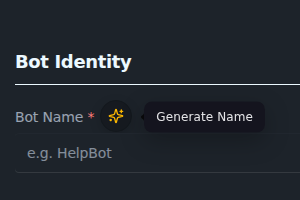

## ai-button-hover-before.png

## ai-button-hover-full.png

## ai-button-hover.png

## ai-button-loading-after.png

## ai-button-loading-before.png

## api-rate-limit-after.png
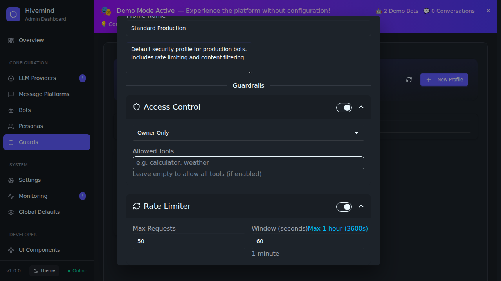

## api-rate-limit-before.png

## backup-retention-baseline.png

## backup-retention-enforced.png

## bot-create-page-after.png
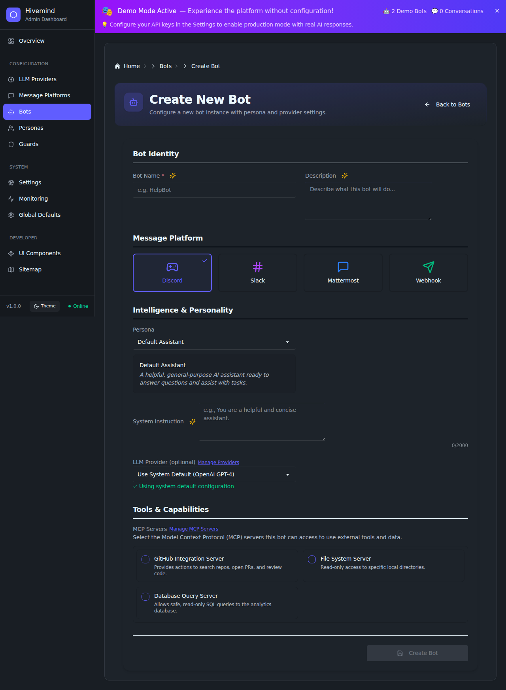

## bot-create-page-before.png

## bot-create-validation-after.png
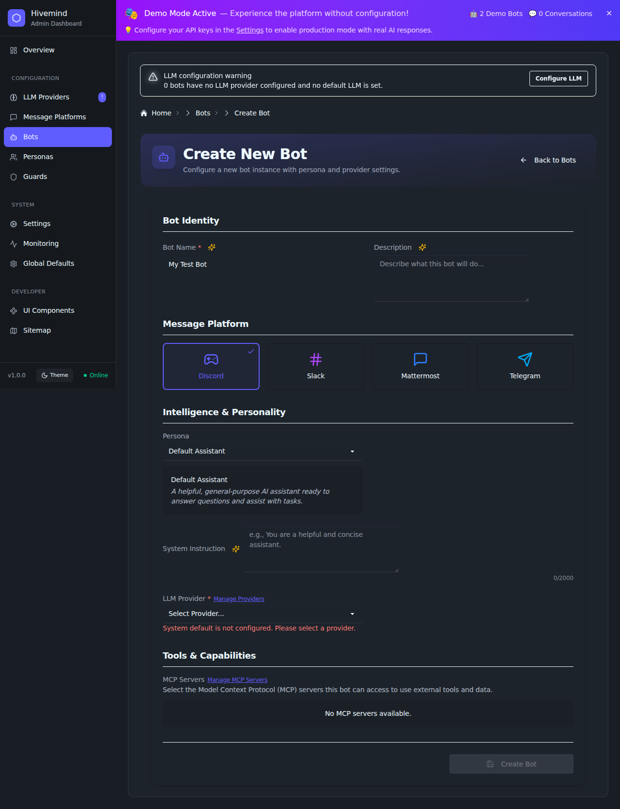

## bot-create-validation-before.png

## bot-details-modal-after.png

## bot-details-modal-before.png

## bot-wizard-validation-after.png

## bot-wizard-validation-before.png

## bots-page-after.png

## bots-page-before.png

## button-loading-after-light.png

## button-loading-before-light.png

## button-loading-before.png

## button-loading-real-app.png

## chatpage-latency.png
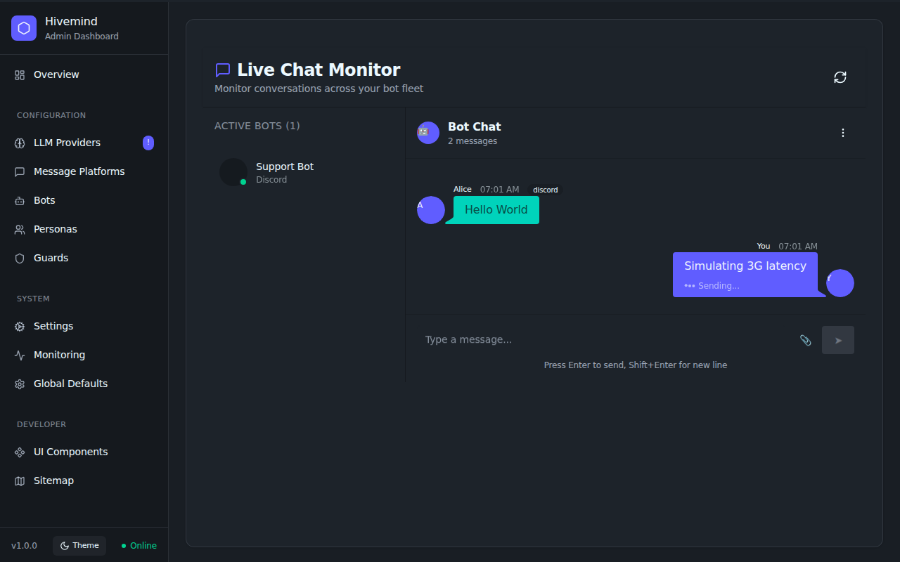

## chatpage-offline.png
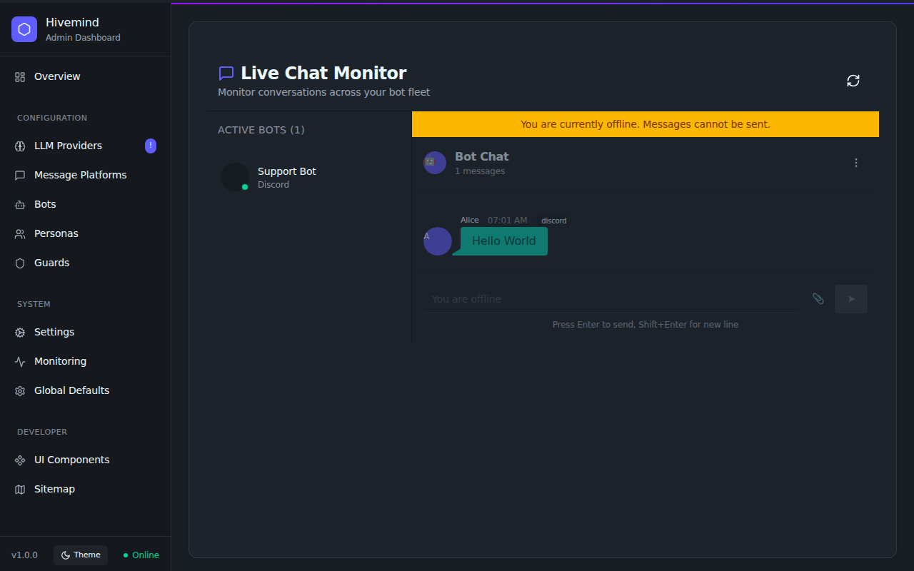

## chatpage-optimistic.png
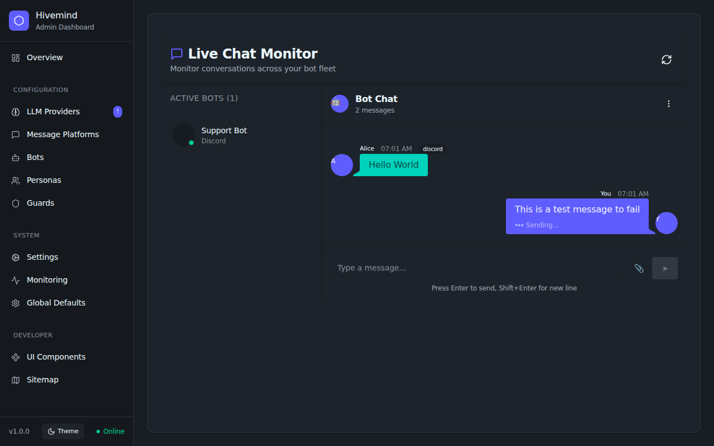

## chatpage-rollback.png

## config-rollback-available.png

## config-rollback-empty.png

## config-test-helper-after.png
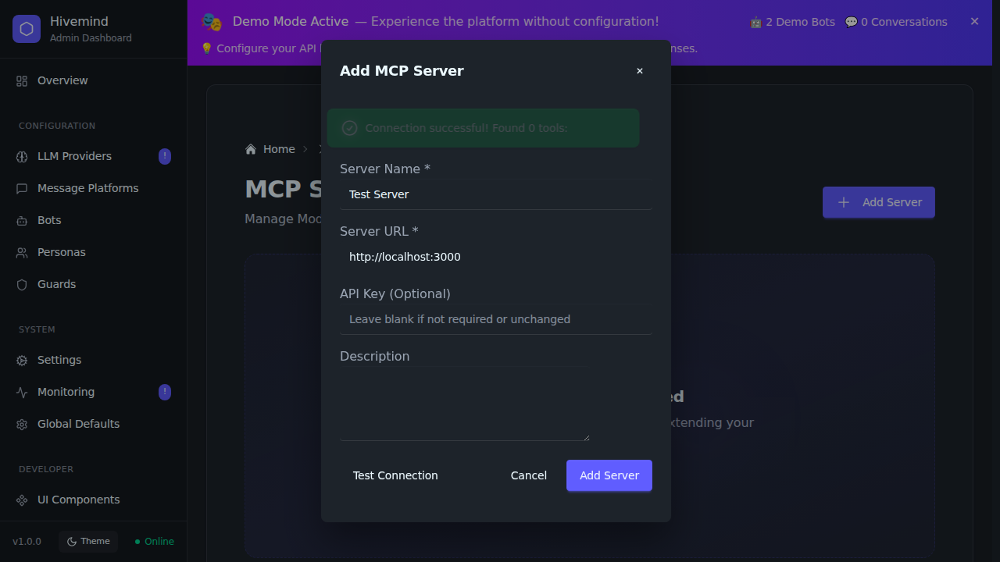

## config-test-helper-before.png

## create-bot-modal.png

## distributed-trace-waterfall.png

## guards-modal-enhanced.png

## mcp-guard-ux-after-undo.png
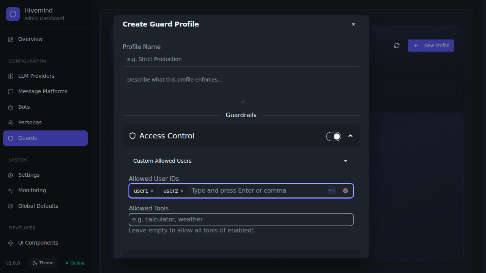

## mcp-guard-ux-after.png
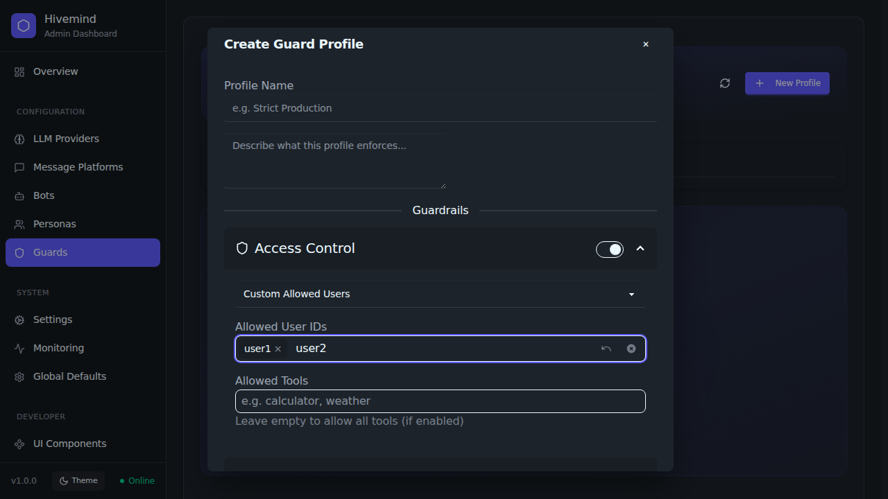

## mcp-guard-ux-before.png
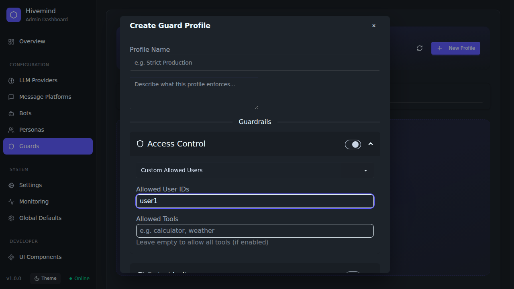

## mcp-nav-after-debug.png

## mcp-tools-modal.png
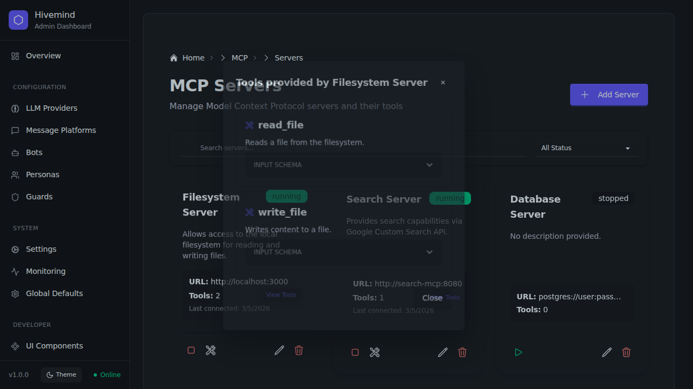

## openwebui-after.png

## openwebui-before.png

## pagination-after-accessible.png

## pagination-after.png

## pagination-before.png

## pagination-expanded-scope.png

## predictive-analytics-before.png

## predictive-analytics.png

## prometheus-metrics-after.png

## prometheus-metrics-before.png

## showcase-page.png
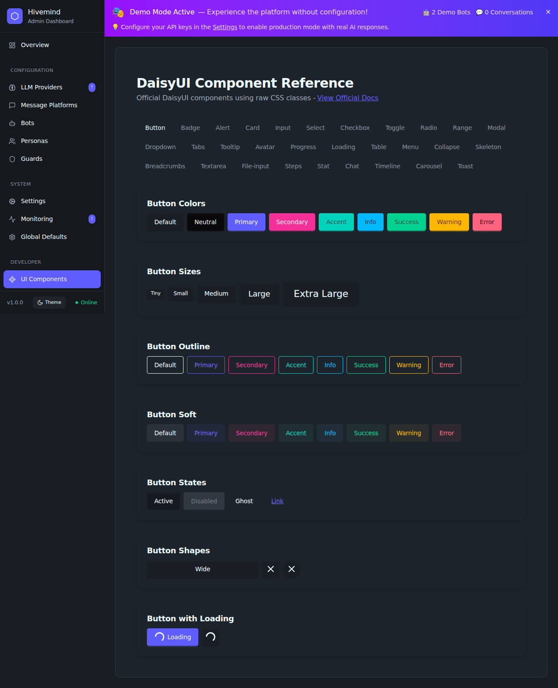

## system-management-config-tab.png

## verification-bots-search.png

## verification-personas-copy.png

## verification-personas.png

## create-bot-modal.png
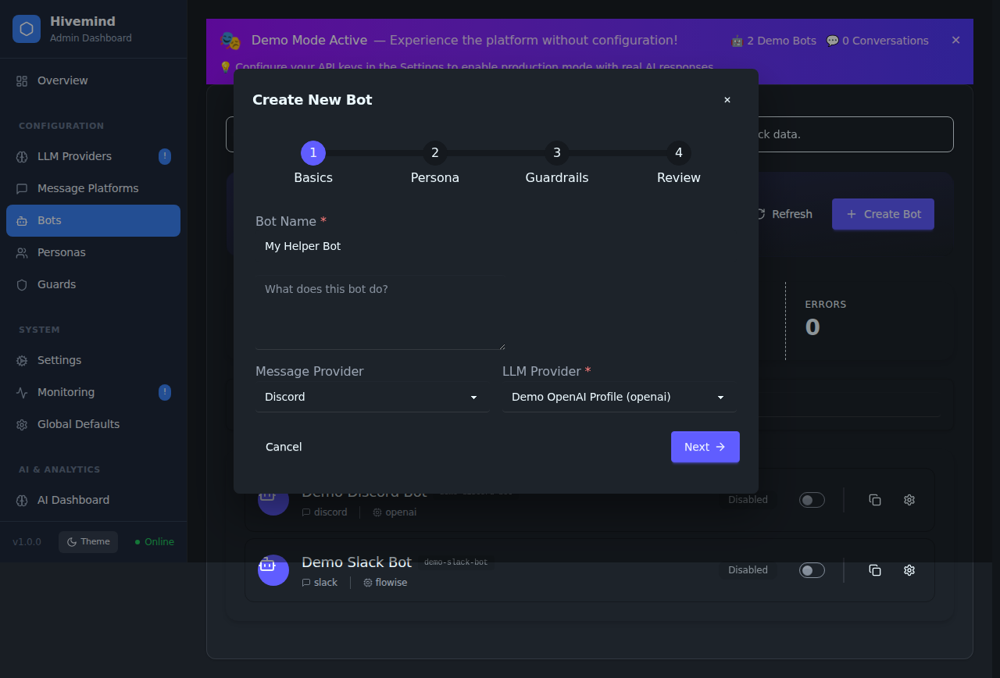
