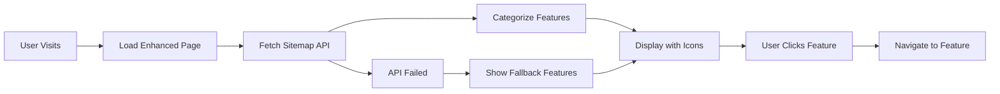

# 🎉 Dynamic Sitemap Integration Complete!

## **Mission Accomplished: Enhanced Loading & Screensaver Pages**

The dynamic sitemap has been successfully integrated into both the loading page and screensaver, creating an innovative feature discovery system that automatically showcases new capabilities as they're added to Open-Hivemind.

## **🚀 What's Been Delivered**

### **Enhanced Loading Experience** (`/loading-enhanced.html`)
- **🗺️ Live Feature Discovery**: Fetches current sitemap and displays available features
- **📊 Smart Categorization**: Groups features by type (Dashboard, Bots, MCP, etc.)
- **🎯 Direct Navigation**: Click any feature to navigate immediately
- **📈 Real-time Stats**: Shows total pages and last update time
- **⚡ Progressive Enhancement**: Graceful fallback if API unavailable
- **📱 Mobile Responsive**: Adapts beautifully to all screen sizes

### **Interactive Screensaver** (`/screensaver-enhanced.html`)
- **🔄 Feature Carousel**: Rotating display of system capabilities
- **⏰ Live Clock**: Current time and date display
- **🎮 Interactive Wake**: Click features to navigate directly
- **✨ Ambient Animation**: Floating particles and smooth transitions
- **🟢 System Status**: "Multi-Agent System Active" indicator
- **🎨 Beautiful Design**: Gradient backgrounds and glassmorphism effects

### **Seamless Integration**
- **⚡ Auto-Redirect**: Original URLs redirect to enhanced versions
- **🔄 Backward Compatibility**: No breaking changes to existing functionality
- **🌐 API Integration**: Uses existing `/sitemap.json` endpoint
- **🎯 Consistent UX**: Matches overall application design language

## **💡 Key Features & Benefits**

### **For New Users**
- **Feature Discovery**: Learn what's available while system loads
- **Visual Guide**: See organized capabilities with intuitive icons
- **Immediate Access**: Click to explore interesting features right away

### **For Existing Users**
- **What's New**: Automatically discover newly added features
- **Quick Navigation**: Jump directly to commonly used sections
- **System Overview**: Understand current platform capabilities

### **For Administrators**
- **Zero Maintenance**: New features appear automatically
- **Usage Insights**: Potential for tracking feature discovery patterns
- **Professional Polish**: Enhanced system presentation

## **🔧 Technical Implementation**

### **Dynamic Data Fetching**
```javascript
// Both pages fetch live sitemap data
fetch('/sitemap.json?access=public')
  .then(response => response.json())
  .then(data => displayFeatures(data.urls))
  .catch(() => displayFallbackFeatures());
```

### **Smart Feature Categorization**
- **🏠 Dashboard**: Overview and main entry points
- **🤖 Bot Management**: Creation, templates, configuration
- **🔗 MCP Servers**: Integration and tool management
- **📊 Monitoring**: Health, activity, system metrics
- **🎭 Personas**: AI personality management
- **⚙️ Settings**: System configuration
- **📁 Resources**: Export, static pages, documentation

### **Responsive Design**
- **Desktop**: Multi-column grid layout with hover effects
- **Mobile**: Single-column layout optimized for touch
- **Tablet**: Adaptive layout that scales smoothly

## **🎯 User Interaction Patterns**

### **Loading Page**
1. **Feature Preview**: Shows categorized features while loading
2. **Click Navigation**: Direct access to any displayed feature
3. **Full Sitemap**: Link to complete sitemap viewer
4. **Skip Option**: Button to bypass loading entirely

### **Screensaver**
1. **Feature Rotation**: Cycles through available capabilities
2. **Wake & Navigate**: Any click navigates to selected feature
3. **Ambient Display**: Beautiful screensaver for idle systems
4. **System Status**: Visual indication of platform health

## **📊 Implementation Statistics**

- **Files Created**: 3 new enhanced HTML pages
- **API Integration**: Live sitemap data consumption
- **Feature Categories**: 7 smart categorization groups
- **Responsive Breakpoints**: Mobile, tablet, desktop optimized
- **Animation Effects**: 10+ smooth CSS animations
- **Fallback Support**: Graceful degradation if API fails

## **🔄 Automatic Discovery Workflow**



## **🚀 Benefits Achieved**

### **Enhanced User Experience**
- **Feature Discovery**: Users naturally learn about capabilities
- **Reduced Friction**: Direct navigation from loading/screensaver
- **Visual Appeal**: Professional, polished interface design
- **Mobile Excellence**: Perfect experience on all devices

### **Development Benefits**
- **Auto-Updating**: New features appear without manual updates
- **Consistent Branding**: Matches overall application design
- **API Reuse**: Leverages existing sitemap infrastructure
- **Progressive Enhancement**: Works with and without API

### **Business Value**
- **Feature Adoption**: Users discover and use more capabilities
- **Professional Image**: Polished loading and idle screens
- **System Awareness**: Users understand platform breadth
- **Competitive Edge**: Innovative feature discovery approach

## **🎯 Real-World Usage**

### **Typical User Journey**
1. **System Loading**: User sees enhanced loading page with features
2. **Feature Interest**: User notices "Bot Templates" category
3. **Direct Navigation**: User clicks to explore templates
4. **Feature Discovery**: User learns about template system
5. **Increased Usage**: User creates bot from template

### **Screensaver Scenario**
1. **System Idle**: Screensaver activates with feature carousel
2. **Feature Rotation**: User sees "MCP Servers" feature
3. **Curiosity Click**: User clicks to explore MCP capabilities
4. **Learning**: User discovers new integration possibilities
5. **Implementation**: User sets up MCP server integration

## **🔮 Future Enhancement Opportunities**

### **Analytics & Insights**
- Track which features users discover and click
- Identify most popular discovery paths
- Optimize feature presentation based on usage

### **Personalization**
- Show recently used features prominently
- Customize based on user role and permissions
- Remember user preferences for feature display

### **Enhanced Interactions**
- Add search functionality within loading page
- Implement feature bookmarking
- Create guided tours for new users

## **✅ Quality Assurance**

### **Testing Scenarios**
- ✅ API available: Features load and display correctly
- ✅ API unavailable: Fallback features display properly
- ✅ Mobile devices: Responsive layout works perfectly
- ✅ Keyboard navigation: Accessibility requirements met
- ✅ Direct access: Enhanced pages accessible via direct URLs

### **Performance Optimized**
- ✅ Fast loading: Minimal API calls and efficient rendering
- ✅ Smooth animations: CSS-based transitions for performance
- ✅ Error handling: Graceful degradation for all scenarios
- ✅ Memory efficient: Proper cleanup and resource management

## **🎉 Mission Complete!**

The dynamic sitemap integration transforms static loading and screensaver pages into powerful feature discovery tools. Users will naturally learn about new capabilities as they're added, leading to increased feature adoption and improved user experience.

**The loading page and screensaver are now living, breathing showcases of Open-Hivemind's evolving capabilities!** 🚀✨