# Screenshots — Previous State (Archive)

This directory contains the previous versions of screenshots before they were updated.
Each filename matches its counterpart in `docs/screenshots/` — the directory conveys the version:

- `docs/screenshots/<name>.png` = current (after)
- `archive/screenshots/<name>.png` = previous (before)

Not every docs screenshot has an archive counterpart. Archive entries only appear once a screenshot has been replaced.

See [CLAUDE.md](/CLAUDE.md) for the screenshot naming and archival convention.

---

## Archived Screenshots

| Screenshot | Description |
|---|---|
| 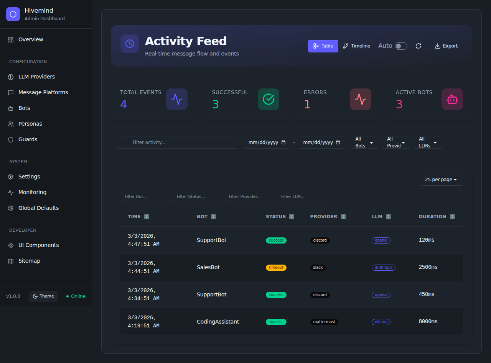 | Activity page (previous version) |
| 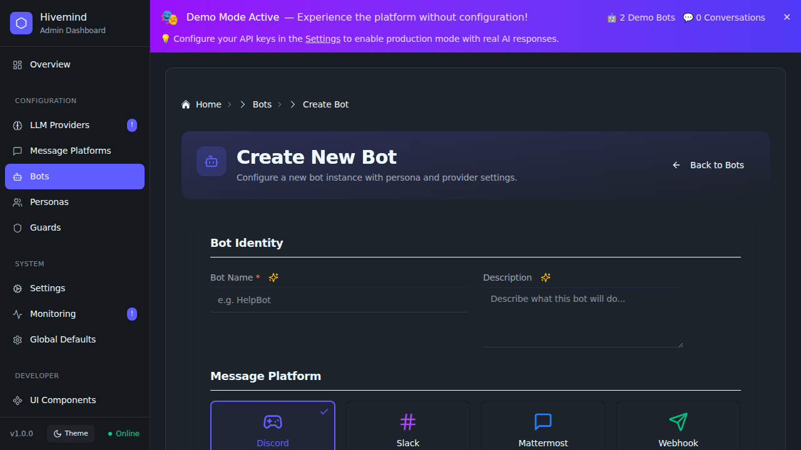 | AI assist button (previous version) |
|  | AI button hover state (previous version) |
| 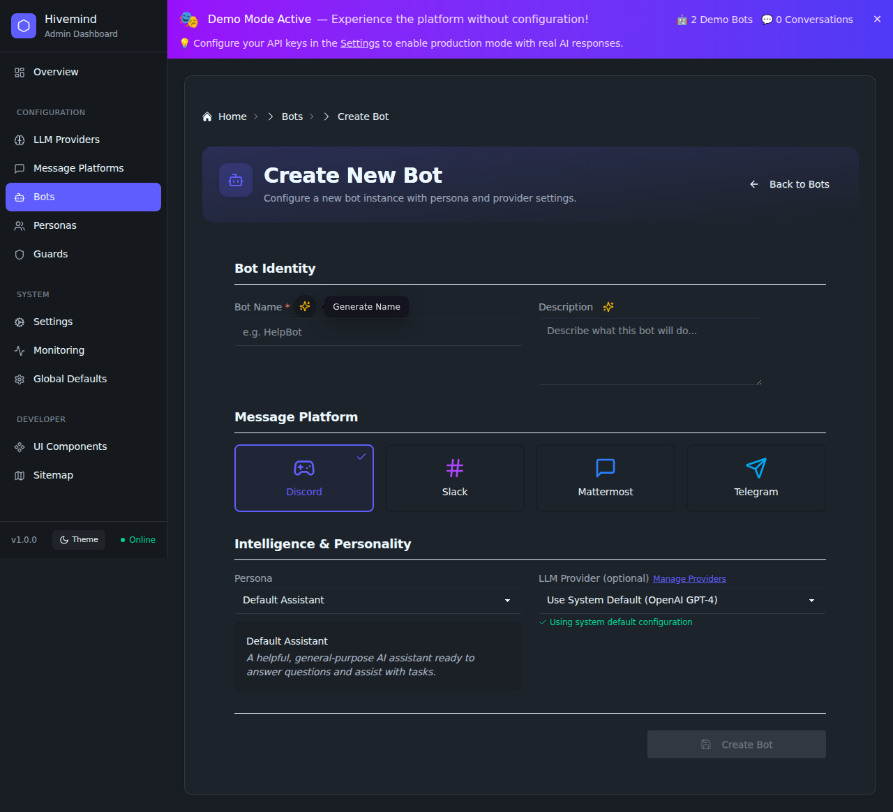 | AI button hover full context (previous version) |
|  | AI button loading state (previous version) |
|  | API rate limiting (previous version) |
|  | Backup retention baseline (previous version) |
| 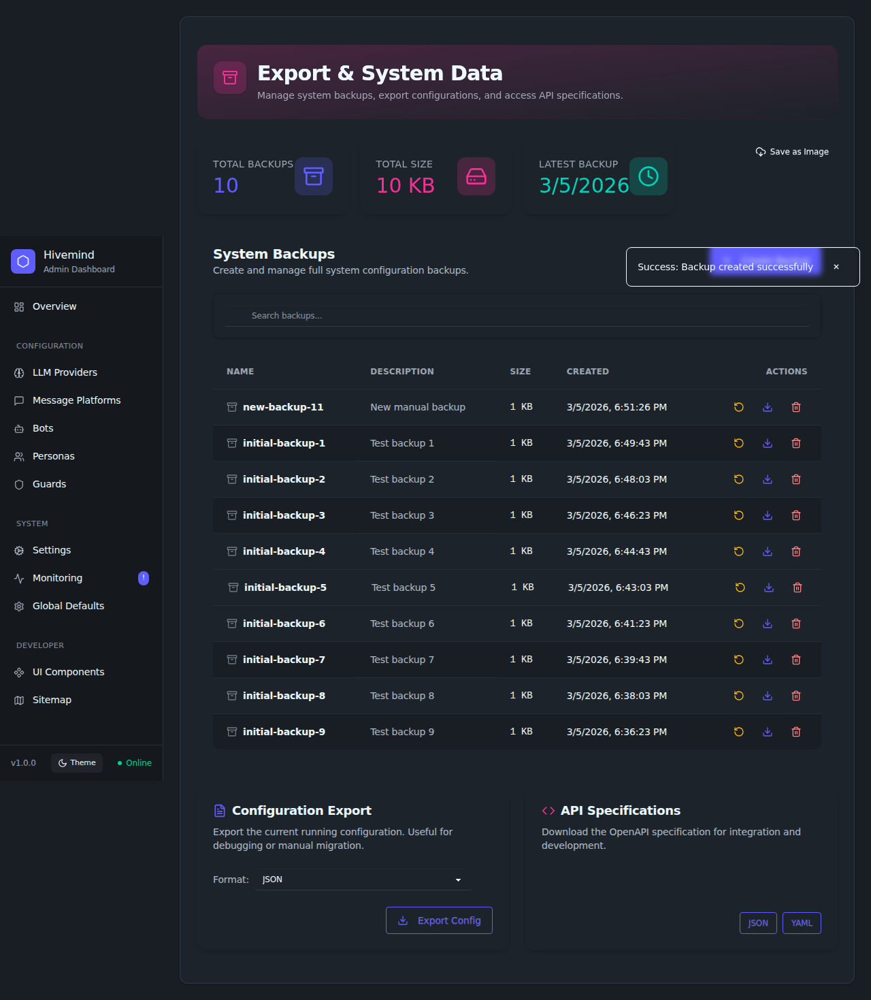 | Backup retention enforced (previous version) |
| 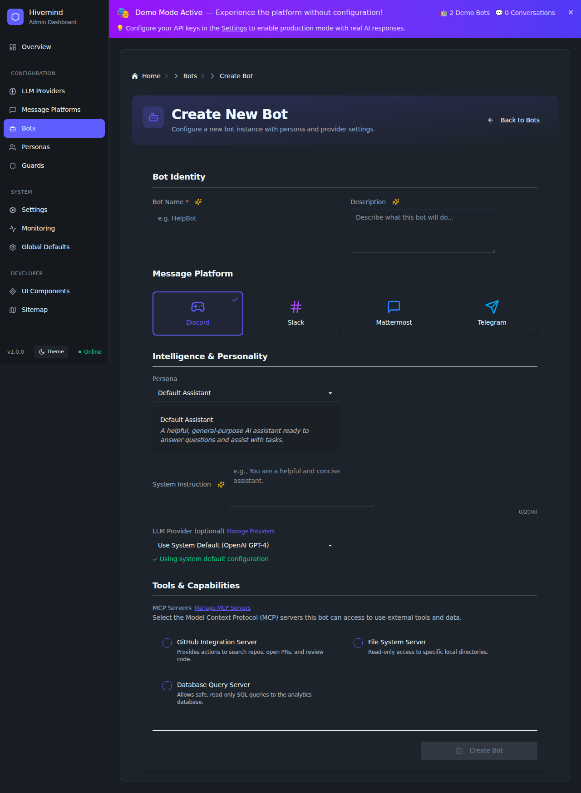 | Bot creation page (previous version) |
| 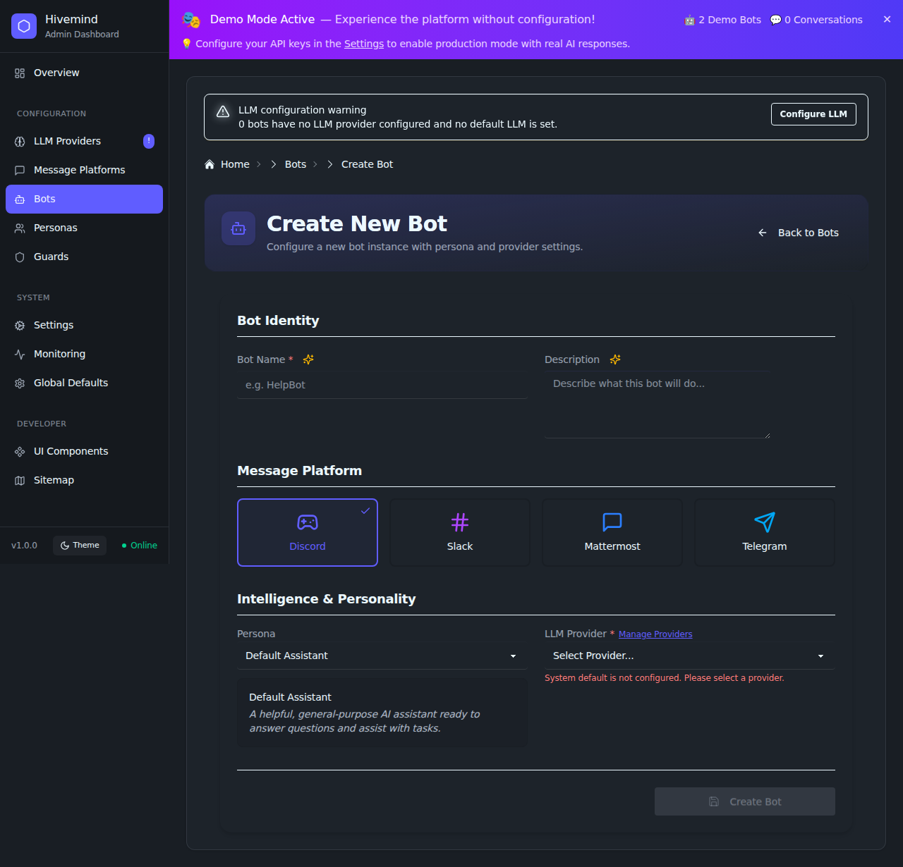 | Bot creation validation (previous version) |
| 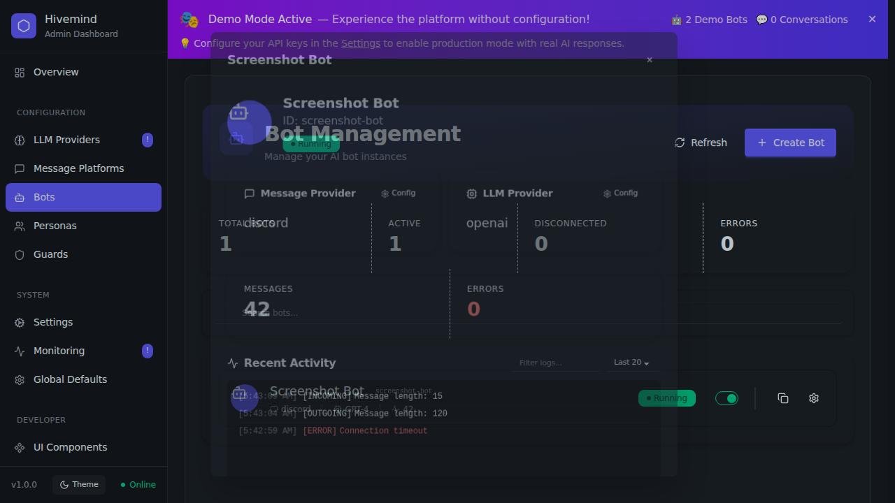 | Bot details modal (previous version) |
| 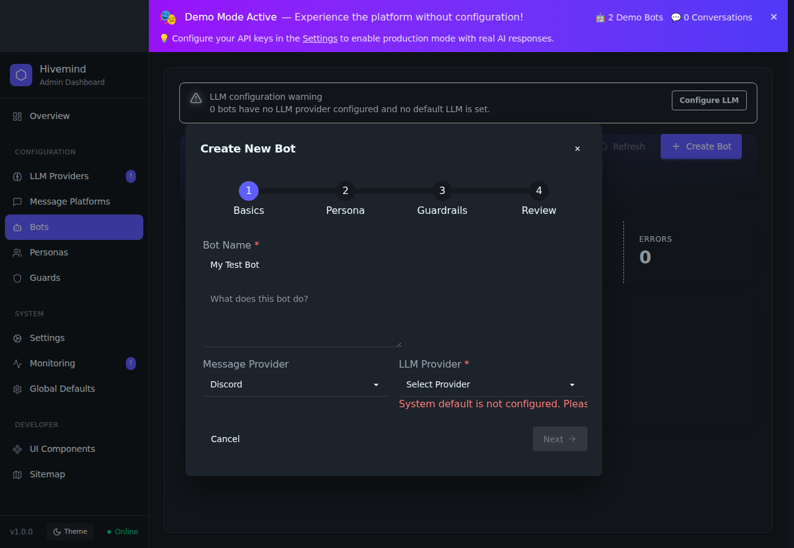 | Bot wizard validation (previous version) |
| 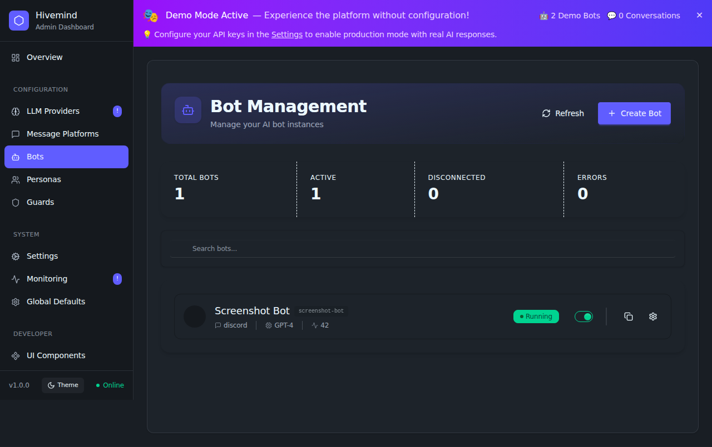 | Bots page (previous version) |
|  | Button loading state (previous version) |
|  | Button loading in production (previous version) |
|  | Config rollback available (previous version) |
| 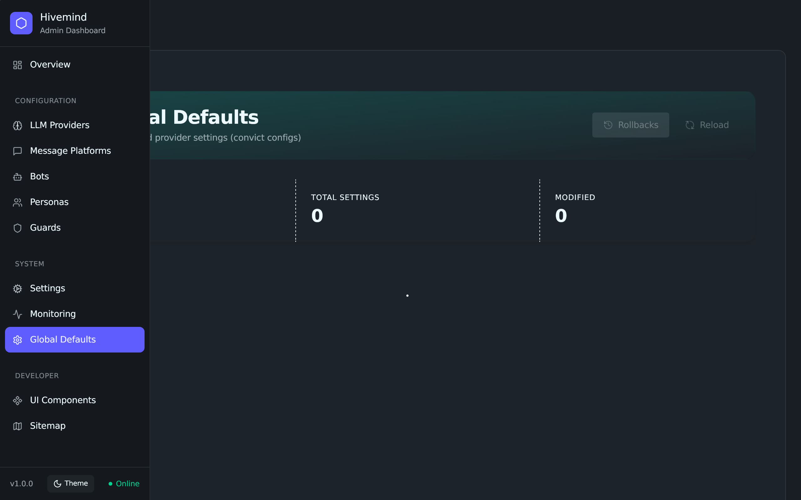 | Config rollback empty (previous version) |
|  | Config test helper (previous version) |
|  | Create bot modal (previous version) |
| 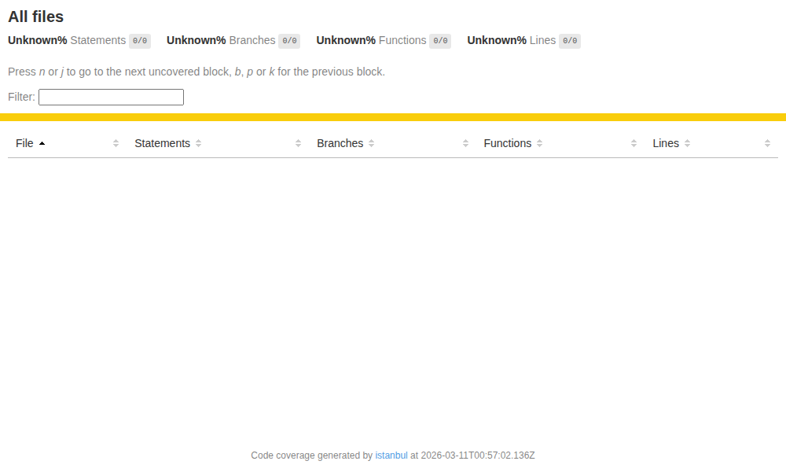 | Guard profiles coverage (previous version) |
|  | Enhanced guards modal (previous version) |
| 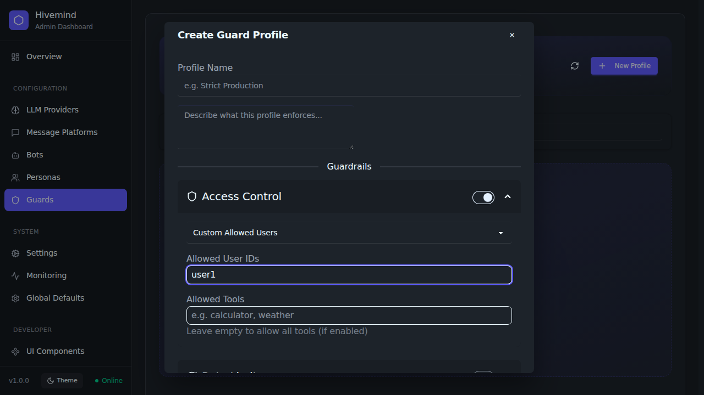 | MCP guard UX (previous version) |
|  | OpenWebUI configuration (previous version) |
|  | Pagination component (previous version) |
|  | Pagination expanded scope (previous version) |
| 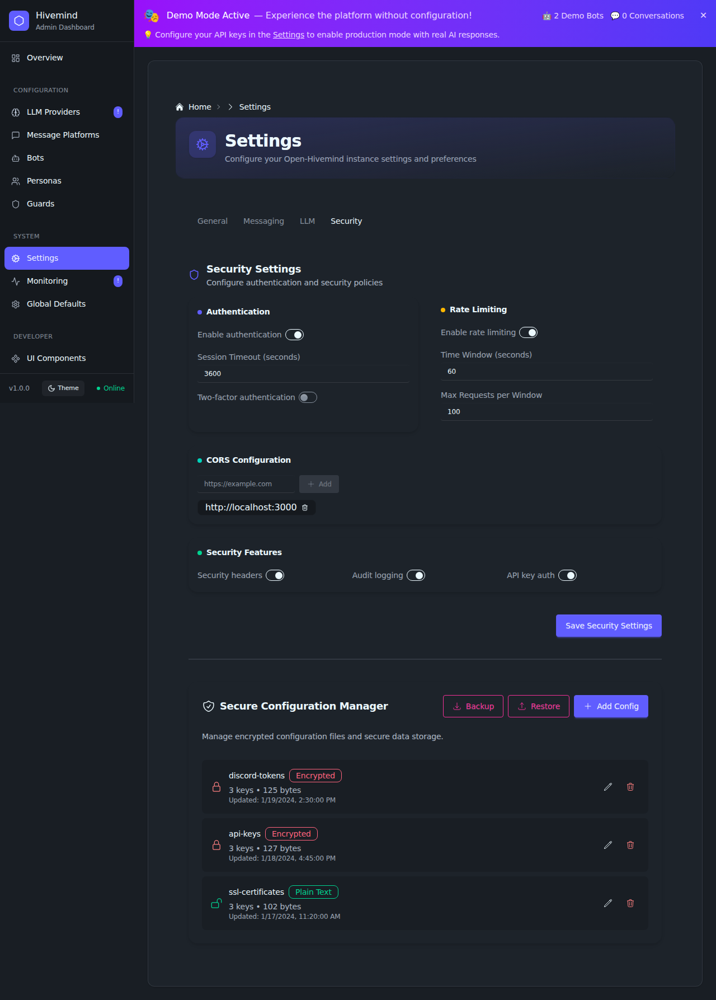 | Security settings (previous version) |
| 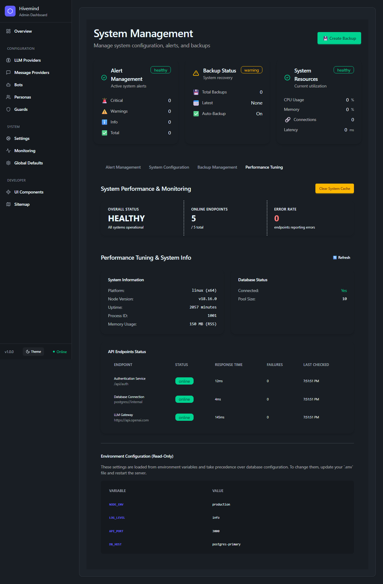 | System management (previous version) |
|  | Bot search verification (previous version) |
|  | Persona verification (previous version) |
|  | Persona copy verification (previous version) |
