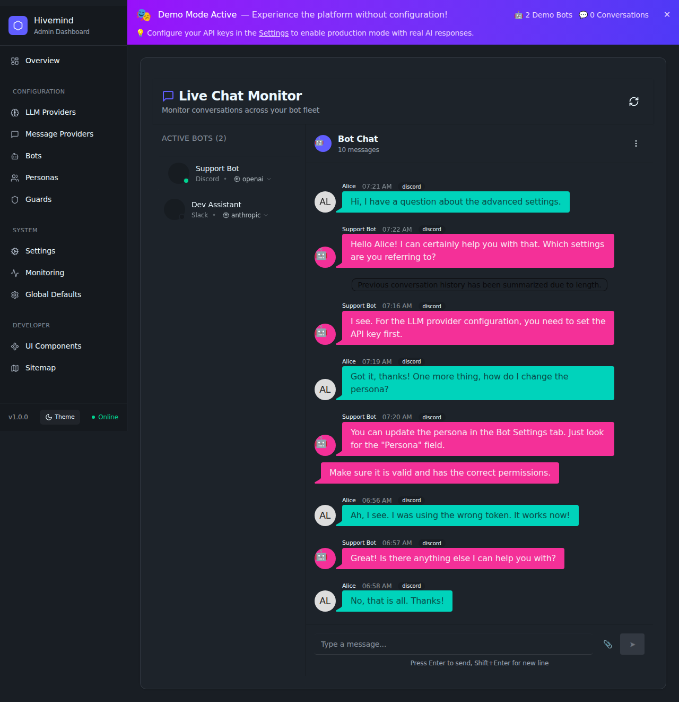
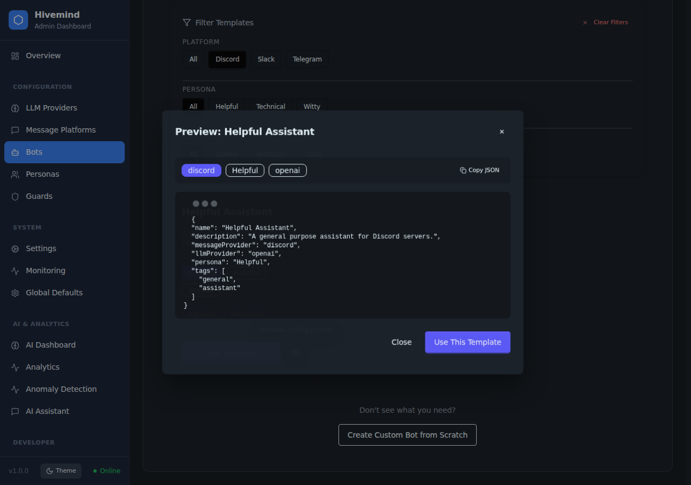

# Open Hivemind User Guide

Welcome to the Open Hivemind User Guide. This document provides an overview of the key features and how to use them.

## Live Chat Monitor

The Live Chat Monitor allows administrators to observe conversations across all active bots in real-time. This is useful for monitoring bot performance, debugging responses, and ensuring quality interactions.

### Features

-   **Bot List**: View all configured bots and their connection status (Online/Offline) in the sidebar.
-   **Conversation History**: Select a bot to view its recent chat history with users.
-   **Real-time Updates**: Use the Refresh button to fetch the latest messages.
-   **Read-Only Mode**: Currently, the interface is read-only. Sending messages directly from the admin panel is disabled to prevent interference with automated flows.

### How to Use

1.  Navigate to the **Chat** section in the admin sidebar.
2.  Click on a bot from the list on the left.
3.  The main view will load the recent message history for that bot.
4.  Click the **Refresh** icon in the header to update the view with new messages.

## System Configuration

The System Configuration page allows administrators to manage global settings, including instance details, localization, logging, system limits, and health monitoring.

### Features

-   **Instance Information**: Configure the display name and description of your Open Hivemind instance.
-   **Localization**: Set the timezone and language preferences.
-   **Logging & Notifications**: Control system logging levels and notification preferences.
-   **System Limits**: Adjust maximum concurrent bots and response timeouts to manage resource usage.
-   **Health & Monitoring**: Enable and configure periodic health checks for external services.
-   **Advanced Settings**: Unlock experimental features and granular configurations.

### How to Use

1.  Navigate to the **Settings** section in the admin sidebar.
2.  Adjust the settings as needed.
3.  Click **Save Settings** to apply changes.

## Bot Management

The Bot Management section allows you to create and configure AI assistants. The simplified creation flow helps you quickly deploy new bots to platforms like Discord, Slack, Mattermost, and Telegram.

### Bot Templates

Get started quickly with pre-configured templates. These templates include optimal settings for different use cases like customer support, code review, or casual conversation.

#### Features
-   **Filtering**: Quickly find templates by Platform, Persona, or LLM Provider using the interactive filter pills.
-   **Preview**: View the full configuration JSON of a template before using it.
-   **One-Click Use**: Instantly create a new bot based on a template.

### Creating a New Bot

1.  Navigate to **Bots** in the sidebar and click **Create Bot**.
2.  **Name & Description**: Use the AI Assist button to generate creative names and descriptions.
3.  **Platform Selection**: Choose your target messaging platform from the visual grid (Discord, Slack, etc.).
4.  **Persona**: Select a persona to define the bot's personality. A preview card will show you the persona's details.
5.  **LLM Provider**: Choose which AI model provider to use, or stick with the system default.
6.  Click **Create Bot** to finalize.
