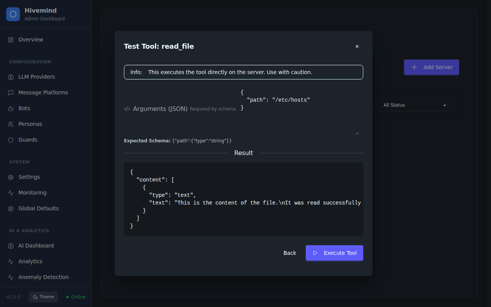

# Open Hivemind User Guide

Welcome to the Open Hivemind User Guide. This document provides an overview of the key features and how to use them.

## Live Chat Monitor

The Live Chat Monitor allows administrators to observe conversations across all active bots in real-time. This is useful for monitoring bot performance, debugging responses, and ensuring quality interactions.

### Features

-   **Bot List**: View all configured bots and their connection status (Online/Offline) in the sidebar.
-   **Conversation History**: Select a bot to view its recent chat history with users.
-   **Real-time Updates**: Use the Refresh button to fetch the latest messages.
-   **Read-Only Mode**: Currently, the interface is read-only. Sending messages directly from the admin panel is disabled to prevent interference with automated flows.

### How to Use

1.  Navigate to the **Chat** section in the admin sidebar.
2.  Click on a bot from the list on the left.
3.  The main view will load the recent message history for that bot.
4.  Click the **Refresh** icon in the header to update the view with new messages.

## MCP Servers & Tool Testing

Model Context Protocol (MCP) servers extend the capabilities of your bots by providing external tools and resources. The MCP Servers page allows you to manage these connections and interactively test tools.

### Features

-   **Server Management**: Add, edit, and remove MCP server connections.
-   **Connection Status**: Monitor the real-time status (Running/Stopped/Error) of each server.
-   **Tool Explorer**: View the list of tools provided by each server, including their input schemas.
-   **Interactive Tool Tester**: Manually execute tools directly from the admin interface to verify functionality and debug responses.

### How to Use

1.  Navigate to **MCP** > **Servers** in the admin sidebar.
2.  Click **Add Server** to connect a new MCP server, or use the action buttons on existing server cards.
3.  Click the **View Tools** icon (screwdriver/wrench) on a running server card to see available tools.
4.  In the tools modal, click **Test Tool** next to any tool.
5.  Enter the required arguments in JSON format and click **Execute Tool** to see the result.
