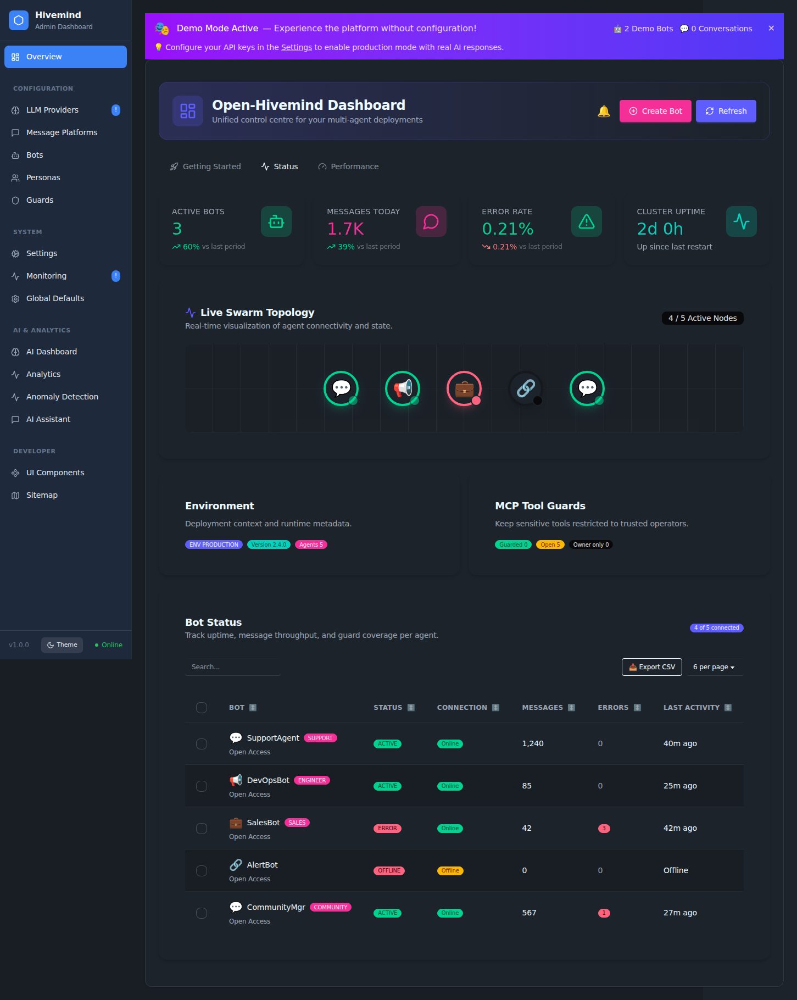

# Open Hivemind User Guide

Welcome to the Open Hivemind User Guide. This document provides an overview of the key features and how to use them.

## Dashboard Overview

The **Unified Dashboard** serves as the command center for your multi-agent swarm, providing real-time visibility into the health and activity of your bots.

### Key Features

-   **Live Swarm Topology**: Visualizes your active agents as a network. Active bots pulse to indicate health, while error states are immediately visible.
-   **Real-Time Status**: Monitor connection status, message throughput, and error rates at a glance.
-   **Performance Metrics**: Track system resource usage (CPU, Memory) and stability scores.
-   **Quick Actions**: Create new bots or refresh system state directly from the header.

## Live Chat Monitor

The Live Chat Monitor allows administrators to observe conversations across all active bots in real-time. This is useful for monitoring bot performance, debugging responses, and ensuring quality interactions.

### Features

-   **Bot List**: View all configured bots and their connection status (Online/Offline) in the sidebar.
-   **Conversation History**: Select a bot to view its recent chat history with users.
-   **Real-time Updates**: Use the Refresh button to fetch the latest messages.
-   **Read-Only Mode**: Currently, the interface is read-only. Sending messages directly from the admin panel is disabled to prevent interference with automated flows.

### How to Use

1.  Navigate to the **Chat** section in the admin sidebar.
2.  Click on a bot from the list on the left.
3.  The main view will load the recent message history for that bot.
4.  Click the **Refresh** icon in the header to update the view with new messages.

## System Configuration

The System Settings page allows administrators to configure global settings for the Open Hivemind instance, including localization, logging, and system limits.

### Key Features

-   **Instance Information**: Set the display name and description for your Hivemind instance.
-   **Localization**: Configure timezone and theme preferences (Light/Dark/Auto).
-   **Logging & Notifications**: Control system-wide logging levels and notification preferences.
-   **System Limits**:
    -   Adjust maximum concurrent bots.
    -   Set default response timeouts.
    -   Toggle and configure **Health Checks** interval to monitor system stability.
-   **Advanced Mode**: Unlock experimental features and granular configuration options.

### How to Use

1.  Navigate to **Settings** > **General** in the sidebar.
2.  Adjust the configuration as needed.
3.  Click **Save Settings** to apply changes.
