# Open-Hivemind User Guide

Welcome to the Open-Hivemind User Guide. It starts with a **Quick Tour** — the complete first-run user story with screenshots — followed by a detailed reference for every page, organized by the application's menu structure.

> All screenshots show **demo-mode data** (simulated bots and conversations) and are captured automatically by Playwright (`npm run test:journey:guide`), so they stay in sync with the real UI.

## Quick Tour — your first session

### 1. First run & onboarding
Start the server (`npm run dev`) and open `http://localhost:3028`. On a fresh install the onboarding wizard walks you through the three things a bot needs: an LLM provider, a message platform, and a name.

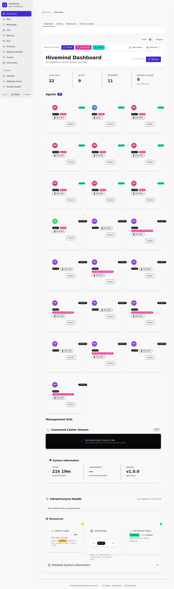

### 2. Connect a message platform
Add your Discord (or Slack/Mattermost) bot token under **Messaging**. The connection is validated immediately, and one token can back several bot personas.

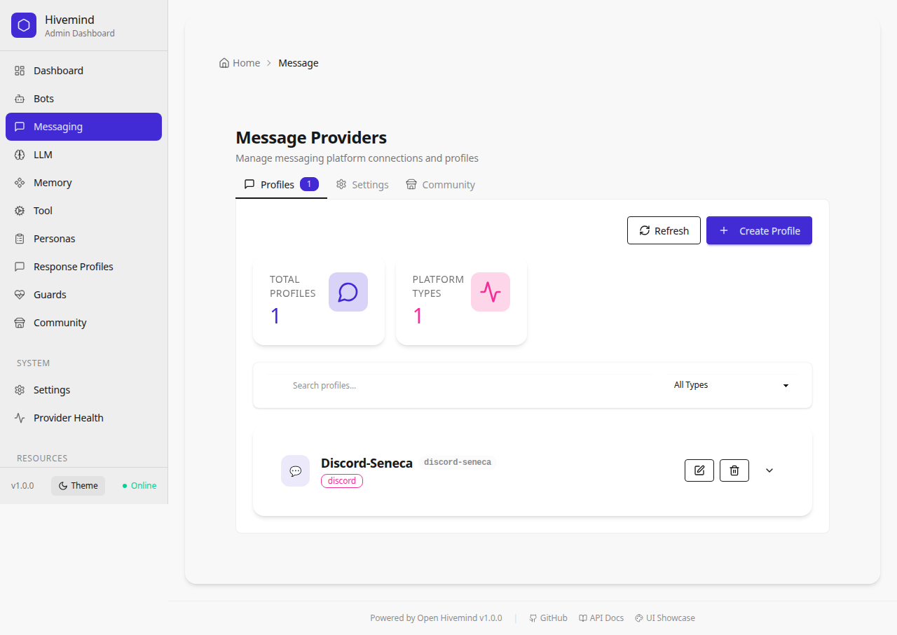

### 3. Connect an LLM provider
Under **LLM**, add a provider — OpenAI, Flowise, OpenWebUI, Letta, or OpenSwarm — and set the default model your bots will use.

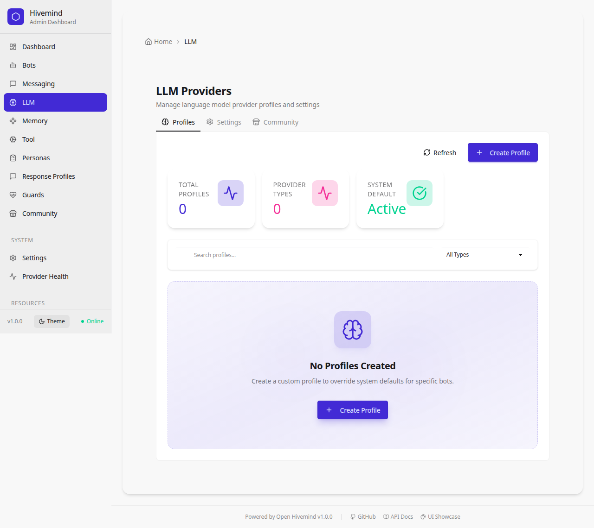

### 4. Create your first bot
On the **Bots** page, click **Create Bot** and walk the 4-step wizard: Basics (name + providers) → Persona → Guardrails → Review. Your new bot appears alongside the rest of the fleet.

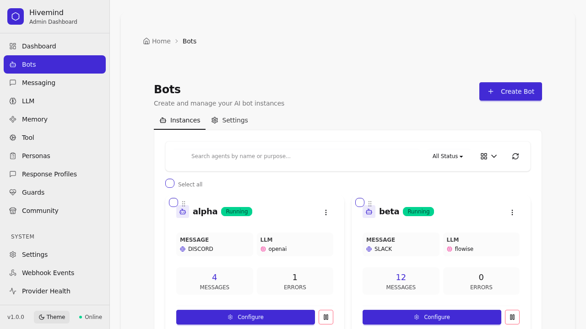

### 5. Test-drive it
Open the bot's detail drawer and use **Test Drive** to exchange a message with the configured LLM before letting it loose on a real channel. Token usage and estimated cost are tracked per exchange.

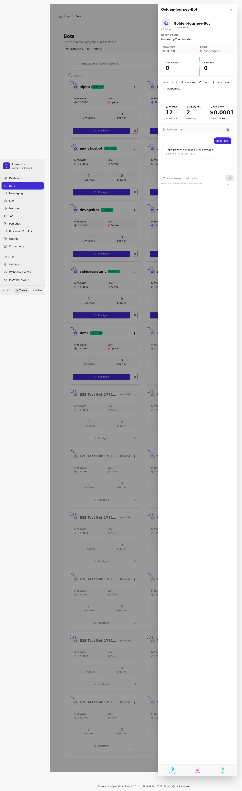

### 6. Watch the activity feed
**Activity** shows every message flowing through the hivemind in real time — who spoke, which bot replied, which provider served it, and how the reply decision was made.

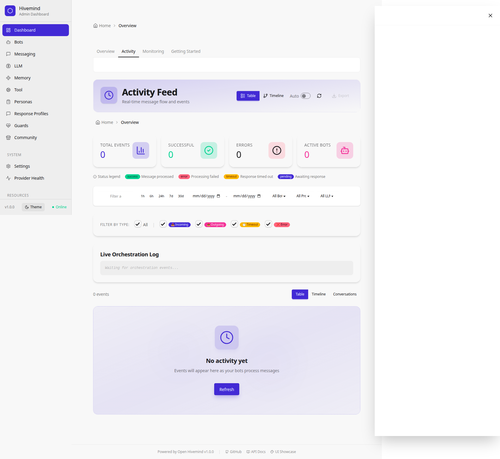

### 7. Give bots personalities
**Personas** hold reusable personality presets (system prompts + traits) you can assign to any bot — the same bot token can speak as different characters in different channels.

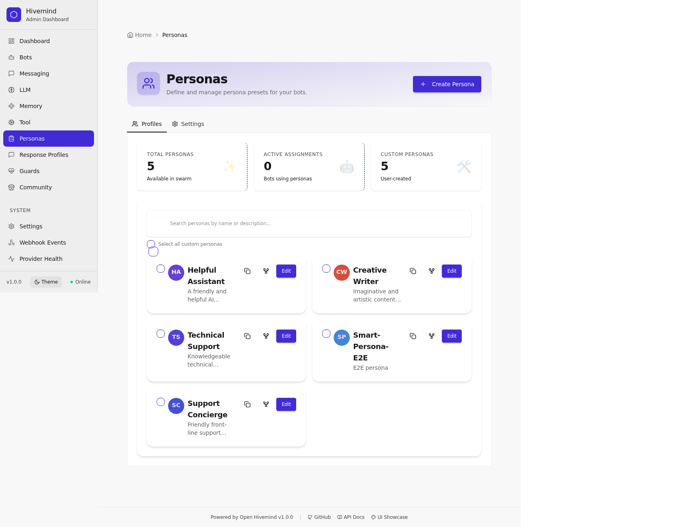

### 8. Set guardrails
**Guards** define safety profiles: rate limits, content filtering strictness, and which MCP tools a bot may invoke (with human-in-the-loop approval if you want it).

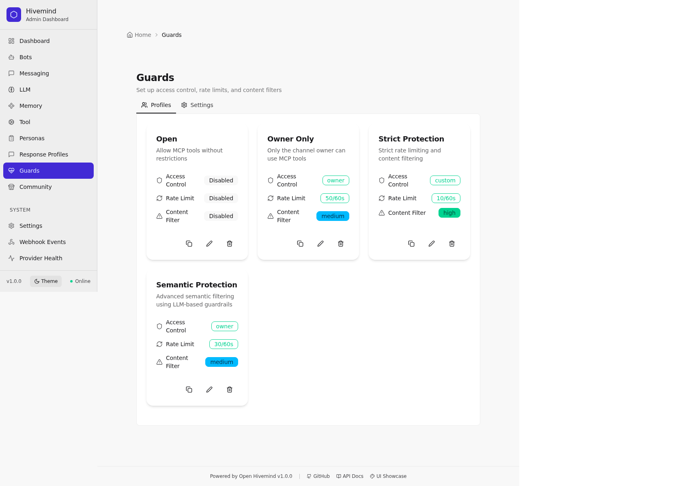

### 9. Add memory
**Memory** configures a backend (Mem0, Mem4AI, MemVault, or PostgreSQL) so bots remember context across conversations, with retention and eviction controls.

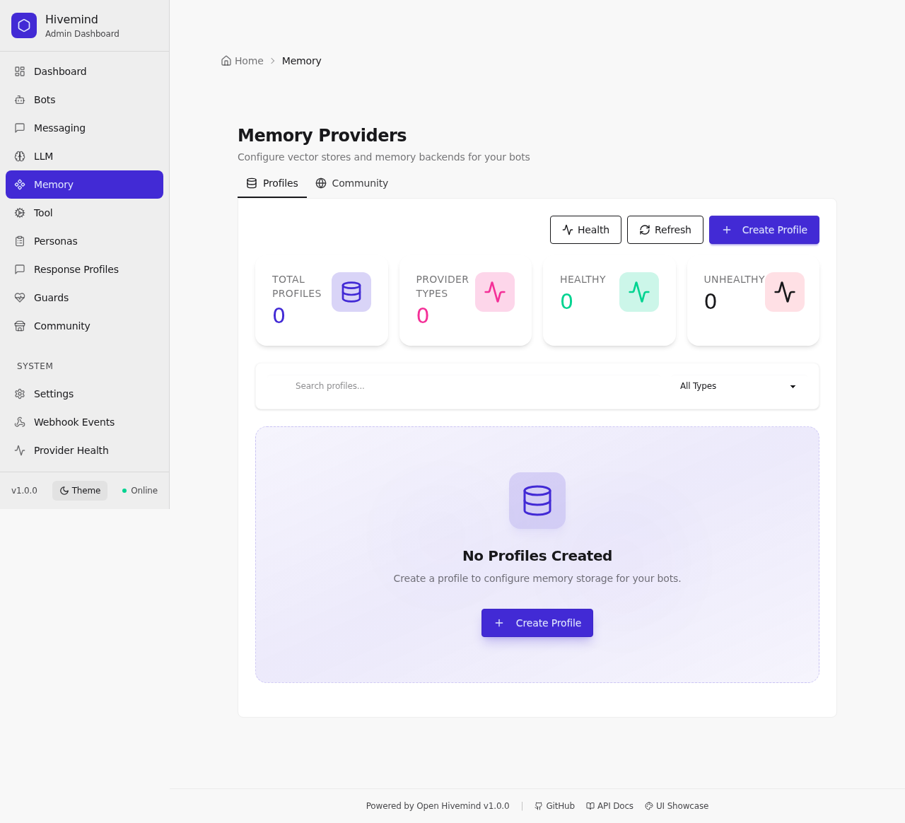

### 10. Monitor the system
The monitoring view tracks health, message rates, and per-bot metrics; Prometheus-compatible metrics and trace export are available for external observability stacks.

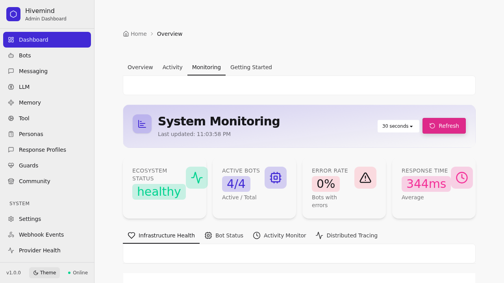

### 11. Export your configuration
Finally, **Export** lets you snapshot the whole setup (bots, providers, personas, guards) as JSON/YAML/CSV — for backup, review, or seeding another instance.

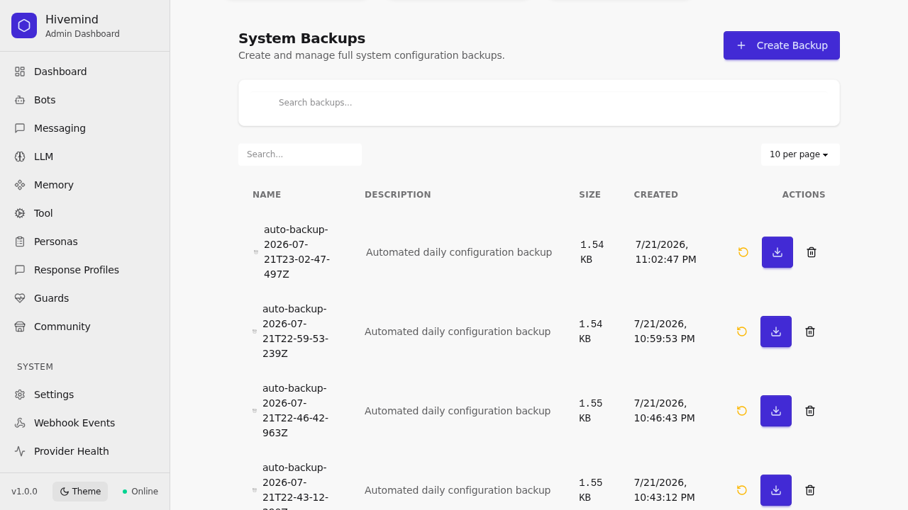

That's the core loop: connect providers → create persona-driven bots → guard them → watch them work. The rest of this guide covers every page in depth.

---

## Table of Contents
- [Quick Tour — your first session](#quick-tour--your-first-session)
- [Common Workflows](#common-workflows)
  - [First launch — explore in Demo Mode](#workflow-1-first-launch--explore-in-demo-mode)
  - [Set up your first live bot](#workflow-2-set-up-your-first-live-bot)
  - [Headless setup with environment variables](#workflow-3-headless-setup-with-environment-variables)
  - [Give your bots distinct personalities](#workflow-4-give-your-bots-distinct-personalities)
  - [Run a multi-bot swarm in one channel](#workflow-5-run-a-multi-bot-swarm-in-one-channel)
  - [Daily health check](#workflow-6-daily-health-check)
  - [Debug "my bot didn't reply"](#workflow-7-debug-my-bot-didnt-reply)
  - [Extend a bot with MCP tools](#workflow-8-extend-a-bot-with-mcp-tools)
  - [Back up and restore configuration](#workflow-9-back-up-and-restore-configuration)
  - [Lock down a public-facing deployment](#workflow-10-lock-down-a-public-facing-deployment)
- [Overview](#overview)
  - [Dashboard / Overview](#dashboard--overview)
  - [Live Chat Monitor](#live-chat-monitor)
  - [Activity Feed](#activity-feed)
- [Configuration](#configuration)
  - [Bots & Bot Management](#bots--bot-management)
  - [Bot Creation Flow](#bot-creation-flow)
  - [Bot Templates](#bot-templates)
  - [LLM Providers](#llm-providers)
  - [Message Platforms](#message-platforms)
  - [Memory Providers](#memory-providers)
  - [Tool Providers](#tool-providers)
  - [Personas Management](#personas-management)
  - [Guards](#guards)
  - [MCP Servers](#mcp-servers)
  - [MCP Tools](#mcp-tools)
  - [Marketplace](#marketplace)
- [System](#system)
  - [Settings Overview](#settings-overview)
  - [Audit & Governance](#audit--governance)
  - [Webhook](#webhook)
  - [Monitoring](#monitoring)
  - [System Management](#system-management)
  - [Global Defaults](#global-defaults)
  - [Demo Mode](#demo-mode)
  - [Onboarding Wizard](#onboarding-wizard)
  - [Command Palette](#command-palette)
- [AI & Analytics](#ai--analytics)
  - [Integrations](#integrations)
- [Developer & Tools](#developer--tools)
  - [API Documentation](#api-documentation)
  - [Help & FAQ](#help--faq)
- [Documentation Maintenance](#documentation-maintenance)

---

## Common Workflows

The most common setup and operational user stories, end to end. Each step links into the
reference sections below for screenshots and per-page detail.

### Workflow 1: First launch — explore in Demo Mode

> *As a new user, I want to see what the platform does before entering any credentials.*

1. Start the app (`pnpm run dev`, or the Docker/Pinokio options in the [README](../README.md)) and open `http://localhost:3028`.
2. Log in with the password you set via the `ADMIN_PASSWORD` environment variable. On a trusted network you can enable password-less local access with `ALLOW_LOCALHOST_ADMIN` / `ALLOW_LOCAL_NETWORK_ACCESS`.
3. With no bots configured, the app runs in [Demo Mode](#demo-mode): a purple banner appears and every page is seeded with simulated bots, conversations, and metrics. Nothing is persisted.
4. Browse the [Dashboard](#dashboard--overview), [Live Chat Monitor](#live-chat-monitor), and [Monitoring](#monitoring) pages to get a feel for the UI. Press **Ctrl + K** to jump anywhere via the [Command Palette](#command-palette).
5. When you're ready to go live, click **Get Started** on the demo banner to enter the Setup Wizard (Workflow 2).

### Workflow 2: Set up your first live bot

> *As an operator, I want one bot answering in my Discord/Slack/Mattermost channel.*

1. Open the [Setup Wizard](#onboarding-wizard) — it launches automatically on first start, from the Demo Mode banner's **Get Started** button, or any time from **Settings → Rerun Setup Wizard**.
2. **Message Provider**: pick Discord, Slack, or Mattermost and paste the credentials (bot token for Discord; bot + app token and signing secret for Slack; URL + token for Mattermost). See [Message Platforms](#message-platforms).
3. **LLM Provider**: pick OpenAI, Flowise, or OpenWebUI and enter the API key. Any OpenAI-compatible endpoint (e.g. a local Ollama or vLLM server) works via the OpenAI provider's base-URL field. See [LLM Providers](#llm-providers).
4. **Create a Bot**: name it and link it to the providers from steps 2–3.
5. **Review** and launch. The wizard summary shows a green check next to each configured provider.
6. Verify it works: open the bot on the [Bots page](#bots--bot-management) and use the **Test Drive** tab to chat against its LLM provider directly (streamed responses, no platform round-trip). Then mention the bot in your channel and watch the reply arrive in the [Live Chat Monitor](#live-chat-monitor).

### Workflow 3: Headless setup with environment variables

> *As a DevOps engineer, I want to configure bots from a `.env` file so deployments are reproducible — no clicking.*

1. Copy `.env.sample` to `.env`.
2. Define each bot with the `BOTS_<NAME>_` prefix. A minimal Discord + OpenAI bot:
   ```bash
   BOTS_ALPHA_MESSAGE_PROVIDER=discord
   BOTS_ALPHA_LLM_PROVIDER=openai
   BOTS_ALPHA_PERSONA=default
   BOTS_ALPHA_DISCORD_BOT_TOKEN=your-discord-bot-token
   BOTS_ALPHA_OPENAI_API_KEY=sk-your-openai-api-key
   BOTS_ALPHA_OPENAI_MODEL=gpt-4o
   ```
3. For a single bot you can skip the prefix and use the global fallbacks (`MESSAGE_PROVIDER`, `LLM_PROVIDER`, `DISCORD_BOT_TOKEN`, …).
4. Set the admin/auth variables (`ADMIN_PASSWORD`, and in production `SESSION_SECRET`, `JWT_SECRET`, `JWT_REFRESH_SECRET` — see Workflow 10).
5. Start the app. Env-defined bots register automatically; the WebUI shows them on the [Bots page](#bots--bot-management) alongside any UI-created bots.

`.env.sample` documents every supported variable.

### Workflow 4: Give your bots distinct personalities

> *As a community manager, I want each bot to have its own voice and behavior.*

1. Go to [Personas](#personas-management) and create a persona — the system prompt is its core instruction set. Built-in personas are read-only but can be cloned as starting points.
2. Assign it to one or more bots (bulk assignment is supported). Prompt edits propagate immediately to every assigned bot.
3. To shape *when* the bot speaks (not just *how*), attach a [Response Profile](#response-profiles): base response probability, mention bonuses, and group-activity modifiers.
4. Watch the result in the [Live Chat Monitor](#live-chat-monitor) and tune.

### Workflow 5: Run a multi-bot swarm in one channel

> *As a power user, I want several personas coexisting in the same channel without talking over each other.*

1. Define multiple bots (Workflow 2 or 3 — e.g. `BOTS_ALPHA_*` and `BOTS_BETA_*`), each with its own platform credentials and persona.
2. Point them at the same channel/guild.
3. Set each bot's [Response Profile](#response-profiles) swarm mode — e.g. **Exclusive** (one bot claims a conversation), **Broadcast**, or **Collaborative** — and tune engagement probabilities so bots defer to busy conversations ("social anxiety" logic).
4. Observe the interplay in the [Live Chat Monitor](#live-chat-monitor) and check per-bot volume on the [Activity Feed](#activity-feed) to confirm no bot is dominating.

### Workflow 6: Daily health check

> *As an operator, I want a quick morning routine to confirm everything is running.*

1. Open the [Dashboard](#dashboard--overview): all bots show **Online**, recent activity looks normal.
2. Check [System Health](#system-health): Database, LLM, Memory, and Message provider cards are green; hover any degraded chip for the error detail.
3. Skim the [Monitoring](#monitoring) dashboard for CPU/memory and per-bot health scores. Prometheus-compatible metrics are exported if you scrape externally.
4. Glance at [Audit & Governance](#audit--governance) for unexpected admin actions.

### Workflow 7: Debug "my bot didn't reply"

> *As an operator, a user reports the bot ignored them and I need to find out why.*

1. **Was the message received?** Filter the [Activity Feed](#activity-feed) by the bot and time range. If the inbound message isn't there, the platform connection is the problem — check the provider's status on [Message Platforms](#message-platforms) and the service cards on [System Health](#system-health).
2. **Did the bot choose not to answer?** Bots respond probabilistically. Check the bot's [Response Profile](#response-profiles) — an un-mentioned message in a busy channel may simply have lost the dice roll. Direct mentions raise the response chance.
3. **Was it blocked?** Review [Guards](#guards) — content filters and tool permissions can suppress a response.
4. **Did the LLM fail?** Use the **Test Drive** tab on the [Bots page](#bots--bot-management) to call the bot's LLM provider directly; an error here means a key, quota, or endpoint problem.
5. Export the filtered activity log as CSV if you need to share findings.

### Workflow 8: Extend a bot with MCP tools

> *As a builder, I want my bot to call external tools (search, tickets, databases) via Model Context Protocol.*

1. Add the server under [MCP Servers](#mcp-servers) (by URL) and wait for the connection check to pass; its tools are discovered automatically.
2. Inspect them on [MCP Tools](#mcp-tools) — view each tool's input/output schema and test it directly in Form or JSON mode before any bot touches it.
3. Enable the tools you want and scope access per bot via [Guards](#guards) tool permissions.
4. Verify in conversation that the bot invokes the tool, and audit usage on the [Activity Feed](#activity-feed).

### Workflow 9: Back up and restore configuration

> *As an operator, I want to survive a bad config change or migrate to a new host.*

1. Automatic: the server takes a daily configuration backup with a 7-backup retention window — view the history under [System Management](#system-management).
2. Manual: create a backup before risky changes from [System Backups & Export](#system-backups--export), or download the full config as JSON/YAML/CSV.
3. Restore by importing the file on the same page, or roll back individual config sections via [Global Defaults](#global-defaults) hot-reload snapshots.
4. Note: scheduled bot tasks (recurring prompts via the `/api/bots/:id/tasks` API) are currently held in memory only and are **not** included in backups — they are lost on restart. See [docs/ROADMAP.md](ROADMAP.md).

### Workflow 10: Lock down a public-facing deployment

> *As an admin, I'm exposing the WebUI beyond localhost and need it secured.*

1. Set `NODE_ENV=production` — this enforces strict validation; the app refuses to start without a proper `SESSION_SECRET` (≥ 32 chars).
2. Set strong `ADMIN_PASSWORD`, `SESSION_SECRET`, `JWT_SECRET`, and `JWT_REFRESH_SECRET`; disable `ALLOW_LOCALHOST_ADMIN`/`ALLOW_LOCAL_NETWORK_ACCESS`.
3. Restrict access: `ADMIN_IP_WHITELIST` for the admin UI, `CORS_ORIGIN`, `TRUST_PROXY` behind a reverse proxy, and rate limits (`RATE_LIMIT_API_MAX`). Webhook endpoints are deny-by-default — allow specific callers via `WEBHOOK_IP_WHITELIST` (exact IPs, no CIDR).
4. Configure [Guards](#guards) for content filtering and tool permissions, and review [Plugin Security](#plugin-security) trust levels for any community packages.
5. Confirm [Audit & Governance](#audit--governance) is recording admin actions, then re-run the daily health check (Workflow 6).
6. Note: two-factor authentication and account lockout are **not yet available** (under security review — see [docs/ROADMAP.md](ROADMAP.md)); compensate with IP restrictions and a strong password.

---

## Overview

### [Dashboard / Overview](/admin/overview)
The central hub for monitoring your bot ecosystem.
*   **Bot Status**: View real-time status of all running bots (Online, Offline, Error).
*   **Recent Activity**: See a feed of recent interactions and events.
*   **System Health**: Quick glance at CPU, memory, and uptime.

### [Live Chat Monitor](/admin/chat)
Observe conversations across all active bots in real-time. This is useful for monitoring bot performance, debugging responses, and ensuring quality interactions.


*   **Bot List**: View all configured bots and their connection status (Online/Offline) in the sidebar.
*   **Conversation History**: Select a bot to view its recent chat history with users.
*   **Real-time Updates**: Use the Refresh button to fetch the latest messages.
*   **Read-Only Mode**: Currently, the interface is read-only. Sending messages directly from the admin panel is disabled to prevent interference with automated flows.

### [Activity Feed](/admin/activity)
A comprehensive view of all message processing events and system actions.


*   **Real-time Filters**: Filter events by specific Bot, Message Platform, LLM Provider, or Date Range.
*   **Timeline View**: Switch between a detailed table and a visual timeline of events.
*   **Export Data**: Download the current activity log as a CSV file for external analysis.
*   **Performance Metrics**: View processing duration for each message interaction.

---

## Configuration


### [Onboarding](/onboarding)
A guided setup experience to help you configure your first AI agent.

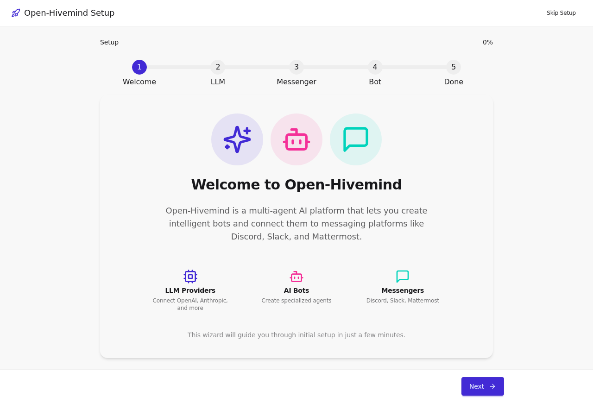

*   **Guided Flow**: Step-by-step configuration of LLMs, message platforms, and bot persona.
*   **Intelligent Defaults**: Suggests starting configurations for standard setups.

### Bots & Bot Management
Create and manage individual bot instances. Connect your AI assistants to platforms like Discord, Slack, Mattermost, and Telegram.


*   **Dedicated Create Page**: Access a full-page interface for creating bots at `/admin/bots/create`.
*   **Duplicate Bot**: Quickly clone an existing bot configuration.

*   **View Activity**: Monitor real-time logs and message flow for each bot via details modal.

*   **Link Persona / Providers**: Assign specific personalities, LLM providers, and platforms to the bot.
*   **Active Status**: Toggle bots on or off individually.

### Bot Creation Flow
The Bot Creation page provides a streamlined workflow for deploying new AI assistants.


1.  Navigate to the **Bots** section and click **Create Bot**.
2.  **Name & Description**: Use the AI Assist button to generate creative names and descriptions.
3.  **Visual Platform Selection**: Choose your target messaging platform using an intuitive grid interface.
4.  **Persona**: Choose a **Persona** from the dropdown; verify the details in the preview card.
5.  **Intelligent Defaults**: The system automatically detects and suggests the default LLM provider, simplifying configuration.
6.  Click **Create Bot** to deploy.

### [Bot Templates](/admin/bots/templates)
Quick-start templates to help you create bots faster.


*   **Template Gallery**: Browse pre-configured templates with specific personas and provider settings.
*   **Quick Create**: Use a template to pre-populate the bot creation form.
*   **Search & Filter**: Find templates by name or description using the search bar, or filter by platform, persona, and LLM provider.

### [LLM Providers](/admin/providers/llm)
Manage connections to Large Language Model providers.
*   **Dashboard Stats**: View total profiles, provider types, and system default status at a glance.
*   **Add Profile**: Configure reusable connection templates for services like OpenAI, Anthropic, Google Gemini, or local models (via Ollama/vLLM).
*   **System Default**: Define the fallback provider for bots without a specific profile.
*   **WebUI Intelligence**: Select a provider to power internal AI features.


### [Message Platforms](/admin/providers/message)
Connect your bots to messaging services.


*   **Discord**: Add your Discord Bot Token and configure server settings.
*   **Slack**: Set up your Slack App Token and Bot Token.
*   **Mattermost**: Configure your Mattermost URL and Bot Token.
*   **Telegram**: Add your Telegram Bot Token (obtained from @BotFather).
*   **Status**: Check connection health for each platform.

### [Memory Providers](/admin/providers/memory)
Configure memory providers for persistent context and knowledge storage.

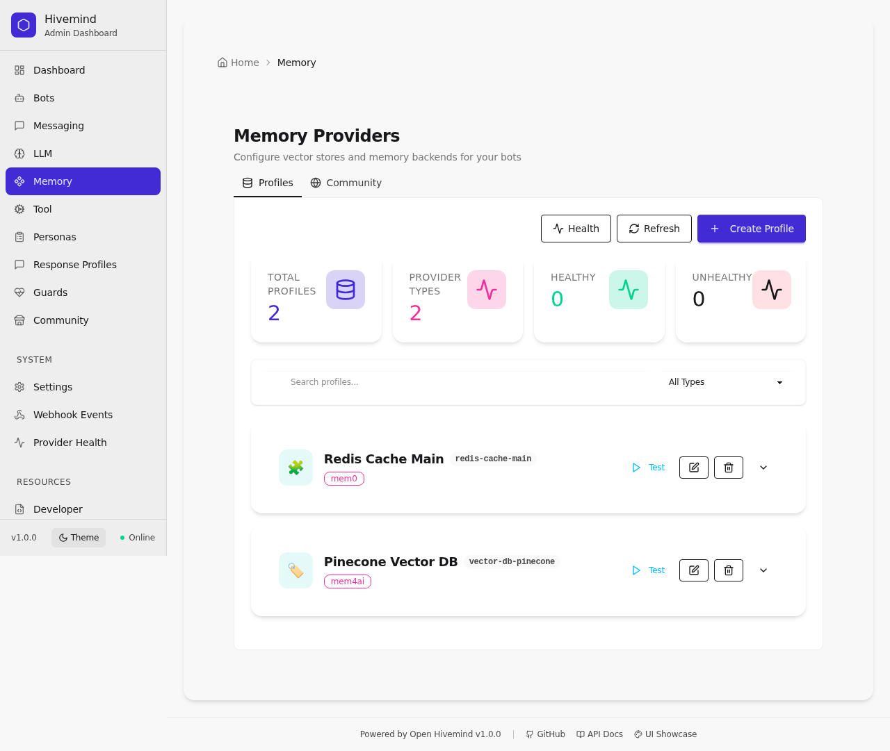

*   **Provider Types**: Support for Redis, Pinecone, and other database or vector storage backends.
*   **Configuration Details**: View connection parameters like host and environment.
*   **Bot Associations**: See which bots are actively utilizing each memory profile.
*   **System Default**: Define the fallback memory provider for bots without a specific profile.

### [Tool Providers](/admin/providers/tool)
Configure tool providers for extended capabilities and integrations.

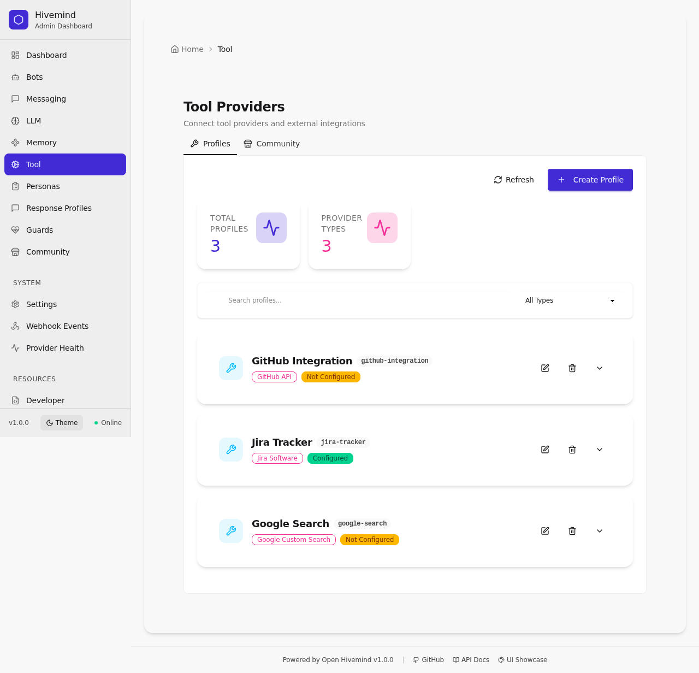

*   **Provider Integrations**: Add custom tools and APIs like GitHub, Jira, Google Search, etc.
*   **Manage Access**: Restrict or permit specific bots from accessing configured tools.

### Personas Management
The Personas (Beta) feature allows you to define distinct AI personalities and system prompts that can be assigned to one or more bots.


*   **Persona Library**: Create, edit, and delete custom personas. Built-in personas (like "Technical Assistant") are read-only but can be cloned.
*   **System Prompts**: Define the core instructions (System Prompt) for the AI.
*   **Bulk Assignment**: Assign a persona to multiple bots simultaneously.
*   **Real-time Updates**: Changes to a persona (e.g., updating the prompt) are immediately reflected across all assigned bots.

### [Guards](/admin/guards)
Set up safety and security boundaries.


*   **Content Filters**: Block specific words or phrases.
*   **Tool Permissions**: Control which MCP tools a bot is allowed to use.
*   **Input Sanitization**: Configure rules to prevent injection attacks or malicious inputs.

### [MCP Servers](/admin/mcp/servers)
Manage Model Context Protocol servers to extend bot capabilities with external tools.


*   **Server List**: View and manage connected MCP servers.
*   **Add Server**: Connect to a new MCP server by URL.
*   **Tool Discovery**: Automatically discover tools provided by connected servers.
*   **Connection Status**: Monitor server health and retry failed connections.

### [MCP Tools](/admin/mcp/tools)
Browse and manage tools available from your connected MCP servers.


*   **Tool Registry**: View all available tools, their descriptions, and server origins.
*   **Schema Inspection**: View input and output schemas for each tool.
*   **Tool Execution**: Test tools directly via **Form Mode** (based on the tool's schema) and **JSON Mode** for advanced input.
*   **Enable/Disable**: Toggle individual tools on or off.

### [Marketplace](/admin/marketplace)
Browse, install, and manage extensions and packages for your application.


*   **Package Marketplace**: Discover new providers, tools, and LLM integrations directly from the community and official sources.
*   **Install from URL**: Manually install a custom package by providing its GitHub repository URL.

*   **Filter & Manage**: Easily filter available packages by type (e.g., LLM, Tool) and update or uninstall existing ones.
---

## System

### [Plugin Security](/admin/plugin-security)
Monitor and manage security settings for all installed plugins.

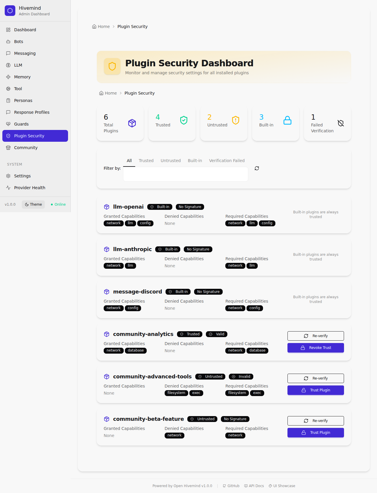

*   **Security Dashboard**: Visual overview of all installed plugins, their trust levels, and signature verification status.
*   **Filtering**: Easily view plugins by status such as Trusted, Untrusted, Built-in, or Verification Failed.

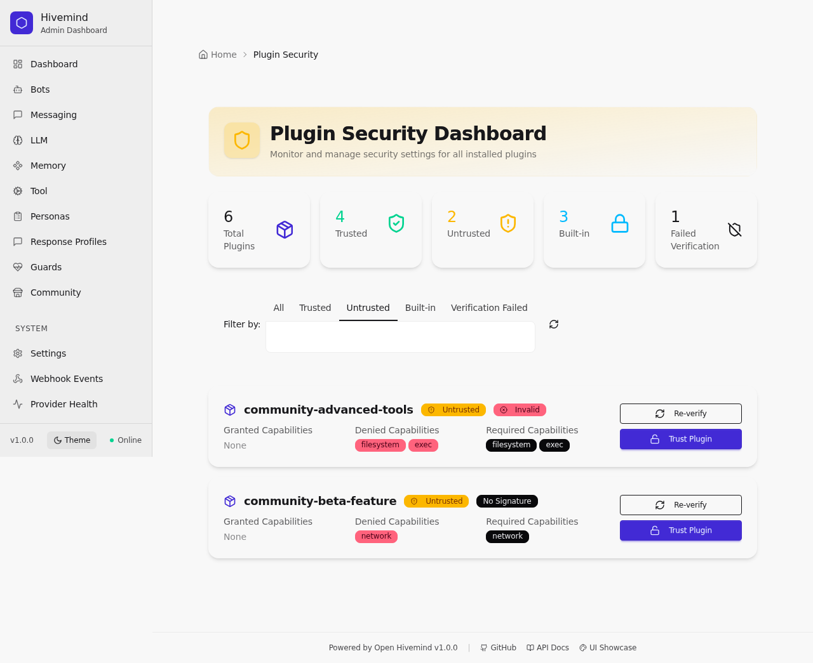

*   **Capability Management**: Review specific capabilities granted, denied, or required by each plugin (e.g., `network`, `llm`, `filesystem`).
*   **Actions**: Re-verify plugin signatures or manually trust/revoke trust for community plugins. (Built-in plugins are always trusted).

### Settings Overview
General system configuration.


*   **Instance Information**: Configure instance name and description.
*   **Localization**: Set the timezone and language preferences.
*   **Logging & Notifications**: Control system logging levels and notification preferences.
*   **System Limits**: Adjust maximum concurrent bots and response timeouts to manage resource usage.
*   **Health & Monitoring**: Enable and configure periodic health checks for external services.
*   **Deep Linking**: Settings tabs (General, Messaging, Security) are reflected in the URL for easy sharing.


*   **Saving Changes**: When updating settings, click "Save Settings". The button will show a loading state while applying changes.

### [Audit & Governance](/admin/audit)
The Enterprise Manager provides an interface to monitor security, compliance, multi-cloud setups, integrations, and crucially, audit events.


*   **Structured Audit Events**: View a detailed, structured log of system activities, actions, and resources.
*   **Search**: Use the input box to quickly filter audit events by user, resource, or general description.
*   **Action Filtering**: Narrow down events by specific actions (e.g., CREATE_BOT) using the combobox filter.

### [Webhook](/admin/integrations/webhook)

Configure incoming webhooks for external integrations.
*   **Endpoint Management**: specific URLs to trigger bot actions from external services.
*   **Security**: Manage webhook secrets and verification.

### [Monitoring](/admin/monitoring)
A comprehensive dashboard for tracking ecosystem status, bot status, and real-time activity.


*   **Ecosystem Status**: Overall health of the bot ecosystem and performance metrics.
*   **Infrastructure Health**: Real-time metrics for CPU, Memory, and API endpoint status.
*   **Bot Status**: Detailed connectivity and health scores for all configured bots.


### [System Health](/admin/health)
Monitor real-time service status and infrastructure health.

**Workflow: Monitoring API Status**
1. Navigate to **System Health** via the sidebar or Command Palette.
2. Check the **Service Health** cards to see the status of the Database, Memory Providers, etc.
3. Review the **Infrastructure Health** list for individual ping statuses to APIs and internal processes.
4. If a service is marked offline or degraded, hover over its status chip for additional error details.

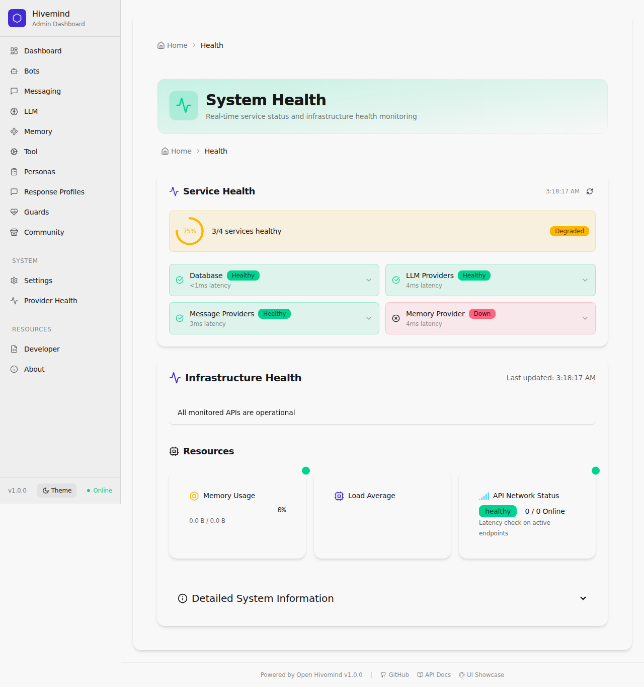

*   **Service Health**: View detailed health status, latency, and details for connected services like Database, LLM Providers, Memory Providers, and Message Providers.
*   **Infrastructure Health**: Overall system status and API endpoint checks.
*   **Resources**: Quick glance at memory usage, CPU load average, and API network status.

### [System Management](/admin/system-management)
Manage configuration, alerts, and system health.


*   **Alert Management**: Monitor and acknowledge system alerts.
*   **System Configuration**: Fine-tune settings like refresh intervals, log levels, and resource thresholds.
*   **Backup History**: Create and restore manual backups, and view automatic backup logs.
*   **Performance Tuning**: Analyze real-time API endpoint status and view system environment details.

### [Response Profiles](/admin/config/response-profiles)
Manage bot response behaviors and probabilities across different scenarios to create distinct personalities or functions for your bots.

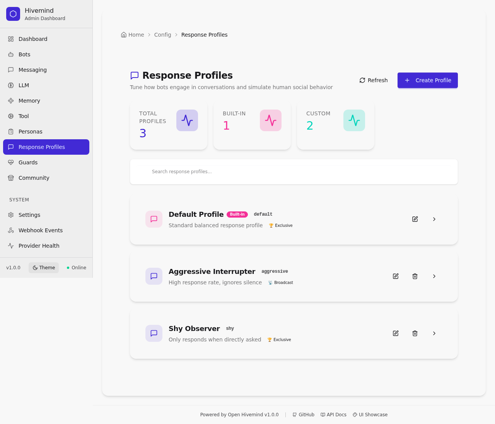
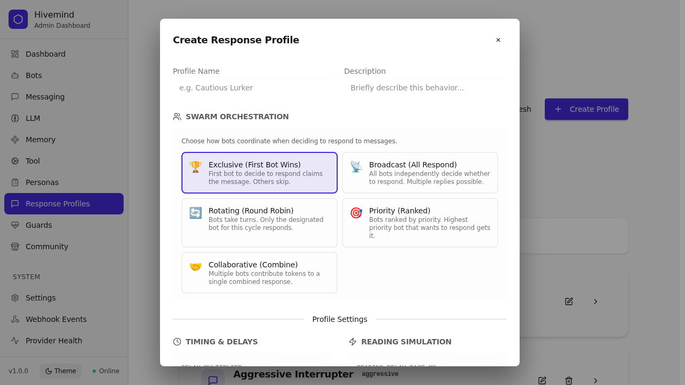

*   **Custom Profiles**: Create specialized behaviors dictating when and how bots engage in conversations.
*   **Swarm Modes**: Configure how bots operate within groups (e.g., Exclusive, Broadcast, Collaborative).
*   **Conditional Triggers**: Fine-tune base probabilities and bonuses based on context, like direct mentions or group activity.

### [Global Defaults](/admin/configuration)
Manage system and provider settings (convict configs) for your application and perform hot-reloads of configurations.


*   **View Settings**: Explore configurations categorized by sections (e.g., General, Server) with the total count of settings listed.
*   **Configuration Modification**: Update your configurations directly from the UI. Fields may be marked as **Sensitive**. Save changes using "Save Configuration" at the bottom of the active section.

### Demo Mode
When running the application without configuration (e.g., first launch), a **Demo Mode** banner appears.

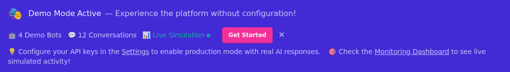

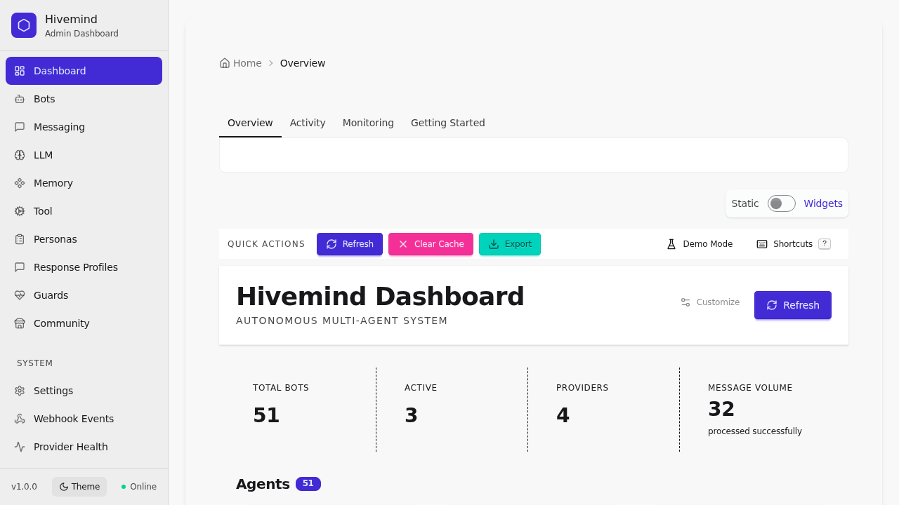

*   **Simulation**: The system simulates bot activity, conversations, and metrics to demonstrate platform capabilities.
*   **Visual Indicator**: A purple banner at the top of every page indicates that data is simulated and not persisted.
*   **Realistic data**: Demo mode seeds example bots, personas, and activity events so every page has content to explore.
*   **Exiting demo mode**: Complete the Setup Wizard (accessible via the banner's **Get Started** button or **Settings → Setup Wizard**) to switch to live configuration.

---

### Onboarding Wizard

The Setup Wizard guides you through the minimum configuration required to run a live bot. It launches automatically on first start and can be re-run at any time from **Settings → Rerun Setup Wizard**.

**Steps:**

| Step | What you configure |
|------|-------------------|
| 1. Welcome | Overview of what's needed |
| 2. Message Provider | Choose a platform (Discord, Slack, Mattermost) and enter credentials |
| 3. LLM Provider | Choose an AI provider (OpenAI, Flowise, OpenWebUI) and enter API key |
| 4. Create a Bot | Name your first bot and link it to the providers from steps 2 & 3 |
| 5. Review | Confirm configuration and launch |

*   If you skip a step the wizard marks it incomplete; you can still navigate forward and return later.
*   Configured providers are shown with a green check on the wizard summary page.

---

### Command Palette

Press **Ctrl + K** (or **⌘ K** on macOS) anywhere in the admin UI to open the Command Palette.

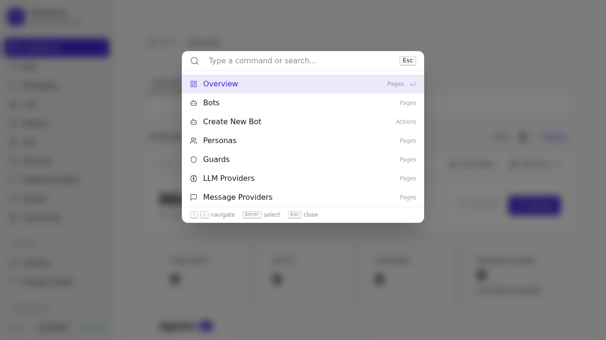

*   **Search**: Type any page name, route segment, or section keyword to filter instantly.
*   **Keyboard navigation**: Use **↑ / ↓** arrow keys to move between results, **Enter** to navigate, **Esc** to close.
*   **Screen reader support**: The palette announces the result count after each keystroke and traps focus within the dialog.

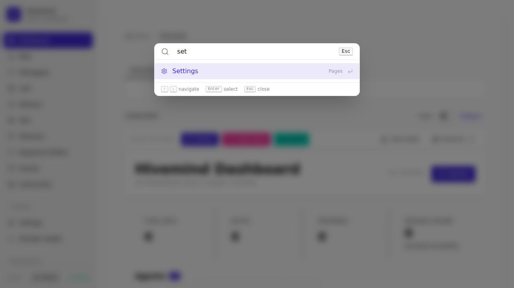

**Available shortcut keys:**

| Shortcut | Action |
|----------|--------|
| `Ctrl + K` | Open / close Command Palette |
| `F1` | Open Help & FAQ page |
| `Esc` | Close any open modal or palette |
| `↑ / ↓` | Navigate Command Palette results |
| `Enter` | Select highlighted Command Palette item |

---

## AI & Analytics

### [AI Dashboard](/admin/ai/dashboard)
Visual insights into your AI usage.
*   **Token Usage**: Track token consumption across different providers.
*   **Cost Estimation**: Estimate costs based on usage.
*   **Model Performance**: Compare response times and quality across models.

### [Analytics](/admin/analytics)
Historical data and trends.


*   **Conversation Volume**: Track message volume over time.
*   **User Engagement**: See active users and interaction frequency.

### [Anomaly Detection](/admin/ai/anomalies)
Identify unusual patterns in bot behavior.
*   **Spike Detection**: Alerts for sudden increases in message volume or errors.
*   **Behavioral Drifts**: Detect if a bot starts deviating from its persona.

### [AI Assistant](/admin/ai/chat)
An internal chat interface for admins to experiment with prompts and query system configurations.

---


### [Integrations](/admin/integrations/llm)
A detailed view of all system integrations and configurations.


*   **Integration Settings**: Manage specific settings for various providers like LLMs.

## Developer & Tools

### [Help & FAQ](/admin/help)
Access the comprehensive help guide, frequently asked questions, and keyboard shortcuts reference.

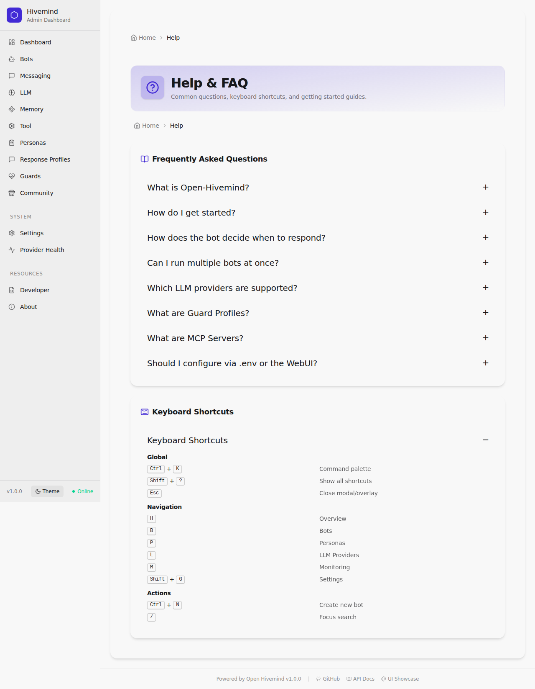
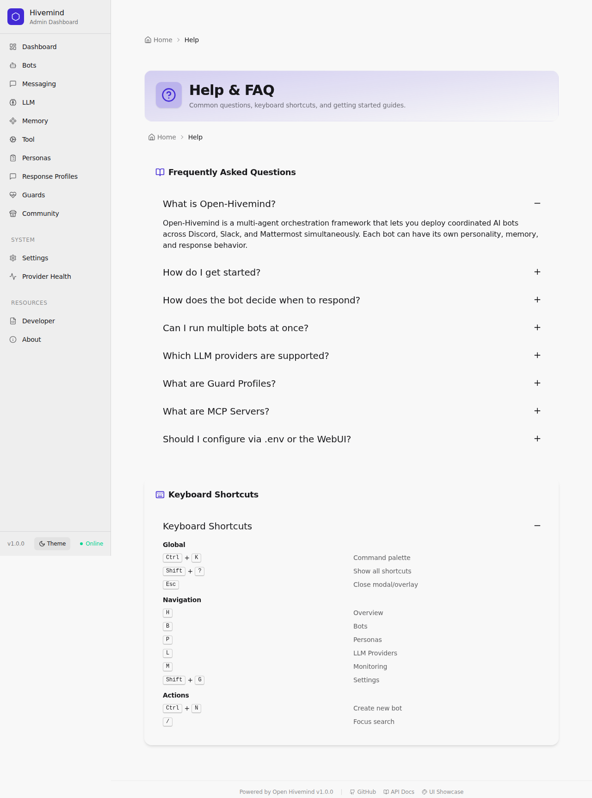

*   **FAQ**: Find answers to common questions about setting up and using the platform.
*   **Keyboard Shortcuts**: View global navigation and action shortcuts for power users.
*   **Getting Started**: Step-by-step guidance for new users configuring their first bot.

### [UI Components](/admin/showcase)
A reference for developers extending the WebUI.
*   **Component Library**: View available UI elements (buttons, inputs, cards) and their usage.

### [API Documentation](/admin/api-docs)
View dynamic API documentation generated from route introspection.

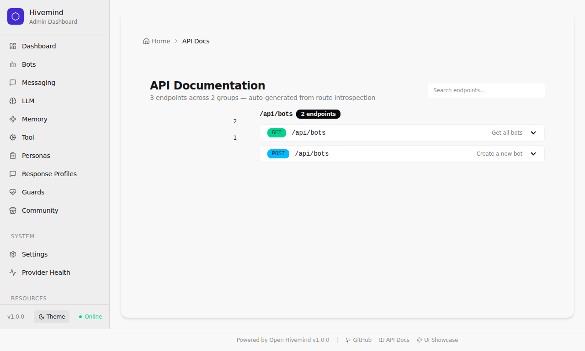

*   **Endpoint Browser**: Navigate through available API endpoints categorized by groups.
*   **Live Testing**: Test API calls directly from the browser with request bodies and parameters.
*   **cURL Examples**: Automatically generated cURL commands for each endpoint.

### [System Backups & Export](/admin/export)
Manage system configuration backups and download API documentation.


*   **Backup Overview**: View key metrics including total backups and storage usage.
*   **System Backups**: Create, restore, and delete full system configuration backups.
*   **Configuration Export**: Export the current running configuration as **JSON, YAML, or CSV**. Optional gzip compression and encryption are supported for exports.
*   **Configuration Import**: Upload a previously exported JSON, YAML, or CSV file (including compressed `.gz` and encrypted `.enc` variants) to restore configuration. Imports can be validated before being applied, giving a full round-trip between formats.
*   **API Specifications**: Download the OpenAPI specification (JSON/YAML) for development.

### [Sitemap](/admin/sitemap)
View the complete navigation structure of the application.


*   **Page Hierarchy & Filtering**: See all available pages and find specific ones by URL or description.
*   **Formats**: Download the sitemap in XML (for SEO) or JSON formats.

### [API Docs](/admin/api-docs)
Access detailed API documentation for programmatic interaction with the system.


*   **Endpoints**: Browse available endpoints and their specifications.
*   **Authentication**: Reference for API authentication methods.

### [Specifications](/admin/specs)
Browse and manage persisted specifications and design documents.

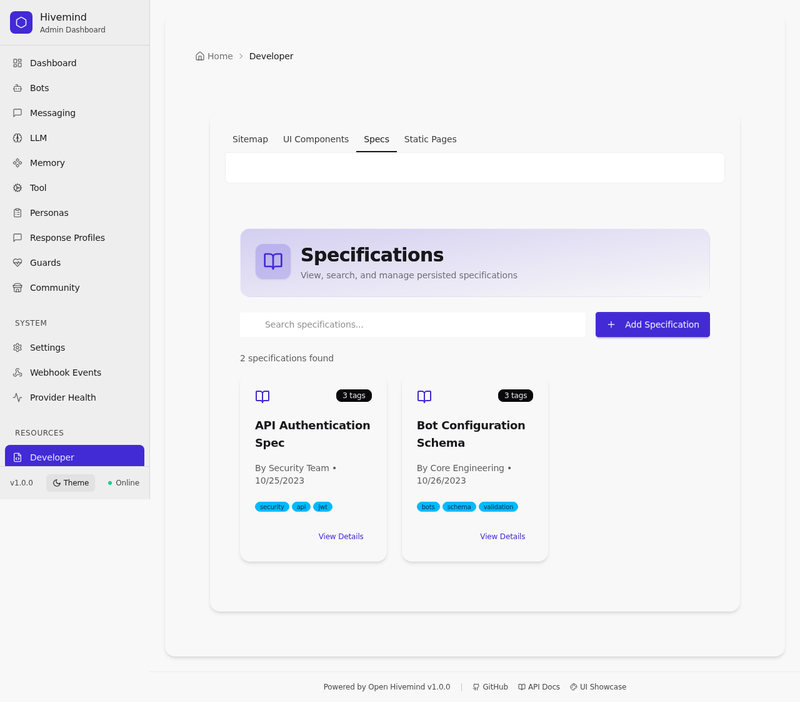

1. Navigate to **Developer & Tools > Specifications**.
2. View the listing of existing architectural and design specifications.
3. Click "View Details" to view a specific document's full contents.

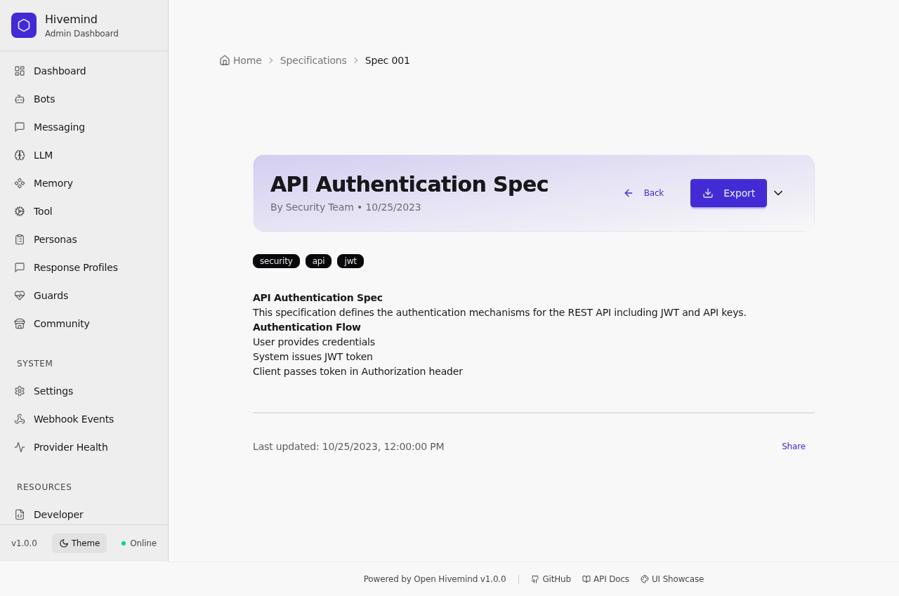

*   **Detailed View**: Read full specifications rendered in Markdown.
*   **Export**: Download specifications as Markdown, JSON, or YAML.

### [Static Pages](/admin/static)
Access a catalog of static HTML pages served by the system, like the Enhanced Homepage or Screensaver.

To view these static pages, navigate to **Developer & Tools > Static Pages** in the admin sidebar. Click on "Open Page" for any of the cards to launch the corresponding static page in a new browser tab.


*   **Enhanced Homepage**: Beautiful landing page with enhanced UI and animations.
*   **Loading Page**: Elegant loading screen with progress indicators.
*   **Screensaver**: Interactive screensaver display for idle states.

---

## Documentation Maintenance

### Generating Screenshots

To ensure this guide remains up-to-date, screenshots are automatically generated using Playwright.

**Automated Update (GitHub Actions):**
You can trigger the **Update Screenshots** workflow manually from the Actions tab in GitHub. This workflow captures screenshots dynamically on demand.

**Manual Update (Local):**
```bash
npm run generate-docs
```
This process runs the End-to-End (E2E) tests located in `tests/e2e/screenshot-*.spec.ts`, captures the UI state natively, and saves the images to `docs/screenshots/`.
