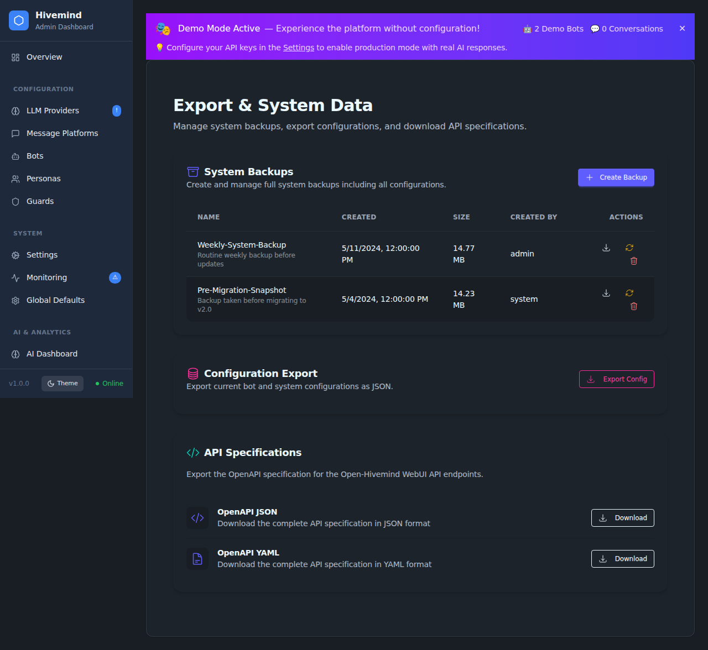
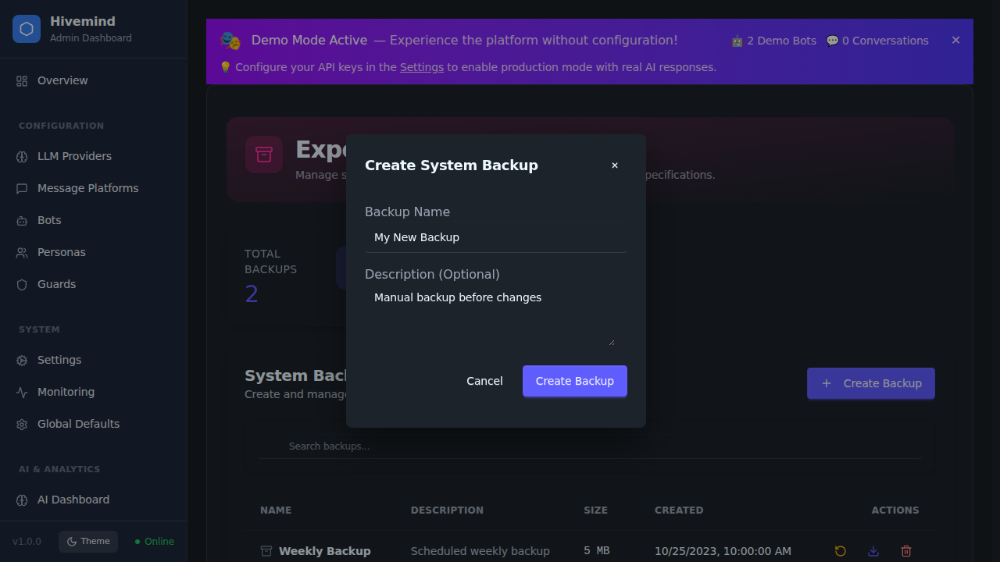

# Export & System Data

The **Export & System Data** page (`/admin/export`) provides tools for managing system backups, exporting configurations, and accessing API specifications. This is essential for disaster recovery, migration, and development.

## System Backups

Backups capture the full system configuration, including bots, personas, and settings.

### Creating a Backup
1.  Navigate to **Admin > Export & System Data**.
2.  Click the **Create Backup** button in the "System Backups" section.
3.  Enter a descriptive name and optional description in the modal.
4.  Click **Create Backup**.

### Managing Backups
The backup list displays all available backups with their size and creation date.
*   **Restore**: Click the <kbd>↺</kbd> icon to restore a backup. **Warning**: This will overwrite the current configuration.
*   **Download**: Click the <kbd>⬇</kbd> icon to download the backup file (`.json.gz`) to your local machine.
*   **Delete**: Click the <kbd>🗑</kbd> icon to permanently remove a backup.

## Configuration Export

You can export the current running configuration as a raw JSON file. This is useful for debugging or manual migration to another instance.

1.  Locate the **Configuration Export** card.
2.  Click **Export Config**.
3.  The `config-export-*.json` file will be downloaded.

### Formats & Round-Trip

The underlying import/export service (`/api/import-export/*`) supports full
round-trip in **JSON, YAML, and CSV**, with optional gzip compression and AES
encryption. Selected configuration IDs are exported via
`POST /api/import-export/export`, and a previously exported file is re-imported via
`POST /api/import-export/import` (multipart upload). Uploads accept `.json`,
`.yaml`/`.yml`, `.csv`, `.gz`, and `.enc` files up to 50 MB. Use
`POST /api/import-export/validate` to validate a file without importing it. See
[Bot, Audit, Import/Export & Webhook API Reference](../api/bot-and-system-endpoints.md)
for the full endpoint list.

## API Specifications

For developers integrating with Open Hivemind, the OpenAPI specification is available for download.

1.  Locate the **API Specifications** card.
2.  Click **JSON** or **YAML** to download the spec in your preferred format.
