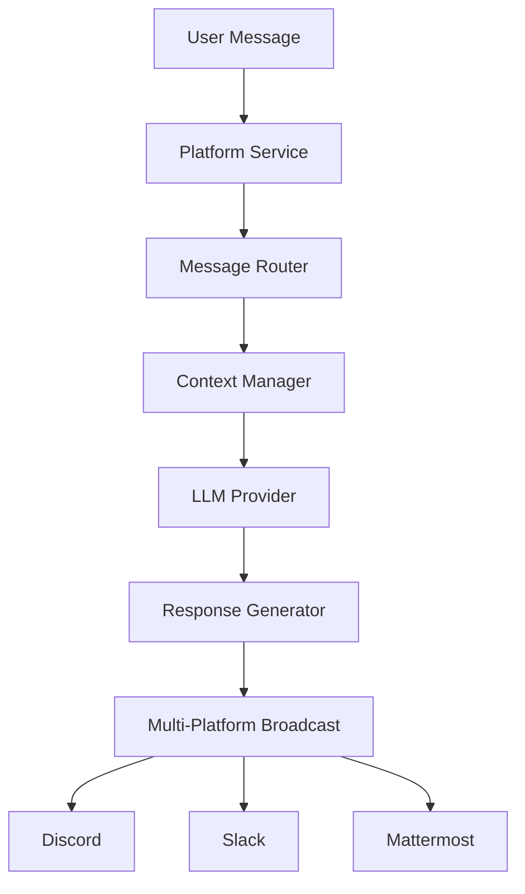

# 🏗️ Open-Hivemind Architecture

## Revolutionary Multi-Agent Design

### 🧠 The Hivemind Concept
Open-Hivemind operates as a **unified digital consciousness** where each bot instance functions as a neuron in a vast, interconnected brain.

```
┌─────────────────────────────────────────────────────────────┐
│                    UNIFIED HIVEMIND                         │
├─────────────────┬─────────────────┬─────────────────────────┤
│   Discord Bot   │   Slack Bot     │   Mattermost Bot        │
│   Instance #1   │   Instance #1   │   Instance #1           │
├─────────────────┼─────────────────┼─────────────────────────┤
│   Discord Bot   │   Slack Bot     │   Mattermost Bot        │
│   Instance #2   │   Instance #2   │   Instance #2           │
└─────────────────┴─────────────────┴─────────────────────────┘
                           │
                    ┌─────────────┐
                    │ LLM Provider │
                    │ OpenAI/Flowise │
                    └─────────────┘
```

### 🔄 Message Flow Architecture



### 🎯 Core Components

#### 🤖 Agent Layer
- **BotConfigurationManager**: Multi-instance bot orchestration
- **MessageHandler**: Unified message processing pipeline
- **ChannelRouter**: Intelligent channel prioritization

#### 🔌 Integration Layer
- **DiscordService**: Voice + text with multi-bot support
- **SlackService**: Socket mode + interactive blocks
- **MattermostService**: REST API integration

#### 🧠 Intelligence Layer
- **LLMProvider**: Pluggable AI backends (OpenAI, Flowise, OpenWebUI)
- **ConversationManager**: Context-aware dialogue management
- **ResponseGenerator**: Multi-modal response crafting

#### 🌐 Management Layer
- **WebUI Dashboard**: Real-time monitoring & configuration
- **ConfigurationService**: Hot-reload configuration management
- **MetricsCollector**: Performance analytics & insights

### 🚀 Scalability Features

#### Horizontal Scaling
- **Multi-Instance Deployment**: Scale bot instances independently
- **Load Balancing**: Distribute message processing across instances
- **Platform Isolation**: Platform failures don't affect others

#### Vertical Scaling
- **Async Processing**: Non-blocking message handling
- **Connection Pooling**: Efficient resource utilization
- **Memory Management**: Optimized for high-throughput scenarios

### 🔒 Security Architecture

#### Authentication & Authorization
- **Token Management**: Secure credential storage & rotation
- **Permission Validation**: Role-based access control
- **Rate Limiting**: Protection against abuse & spam

#### Data Protection
- **Message Encryption**: End-to-end security for sensitive data
- **Audit Logging**: Comprehensive activity tracking
- **Privacy Controls**: GDPR-compliant data handling

### 🎯 Design Principles

1. **Unified Consciousness**: All bots share collective intelligence
2. **Platform Agnostic**: Consistent behavior across all platforms
3. **Fault Tolerant**: Graceful degradation when services fail
4. **Developer Friendly**: Simple configuration, powerful capabilities
5. **Enterprise Ready**: Security, scalability, monitoring built-in

### 🔮 Future Architecture

#### Planned Enhancements
- **Distributed Deployment**: Kubernetes-native scaling
- **Edge Computing**: Regional bot deployment for low latency
- **AI Model Switching**: Dynamic LLM selection based on context
- **Blockchain Integration**: Decentralized bot governance

**Open-Hivemind: Where individual bots become a collective intelligence** 🧠✨