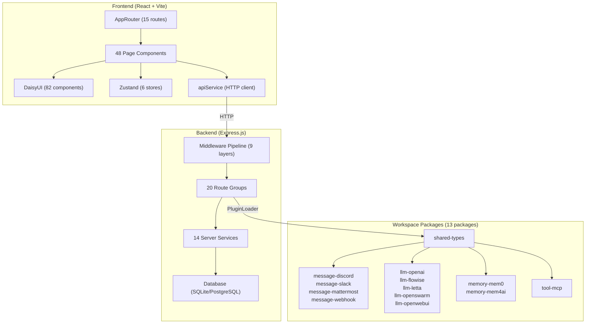
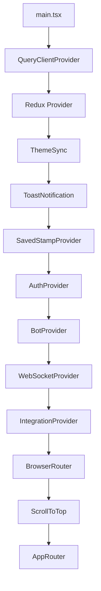
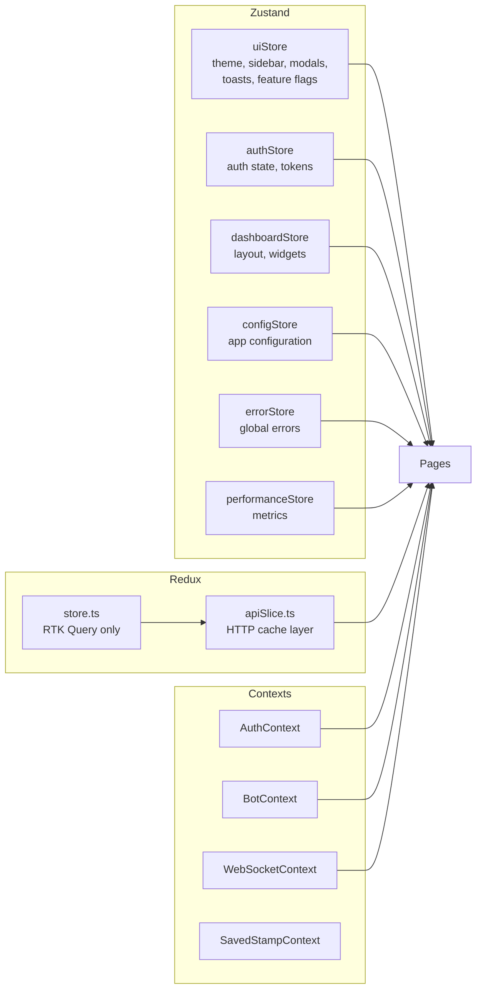
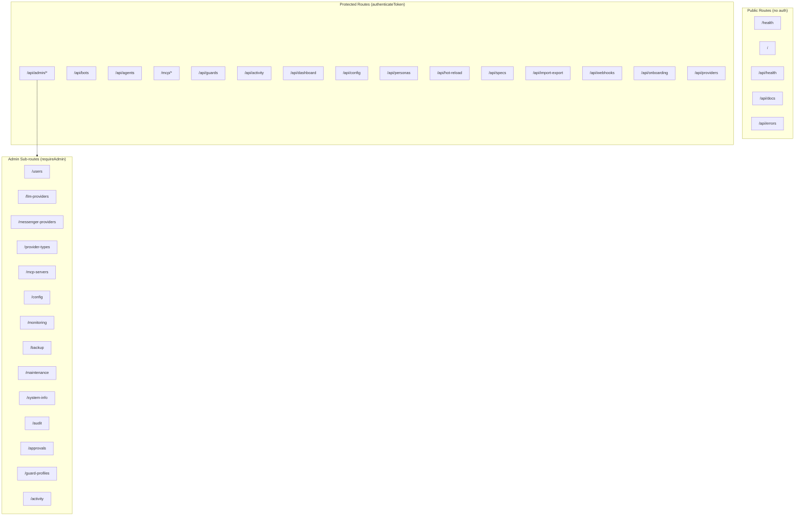
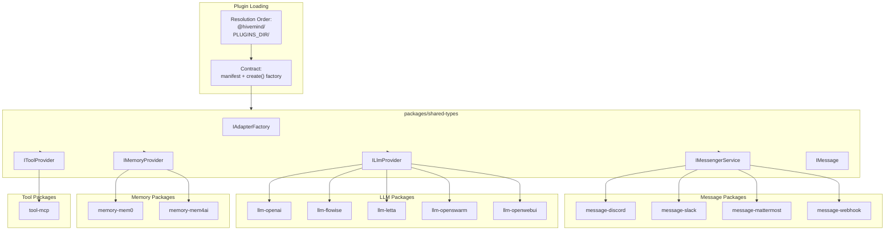
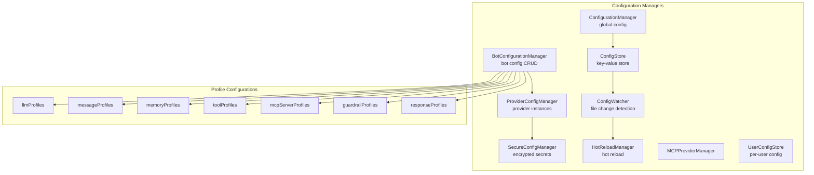
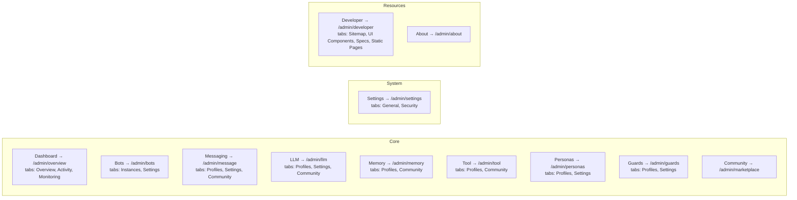
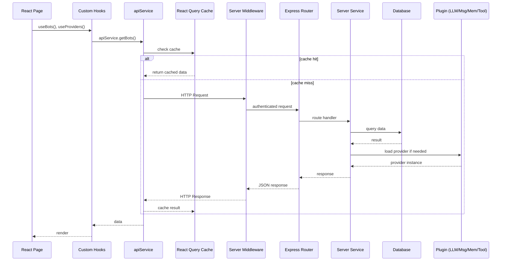
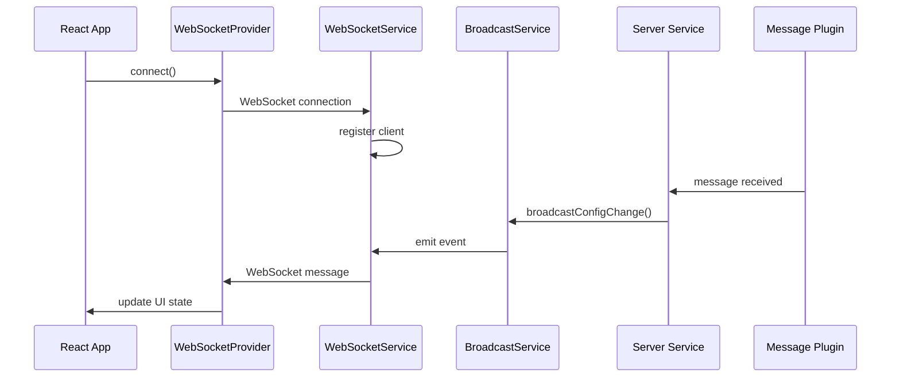

# Open-Hivemind Architecture

## System Overview

Open-Hivemind is a full-stack monorepo with a React frontend, Express.js backend, and plugin-based provider architecture.

```mermaid
graph TB
    subgraph Client["Frontend (React + Vite)"]
        Router["AppRouter (15 routes)"]
        Pages["48 Page Components"]
        DaisyUI["DaisyUI (82 components)"]
        Zustand["Zustand (6 stores)"]
        ApiService["apiService (HTTP client)"]
    end

    subgraph Server["Backend (Express.js)"]
        Middleware["Middleware Pipeline (9 layers)"]
        Routes["20 Route Groups"]
        Services["14 Server Services"]
        DB["Database (SQLite/PostgreSQL)"]
    end

    subgraph Plugins["Workspace Packages (13 packages)"]
        SharedTypes["shared-types"]
        MessagePkgs["message-discord<br/>message-slack<br/>message-mattermost<br/>message-webhook"]
        LlmPkgs["llm-openai<br/>llm-flowise<br/>llm-letta<br/>llm-openswarm<br/>llm-openwebui"]
        MemoryPkgs["memory-mem0<br/>memory-mem4ai"]
        ToolPkgs["tool-mcp"]
    end

    Router --> Pages
    Pages --> DaisyUI
    Pages --> Zustand
    Pages --> ApiService

    ApiService -->|HTTP| Middleware
    Middleware --> Routes
    Routes --> Services
    Services --> DB

    Routes -->|PluginLoader| SharedTypes
    SharedTypes --> MessagePkgs
    SharedTypes --> LlmPkgs
    SharedTypes --> MemoryPkgs
    SharedTypes --> ToolPkgs
```

## Frontend Architecture

### Provider Stack

```mermaid
graph TB
    Main["main.tsx"]
    QueryClient["QueryClientProvider"]
    Redux["Redux Provider"]
    ThemeSync["ThemeSync"]
    Toast["ToastNotification"]
    SavedStamp["SavedStampProvider"]
    Auth["AuthProvider"]
    Bot["BotProvider"]
    WS["WebSocketProvider"]
    Integration["IntegrationProvider"]
    BrowserRouter["BrowserRouter"]
    ScrollToTop["ScrollToTop"]
    AppRouter["AppRouter"]

    Main --> QueryClient
    QueryClient --> Redux
    Redux --> ThemeSync
    ThemeSync --> Toast
    Toast --> SavedStamp
    SavedStamp --> Auth
    Auth --> Bot
    Bot --> WS
    WS --> Integration
    Integration --> BrowserRouter
    BrowserRouter --> ScrollToTop
    ScrollToTop --> AppRouter
```

### Layout Hierarchy

```mermaid
graph TB
    AppRouter["AppRouter"]
    Public["Public Routes"]
    MainLayout["MainLayout (Dashboard)"]
    UberLayout["UberLayout (Admin)"]

    AppRouter -->|"/"| Public
    AppRouter -->|"/dashboard"| MainLayout
    AppRouter -->|"/admin/*"| UberLayout

    MainLayout --> DashboardPage["DashboardPage"]
    MainLayout --> StandaloneActivity["StandaloneActivity"]

    UberLayout --> Overview["OverviewPage (tabbed)"]
    UberLayout --> Bots["BotsPage"]
    UberLayout --> LLM["LLMProvidersPage"]
    UberLayout --> Messaging["MessageProvidersPage"]
    UberLayout --> Memory["MemoryProvidersPage"]
    UberLayout --> Tool["ToolProvidersPage"]
    UberLayout --> Personas["PersonasPage"]
    UberLayout --> Guards["GuardsPage"]
    UberLayout --> Marketplace["MarketplacePage"]
    UberLayout --> Settings["SystemSettings"]
    UberLayout --> Developer["DeveloperPage (tabbed)"]
    UberLayout --> Analytics["AnalyticsDashboard"]
    UberLayout --> Export["ExportPage"]
    UberLayout --> Audit["AuditPage"]
    UberLayout --> Health["AdminHealthPage"]
    UberLayout --> About["AboutPage"]
```

### State Management

```mermaid
graph LR
    subgraph Zustand
        uiStore["uiStore<br/>theme, sidebar, modals,<br/>toasts, feature flags"]
        authStore["authStore<br/>auth state, tokens"]
        dashboardStore["dashboardStore<br/>layout, widgets"]
        configStore["configStore<br/>app configuration"]
        errorStore["errorStore<br/>global errors"]
        perfStore["performanceStore<br/>metrics"]
    end

    subgraph Redux
        store["store.ts<br/>RTK Query only"]
        apiSlice["apiSlice.ts<br/>HTTP cache layer"]
    end

    subgraph Contexts
        AuthCtx["AuthContext"]
        BotCtx["BotContext"]
        WSCtx["WebSocketContext"]
        SavedCtx["SavedStampContext"]
    end

    uiStore --> Pages
    authStore --> Pages
    dashboardStore --> Pages
    configStore --> Pages
    errorStore --> Pages
    perfStore --> Pages

    store --> apiSlice
    apiSlice --> Pages

    AuthCtx --> Pages
    BotCtx --> Pages
    WSCtx --> Pages
```

## Backend Architecture

### Middleware Pipeline

```mermaid
graph LR
    Req["HTTP Request"]
    Corr["correlationMiddleware<br/>request tracing"]
    Sec["securityHeaders<br/>CSP, HSTS, X-Frame"]
    CORS["CORS<br/>configurable origins"]
    Rate["rateLimiter<br/>per-IP rate limiting"]
    Body["bodyParser<br/>JSON, 10mb limit"]
    CSRF["csrf<br/>token validation"]
    Audit["auditLogger<br/>request logging"]
    Router["Express Router"]

    Req --> Corr
    Corr --> Sec
    Sec --> CORS
    CORS --> Rate
    Rate --> Body
    Body --> CSRF
    CSRF --> Audit
    Audit --> Router
```

### Route Tree

```mermaid
graph TB
    subgraph Public["Public Routes (no auth)"]
        Health["/health"]
        Sitemap["/"]
        ApiHealth["/api/health"]
        ApiDocs["/api/docs"]
        ApiErrors["/api/errors"]
    end

    subgraph Protected["Protected Routes (authenticateToken)"]
        Admin["/api/admin/*"]
        Bots["/api/bots"]
        Agents["/api/agents"]
        MCP["/api/mcp/*"]
        Guards["/api/guards"]
        Activity["/api/activity"]
        Dashboard["/api/dashboard"]
        Config["/api/config"]
        Personas["/api/personas"]
        HotReload["/api/hot-reload"]
        Specs["/api/specs"]
        ImportExport["/api/import-export"]
        Webhooks["/api/webhooks"]
        Onboarding["/api/onboarding"]
        Providers["/api/providers"]
    end

    subgraph AdminSub["Admin Sub-routes (requireAdmin)"]
        Users["/users"]
        LLMProviders["/llm-providers"]
        MessengerProviders["/messenger-providers"]
        ProviderTypes["/provider-types"]
        MCPServers["/mcp-servers"]
        AdminConfig["/config"]
        Monitoring["/monitoring"]
        Backup["/backup"]
        Maintenance["/maintenance"]
        SystemInfo["/system-info"]
        AuditLog["/audit"]
        Approvals["/approvals"]
        GuardProfiles["/guard-profiles"]
        MCP["/mcp/*"]
        AdminActivity["/activity"]
    end

    Admin --> AdminSub
```

### Service Layer

```mermaid
graph TB
    subgraph Services["Server Services"]
        BotConfig["BotConfigService<br/>CRUD + versioning"]
        BotMetrics["BotMetricsService<br/>performance metrics"]
        ActivityLogger["ActivityLogger<br/>event logging"]
        ConfigValidator["ConfigurationValidator<br/>schema validation"]
        ConfigVersion["ConfigurationVersionService<br/>versioning"]
        ConfigImport["ConfigurationImportExportService"]
        ConfigTemplate["ConfigurationTemplateService"]
        RealTimeValid["RealTimeValidationService"]
        RealTimeNotif["RealTimeNotificationService"]
        ToolHistory["ToolExecutionHistoryService"]
        ToolPrefs["ToolPreferencesService"]
        UsageTracker["UsageTrackerService"]
        WebSocket["WebSocketService"]
    end

    subgraph WebSocketSub["WebSocket Sub-services"]
        ConnMgr["ConnectionManager"]
        Broadcast["BroadcastService"]
        EventHandlers["EventHandlers"]
    end

    WebSocket --> ConnMgr
    WebSocket --> Broadcast
    WebSocket --> EventHandlers
```

### Database Layer

```mermaid
graph TB
    subgraph Database["Database Layer"]
        DBMgr["DatabaseManager<br/>primary interface"]
        ConnMgr["ConnectionManager<br/>connection pooling"]
        SchemaMgr["SchemaManager<br/>schema management"]
        MigrationMgr["MigrationManager<br/>migrations"]
        QueryBuilder["queryBuilder<br/>query utilities"]
    end

    subgraph Repositories["Repositories (DAO)"]
        BotConfigRepo["BotConfigRepository"]
        MessageRepo["MessageRepository"]
        ApprovalRepo["ApprovalRepository"]
        Anomaly Repo["AnomalyRepository"]
        Decision Repo["DecisionRepository"]
        AIFeedback Repo["AIFeedbackRepository"]
    end

    DBMgr --> ConnMgr
    DBMgr --> SchemaMgr
    DBMgr --> MigrationMgr
    DBMgr --> QueryBuilder
    DBMgr --> BotConfigRepo
    DBMgr --> MessageRepo
    DBMgr --> ApprovalRepo
    DBMgr --> Anomaly Repo
    DBMgr --> Decision Repo
    DBMgr --> AIFeedback Repo
```

## Plugin Architecture

```mermaid
graph TB
    subgraph PluginLoader["Plugin Loading"]
        Resolution["Resolution Order:<br/>@hivemind/<name><br/>PLUGINS_DIR/<name>"]
        Contract["Contract:<br/>manifest + create() factory"]
    end

    subgraph SharedTypes["packages/shared-types"]
        IFactory["IAdapterFactory"]
        IMessenger["IMessengerService"]
        ILlm["ILlmProvider"]
        IMemory["IMemoryProvider"]
        ITool["IToolProvider"]
        IMessage["IMessage"]
    end

    subgraph MessageProviders["Message Packages"]
        Discord["message-discord"]
        Slack["message-slack"]
        Mattermost["message-mattermost"]
        Webhook["message-webhook"]
    end

    subgraph LlmProviders["LLM Packages"]
        OpenAI["llm-openai"]
        Flowise["llm-flowise"]
        Letta["llm-letta"]
        OpenSwarm["llm-openswarm"]
        OpenWebUI["llm-openwebui"]
    end

    subgraph MemoryProviders["Memory Packages"]
        Mem0["memory-mem0"]
        Mem4ai["memory-mem4ai"]
    end

    subgraph ToolProviders["Tool Packages"]
        MCP["tool-mcp"]
    end

    Resolution --> Contract
    Contract --> SharedTypes
    SharedTypes --> IMessenger
    SharedTypes --> ILlm
    SharedTypes --> IMemory
    SharedTypes --> ITool

    IMessenger --> Discord
    IMessenger --> Slack
    IMessenger --> Mattermost
    IMessenger --> Webhook

    ILlm --> OpenAI
    ILlm --> Flowise
    ILlm --> Letta
    ILlm --> OpenSwarm
    ILlm --> OpenWebUI

    IMemory --> Mem0
    IMemory --> Mem4ai

    ITool --> MCP
```

## Configuration Management

```mermaid
graph TB
    subgraph ConfigManagers["Configuration Managers"]
        BotConfigMgr["BotConfigurationManager<br/>bot config CRUD"]
        ProviderCfgMgr["ProviderConfigManager<br/>provider instances"]
        SecureCfgMgr["SecureConfigManager<br/>encrypted secrets"]
        ConfigMgr["ConfigurationManager<br/>global config"]
        ConfigStore["ConfigStore<br/>key-value store"]
        ConfigWatcher["ConfigWatcher<br/>file change detection"]
        HotReload["HotReloadManager<br/>hot reload"]
        MCPProviderMgr["MCPProviderManager"]
        UserCfgStore["UserConfigStore<br/>per-user config"]
    end

    subgraph Profiles["Profile Configurations"]
        LLMProfiles["llmProfiles"]
        MessageProfiles["messageProfiles"]
        MemoryProfiles["memoryProfiles"]
        ToolProfiles["toolProfiles"]
        MCPServerProfiles["mcpServerProfiles"]
        GuardProfiles["guardrailProfiles"]
        ResponseProfiles["responseProfiles"]
    end

    BotConfigMgr --> ProviderCfgMgr
    ProviderCfgMgr --> SecureCfgMgr
    ConfigMgr --> ConfigStore
    ConfigStore --> ConfigWatcher
    ConfigWatcher --> HotReload

    BotConfigMgr --> LLMProfiles
    BotConfigMgr --> MessageProfiles
    BotConfigMgr --> MemoryProfiles
    BotConfigMgr --> ToolProfiles
    BotConfigMgr --> MCPServerProfiles
    BotConfigMgr --> GuardProfiles
    BotConfigMgr --> ResponseProfiles
```

## Navigation Structure

```mermaid
graph LR
    subgraph Core["Core"]
        NavDashboard["Dashboard → /admin/overview<br/>tabs: Overview, Activity, Monitoring"]
        NavBots["Bots → /admin/bots<br/>tabs: Instances, Settings"]
        NavMessaging["Messaging → /admin/message<br/>tabs: Profiles, Settings, Community"]
        NavLLM["LLM → /admin/llm<br/>tabs: Profiles, Settings, Community"]
        NavMemory["Memory → /admin/memory<br/>tabs: Profiles, Community"]
        NavTool["Tool → /admin/tool<br/>tabs: Profiles, Community"]
        NavPersonas["Personas → /admin/personas<br/>tabs: Profiles, Settings"]
        NavGuards["Guards → /admin/guards<br/>tabs: Profiles, Settings"]
        NavMarketplace["Community → /admin/marketplace"]
    end

    subgraph System["System"]
        NavSettings["Settings → /admin/settings<br/>tabs: General, Security"]
    end

    subgraph Resources["Resources"]
        NavDeveloper["Developer → /admin/developer<br/>tabs: Sitemap, UI Components, Specs, Static Pages"]
        NavAbout["About → /admin/about"]
    end
```

## Data Flow

### Request Flow: Client to Server

```mermaid
sequenceDiagram
    participant Page as React Page
    participant Hooks as Custom Hooks
    participant API as apiService
    participant Query as React Query Cache
    participant Middleware as Server Middleware
    participant Router as Express Router
    participant Service as Server Service
    participant DB as Database
    participant Plugin as Plugin (LLM/Msg/Mem/Tool)

    Page->>Hooks: useBots(), useProviders()
    Hooks->>API: apiService.getBots()
    API->>Query: check cache
    alt cache hit
        Query-->>API: return cached data
    else cache miss
        API->>Middleware: HTTP Request
        Middleware->>Router: authenticated request
        Router->>Service: route handler
        Service->>DB: query data
        DB-->>Service: result
        Service->>Plugin: load provider if needed
        Plugin-->>Service: provider instance
        Service-->>Router: response
        Router-->>Middleware: JSON response
        Middleware-->>API: HTTP Response
        API-->>Query: cache result
    end
    API-->>Hooks: data
    Hooks-->>Page: render
```

### WebSocket Real-Time Flow

```mermaid
sequenceDiagram
    participant Client as React App
    participant WSClient as WebSocketProvider
    participant WSServer as WebSocketService
    participant Broadcast as BroadcastService
    participant Service as Server Service
    participant Plugin as Message Plugin

    Client->>WSClient: connect()
    WSClient->>WSServer: WebSocket connection
    WSServer->>WSServer: register client

    Plugin->>Service: message received
    Service->>Broadcast: broadcastConfigChange()
    Broadcast->>WSServer: emit event
    WSServer->>WSClient: WebSocket message
    WSClient->>Client: update UI state
```

## Key Statistics

| Metric | Count |
|---|---|
| Frontend pages | 48 |
| DaisyUI components | 82 |
| Navigation items | 15 |
| Custom hooks | 31 |
| Zustand stores | 6 |
| Server route groups | 20 |
| Server services | 14 |
| Database repositories | 6 |
| Configuration managers | 9 |
| Profile types | 7 |
| Workspace packages | 13 |
| Middleware layers | 9 |

## Key Files Reference

| Layer | File |
|---|---|
| Client entry | `src/client/src/main.tsx` |
| App shell | `src/client/src/App.tsx` |
| Router | `src/client/src/router/AppRouter.tsx` |
| Admin layout | `src/client/src/layouts/UberLayout.tsx` |
| Navigation config | `src/client/src/config/navigation.tsx` |
| UI store | `src/client/src/store/uiStore.ts` |
| API service | `src/client/src/services/api.ts` |
| Server entry | `src/server/server.ts` |
| Admin routes | `src/server/routes/admin/index.ts` |
| Bot config service | `src/server/services/BotConfigService.ts` |
| WebSocket service | `src/server/services/WebSocketService.ts` |
| Bot manager | `src/managers/BotManager.ts` |
| Provider config manager | `src/config/ProviderConfigManager.ts` |
| Bot config manager | `src/config/BotConfigurationManager.ts` |
| Plugin loader | `src/plugins/PluginLoader.ts` |
| Shared types | `packages/shared-types/src/index.ts` |
