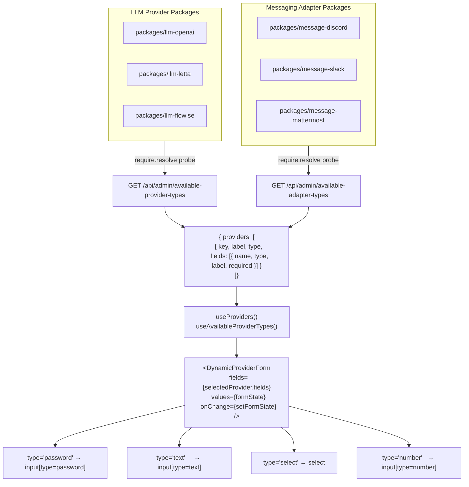

# Provider & Adapter Package Architecture

This document explains how LLM providers and messaging adapters are structured as independent packages, how the backend discovers them at runtime, and how the WebUI renders their configuration forms dynamically — with no hardcoded provider lists anywhere.

## Core principle

The core application has **zero knowledge** of any specific provider or adapter. It only knows about the interfaces `ILlmProvider` and `IAdapterFactory`. Everything else — OpenAI, Letta, Discord, Slack — lives in a separate package under `packages/` and is loaded via `require()` at runtime.

## Runtime discovery flow



The UI **never** has a hardcoded list of provider names. It asks the backend what is available, and renders whatever comes back.

## Current implementation status

| Layer | Status | Location |
|---|---|---|
| Runtime package loading | ✅ Done | `src/llm/getLlmProvider.ts`, `src/message/management/getMessengerProvider.ts` |
| `GET /api/admin/llm-providers` | ⚠️ Returns configured instances, not available types | `src/server/routes/admin/llmProviders.ts` |
| `GET /api/admin/available-provider-types` | ❌ Not yet implemented | needs adding to `src/server/routes/admin/llmProviders.ts` |
| Frontend field schemas | ⚠️ Exist but frontend-only | `src/client/src/provider-configs/schemas/` |
| `ProviderConfigModal` dynamic form | ✅ Done | `src/client/src/components/ProviderConfiguration/ProviderConfigModal.tsx` |
| `useProviders()` hook | ✅ Done | `src/client/src/hooks/useProviders.ts` |
| Hardcoded provider lists in UI | ❌ Still present | `AgentConfigurator`, `LlmProfileManager`, `Dashboard`, `ConfigurationEditor` |

## How to add a new LLM provider package

### 1. Create the package

```
packages/llm-myprovider/
├── package.json          # name: "@hivemind/llm-myprovider"
├── tsconfig.json         # extends ../../tsconfig.json
└── src/
    ├── index.ts          # exports MyProvider, MyProviderConfig
    └── myProvider.ts     # implements ILlmProvider
```

### 2. Implement `ILlmProvider`

```typescript
import type { ILlmProvider } from '@hivemind/shared-types';

export class MyProvider implements ILlmProvider {
  name = 'myprovider';
  supportsChatCompletion() { return true; }
  supportsCompletion() { return false; }

  async generateChatCompletion(message, history, metadata) {
    // call your API here
    return responseText;
  }

  async generateCompletion(message) {
    throw new Error('Not supported');
  }
}
```

### 3. Register in the backend loader

In `src/llm/getLlmProvider.ts`, add a case to both the configured-providers switch and the legacy-env switch:

```typescript
case 'myprovider':
  const { MyProvider } = require('@hivemind/llm-myprovider');
  instance = new MyProvider(config.config);
  break;
```

### 4. Add the frontend field schema

In `src/client/src/provider-configs/schemas/myprovider.ts`:

```typescript
import type { ProviderConfigSchema } from '../types';

export const myProviderSchema: ProviderConfigSchema = {
  key: 'myprovider',
  label: 'My Provider',
  type: 'llm',
  docsUrl: 'https://myprovider.example.com/docs',
  fields: [
    { name: 'apiKey',   type: 'password', label: 'API Key',  required: true },
    { name: 'endpoint', type: 'text',     label: 'Endpoint', default: 'https://api.myprovider.example.com' },
  ],
};
```

Then export it from `src/client/src/provider-configs/index.ts`:

```typescript
export * from './schemas/myprovider';
// and add to PROVIDER_SCHEMAS:
import { myProviderSchema } from './schemas/myprovider';
const PROVIDER_SCHEMAS = {
  // ...existing...
  myprovider: myProviderSchema,
};
```

### 5. Register in the backend available-types endpoint

In `src/server/routes/admin/llmProviders.ts`, add your provider to the `KNOWN_LLM_TYPES` array in `GET /available-provider-types`:

```typescript
{ key: 'myprovider', label: 'My Provider', pkg: '@hivemind/llm-myprovider' }
```

The endpoint uses `require.resolve(pkg)` to check if the package is actually installed before including it in the response. If the package isn't present, it won't appear in the UI.

## How to add a new messaging adapter package

Same pattern, but implement `IAdapterFactory` from `@hivemind/shared-types` and register in `src/message/management/getMessengerProvider.ts`.

```typescript
export interface IAdapterFactory {
  metadata: { name: string; version: string; platform: string };
  createService(config: unknown, dependencies: AdapterDependencies): IMessengerService;
}
```

## What the UI does with this

`ProviderConfigModal` already renders fields dynamically from `getProviderSchema(selectedType)`. The only remaining work is ensuring the dropdown that populates `selectedType` comes from `GET /api/admin/available-provider-types` rather than a hardcoded array. Once that endpoint exists, every component that currently has a hardcoded list should be replaced with a call to `useAvailableProviderTypes()`.

## Key files reference

| File | Purpose |
|---|---|
| `src/llm/getLlmProvider.ts` | Runtime LLM provider instantiation via `require()` |
| `src/message/management/getMessengerProvider.ts` | Runtime adapter instantiation |
| `src/server/routes/admin/llmProviders.ts` | REST endpoints for provider CRUD and discovery |
| `src/client/src/provider-configs/index.ts` | Frontend field schema registry |
| `src/client/src/hooks/useProviders.ts` | React hook for fetching available providers |
| `src/client/src/services/providerService.ts` | fetch() wrappers for provider API calls |
| `src/client/src/components/ProviderConfiguration/ProviderConfigModal.tsx` | Dynamic form renderer |
| `packages/shared-types/src/ILlmProvider.ts` | Interface all LLM providers must implement |
| `packages/shared-types/src/IAdapterFactory.ts` | Interface all adapters must implement |
