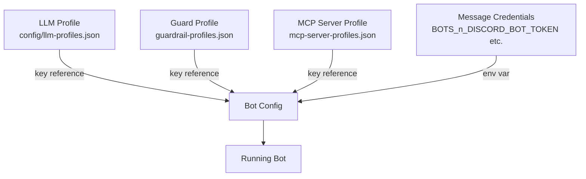

# Bot Configuration

Navigation: [Docs Index](../README.md) | [Configuration Overview](overview.md) | [Multi-Instance Setup](multi-instance-setup.md)


This guide covers how to configure bots in Open Hivemind using the recommended profile-based approach, with notes on legacy direct-key configuration for CI and secret-injection scenarios.

## Overview

Bot configuration is split into three tiers. Profiles are reusable — one profile can be shared across many bots, making it easy to update a model or API key in one place.



| Tier | What it holds | Where it lives |
|---|---|---|
| **LLM Profile** | Provider, model, API key, base URL | `config/llm-profiles.json` or Web UI → Providers → LLM |
| **Message Provider Credentials** | Platform tokens (Discord, Slack, Mattermost) | `BOTS_{n}_*` env vars — no profile system yet |
| **Bot Config** | References tier 1+2 by key, plus persona/behaviour settings | `BOTS_{n}_*` env vars, `config/bots/{name}.json`, or Web UI → Bots |

**Priority order** (highest wins):
1. `BOTS_{name}_*` environment variables
2. Profile settings (fill gaps not covered by env vars)
3. `config/bots/{name}.json` file defaults

---

## Recommended approach: Profile-based

### Step 1 — Create an LLM Profile

Via Web UI: **Providers → LLM → Add New**

Or add an entry to `config/llm-profiles.json`:

```json
{
  "production-gpt4o": {
    "provider": "openai",
    "config": {
      "apiKey": "sk-...",
      "model": "gpt-4o",
      "baseURL": "https://api.openai.com/v1"
    }
  },
  "internal-flowise": {
    "provider": "flowise",
    "config": {
      "apiKey": "flowise-key",
      "apiBaseUrl": "http://localhost:3000/api/v1",
      "chatflowId": "your-chatflow-id"
    }
  }
}
```

The key (e.g. `"production-gpt4o"`) is what bots reference via `BOTS_{n}_LLM_PROFILE`.

### Step 2 — Configure message provider credentials

Message provider credentials are still per-bot env vars — there is no profile system for these yet.

**Discord**

| Variable | Description |
|---|---|
| `BOTS_{n}_DISCORD_BOT_TOKEN` | Bot token from Discord Developer Portal |
| `BOTS_{n}_DISCORD_CLIENT_ID` | Application client ID |
| `BOTS_{n}_DISCORD_GUILD_ID` | Guild (server) ID |
| `BOTS_{n}_DISCORD_CHANNEL_ID` | Default channel ID |

**Slack**

| Variable | Description |
|---|---|
| `BOTS_{n}_SLACK_BOT_TOKEN` | Bot token (`xoxb-...`) |
| `BOTS_{n}_SLACK_APP_TOKEN` | App-level token (`xapp-...`) |
| `BOTS_{n}_SLACK_SIGNING_SECRET` | Signing secret for request verification |
| `BOTS_{n}_SLACK_JOIN_CHANNELS` | Comma-separated channel IDs to join on startup |

**Mattermost**

| Variable | Description |
|---|---|
| `BOTS_{n}_MATTERMOST_SERVER_URL` | Mattermost server URL |
| `BOTS_{n}_MATTERMOST_TOKEN` | Personal access token or bot token |
| `BOTS_{n}_MATTERMOST_CHANNEL` | Default channel name |

### Step 3 — Create a bot

Via Web UI: **Bots → Create**

Or define the bot in your `.env` file using profile references instead of raw API keys:

```bash
# Register bot names
BOTS=alpha

# Bot type
BOTS_ALPHA_MESSAGE_PROVIDER=discord
BOTS_ALPHA_LLM_PROVIDER=openai

# Profile references (recommended — no secrets in bot config)
BOTS_ALPHA_LLM_PROFILE=production-gpt4o
BOTS_ALPHA_MCP_GUARD_PROFILE=owner-only

# Message provider credentials (still env vars)
BOTS_ALPHA_DISCORD_BOT_TOKEN=your-discord-token-here
BOTS_ALPHA_DISCORD_CLIENT_ID=your-client-id
BOTS_ALPHA_DISCORD_GUILD_ID=your-guild-id

# Identity — Persona ID string (resolved by PersonaManager to a full Persona object)
BOTS_ALPHA_PERSONA=helpful-assistant
# Optional: override the persona's built-in systemPrompt with a standalone instruction
# BOTS_ALPHA_SYSTEM_INSTRUCTION=You are a helpful assistant focused on internal tooling.
```

---

## Persona and system instruction

### `BOTS_{n}_PERSONA`

Stores a **Persona ID string**. At runtime, PersonaManager resolves this ID to a full Persona object containing:

- `id`, `name`, `description`, `category`, `traits`
- `systemPrompt` — the full prompt template for this bot's voice and character
- `responseProfileId` — optional reference to a response profile (overrides bot-level settings)
- `avatarStyle`, `isBuiltIn`

Personas are reusable templates — the same persona can be assigned to multiple bots. They are managed in the Web UI under **Personas** or defined in `config/personas/`.

### `BOTS_{n}_SYSTEM_INSTRUCTION`

An **independent system instruction** that can override or supplement the persona's `systemPrompt`. When both a persona and a system instruction are set, the system instruction takes precedence over the persona's built-in `systemPrompt`. Use this when you need to give a specific bot a custom prompt without creating an entirely new persona.

---

## Optional profiles

In addition to `LLM_PROFILE`, bots support several other profile types. All are referenced by string key.

### MCP Guard Profile (`MCP_GUARD_PROFILE`)

Controls which users can invoke MCP tools.

**Variable:** `BOTS_{n}_MCP_GUARD_PROFILE`
**Applied by:** `applyGuardrailProfile()` in `botConfigFactory.ts`
**Profile file:** `config/guardrail-profiles.json`

```bash
BOTS_ALPHA_MCP_GUARD_PROFILE=owner-only
```

```json
{
  "owner-only": {
    "mcpGuard": {
      "mode": "owner",
      "allowlist": ["123456789", "987654321"]
    }
  }
}
```

### MCP Server Profile (`MCP_SERVER_PROFILE`)

Injects a predefined set of MCP servers into a bot.

**Variable:** `BOTS_{n}_MCP_SERVER_PROFILE`
**Applied by:** `applyMcpServerProfile()` in `botConfigFactory.ts`
**Profile file:** `config/mcp-server-profiles.json`

```bash
BOTS_ALPHA_MCP_SERVER_PROFILE=internal-tools
```

### Memory Profile (`MEMORY_PROFILE`)

Configures the bot's memory/context backend.

**Variable:** `BOTS_{n}_MEMORY_PROFILE`
**Applied by:** `MemoryManager` at runtime.
**Profile file:** `config/memory-profiles.json`

Memory profiles define which provider (e.g., `mem0`, `mem4ai`) and configuration (API keys, URLs) a bot uses to persist and retrieve long-term conversation context.

### Response Profile (`RESPONSE_PROFILE`)

Overrides per-bot `MESSAGE_*` settings (unsolicited response chance, typing delays, response length, etc.). This is **not** the same as a persona — response profiles contain only messaging-behaviour overrides, not character or prompt data.

**Variable:** `BOTS_{n}_RESPONSE_PROFILE`
**Applied by:** `getMessageSetting()` at runtime.

Built-in profiles: `eager` (higher response chance, shorter delays) and `cautious` (lower chance, longer delays). Custom profiles can be defined in `config/response-profiles.json`.

**Unsolicited response configuration operates at three levels** (highest priority wins):

| Level | Mechanism | Where defined |
|---|---|---|
| Per-persona | `Persona.responseProfileId` | Reference to a profile; editable via Web UI → Personas |
| Per-bot | `BOTS_{n}_RESPONSE_PROFILE` → response profile key | `config/response-profiles.json` or built-ins |
| Global | `MESSAGE_UNSOLICITED_BASE_CHANCE`, `MESSAGE_UNSOLICITED_ADDRESSED`, etc. | Environment variables / `.env` (via `schemas/messageSchema.ts`) |

---

## Legacy: direct provider env vars

You can still set provider credentials directly on a bot without an LLM profile. This is useful for CI pipelines or secret-injection environments where you want to avoid maintaining a `llm-profiles.json` file.

Direct vars **override** any LLM profile — the profile is not applied when the corresponding env var is already set.

```bash
BOTS_ALPHA_LLM_PROVIDER=openai
BOTS_ALPHA_OPENAI_API_KEY=sk-...         # overrides any LLM_PROFILE
BOTS_ALPHA_OPENAI_MODEL=gpt-4o
```

```bash
BOTS_ALPHA_LLM_PROVIDER=flowise
BOTS_ALPHA_FLOWISE_API_KEY=flowise-key   # overrides any LLM_PROFILE
BOTS_ALPHA_FLOWISE_API_BASE_URL=http://localhost:3000/api/v1
```

```bash
BOTS_ALPHA_LLM_PROVIDER=letta
BOTS_ALPHA_LETTA_AGENT_ID=agent-uuid     # overrides any LLM_PROFILE
```

---

## Multi-bot example

Two bots sharing an infrastructure: one Discord bot backed by a centralised OpenAI profile, one Slack bot backed by an internal Flowise instance.

```bash
# Register bots
BOTS=discord-alpha,slack-support

# --- discord-alpha ---
BOTS_DISCORD_ALPHA_MESSAGE_PROVIDER=discord
BOTS_DISCORD_ALPHA_LLM_PROVIDER=openai
BOTS_DISCORD_ALPHA_LLM_PROFILE=production-gpt4o      # uses shared profile
BOTS_DISCORD_ALPHA_MCP_GUARD_PROFILE=owner-only
BOTS_DISCORD_ALPHA_PERSONA=helpful-assistant
BOTS_DISCORD_ALPHA_DISCORD_BOT_TOKEN=discord-token-alpha
BOTS_DISCORD_ALPHA_DISCORD_CLIENT_ID=client-id-alpha
BOTS_DISCORD_ALPHA_DISCORD_GUILD_ID=guild-id-alpha
BOTS_DISCORD_ALPHA_DISCORD_CHANNEL_ID=channel-id-alpha

# --- slack-support ---
BOTS_SLACK_SUPPORT_MESSAGE_PROVIDER=slack
BOTS_SLACK_SUPPORT_LLM_PROVIDER=flowise
BOTS_SLACK_SUPPORT_LLM_PROFILE=internal-flowise      # uses shared profile
BOTS_SLACK_SUPPORT_MCP_GUARD_PROFILE=allowlist-support
BOTS_SLACK_SUPPORT_PERSONA=support-agent
BOTS_SLACK_SUPPORT_SLACK_BOT_TOKEN=xoxb-...
BOTS_SLACK_SUPPORT_SLACK_APP_TOKEN=xapp-...
BOTS_SLACK_SUPPORT_SLACK_SIGNING_SECRET=signing-secret
BOTS_SLACK_SUPPORT_SLACK_JOIN_CHANNELS=C01234567,C09876543
```

---

## Profile reference

| Profile type | Variable | Profile file | Applied by | Status |
|---|---|---|---|---|
| LLM | `BOTS_{n}_LLM_PROFILE` | `config/llm-profiles.json` | `applyLlmProfile()` | Fully applied |
| MCP Guard | `BOTS_{n}_MCP_GUARD_PROFILE` | `config/guardrail-profiles.json` | `applyGuardrailProfile()` | Fully applied |
| MCP Server | `BOTS_{n}_MCP_SERVER_PROFILE` | `config/mcp-server-profiles.json` | `applyMcpServerProfile()` | Fully applied |
| Memory | `BOTS_{n}_MEMORY_PROFILE` | `config/memory-profiles.json` | `MemoryManager` | Fully applied |
| Response | `BOTS_{n}_RESPONSE_PROFILE` | `config/response-profiles.json` | `getMessageSetting()` | Fully applied; built-ins: `eager`, `cautious` |

---

## Troubleshooting

### No bots found

- Check that `BOTS` is set and lists your bot names (comma-separated, case-insensitive).
- Verify at least one message provider credential is set for each bot.
- Check `config/bots/` for JSON files that match the bot names.

### Profile not applied

- Confirm the profile key in `BOTS_{n}_LLM_PROFILE` (etc.) exactly matches a key in the corresponding profile JSON file.
- Direct `BOTS_{n}_OPENAI_API_KEY`-style vars take priority over the profile — remove them if you want the profile to win.

### Debug mode

Enable verbose startup logging:

```bash
DEBUG=app:BotConfigurationManager npm run dev
```

### Validate configuration via API

With the server running (`npm run dev`):

```bash
# List all resolved bot configs
curl -s http://localhost:3028/api/config/bots | jq .

# Inspect a specific bot
curl -s http://localhost:3028/api/config/bots/alpha | jq .
```
