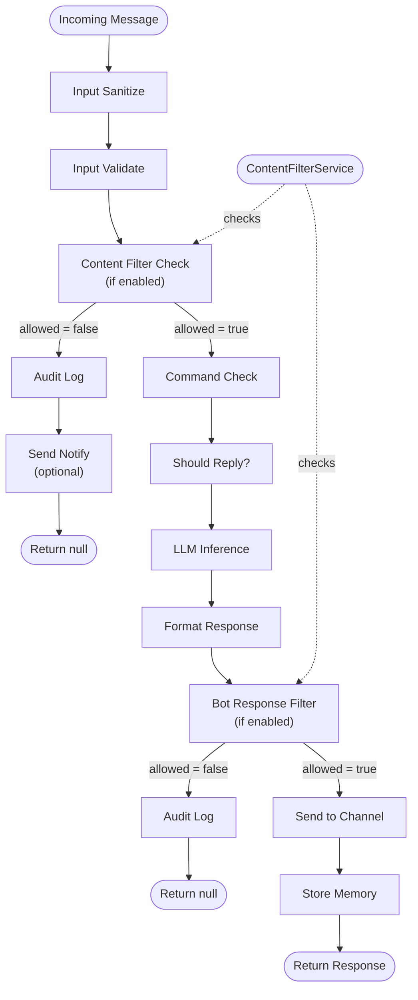
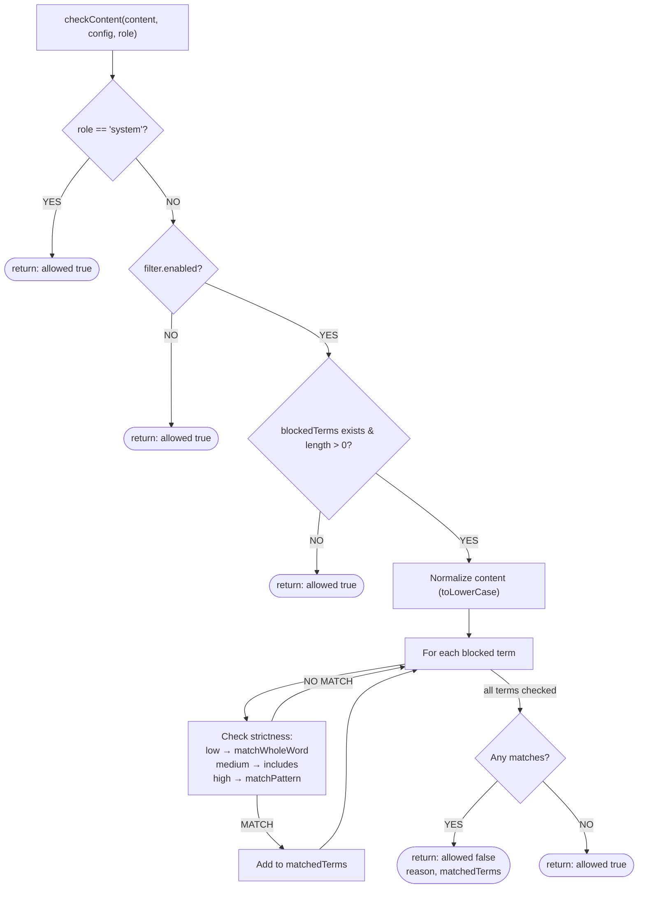
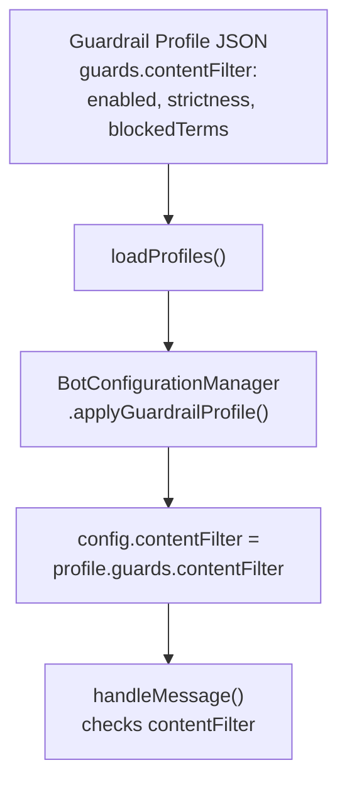
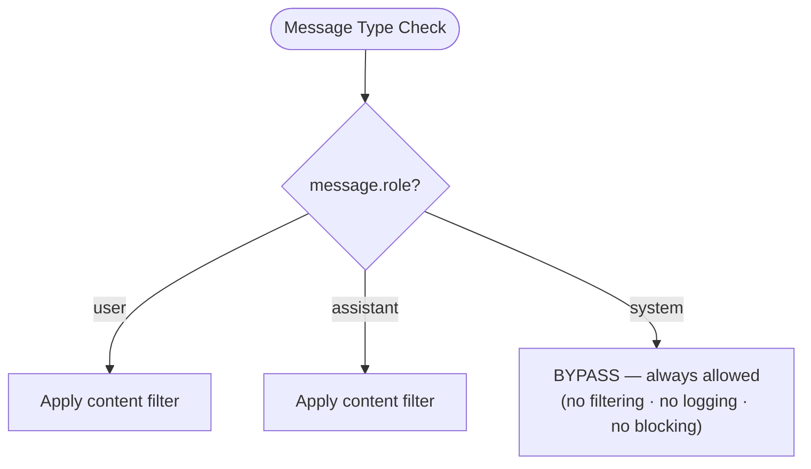
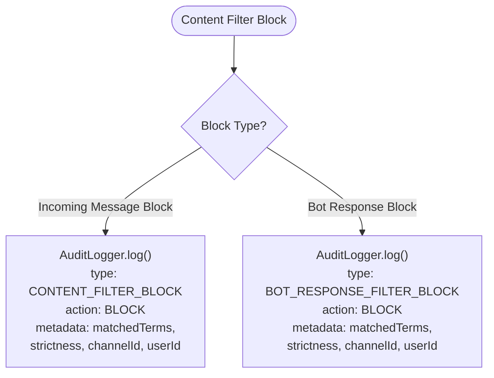
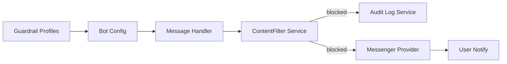

# Content Filter Flow Diagram

## Message Processing Pipeline

## Content Filter Decision Flow

## Strictness Level Matching

| Strictness | Function | Match Logic | Example term: `spam` |
|---|---|---|---|
| **LOW** | `matchWholeWord` | Word-boundary regex `\b{term}\b`, case-insensitive | ✅ `"spam here"` · ❌ `"spammy"` · ✅ `"SPAM"` |
| **MEDIUM** | `content.includes` | Case-insensitive substring | ✅ `"spam here"` · ✅ `"spammy"` · ✅ `"SPAM"` |
| **HIGH** | `matchPattern` | Substring + deobfuscation (`0→o`, `1→i`, `3→e`, `4→a`, `5→s`, `7→t`, `8→b`, `$→s`, `@→a`, `!→i`, strips `*_- `) | ✅ `"sp4m"` · ✅ `"$pam"` · ✅ `"s p a m"` |

## Configuration Flow

## System Message Bypass

## Audit Logging Flow

## Performance Profile

Processing time per message:

| Configuration | 10 terms | 100 terms |
|---|---|---|
| Filter disabled | ~0.001 ms | ~0.001 ms |
| Low strictness | ~0.1–0.5 ms | ~0.5–2 ms |
| Medium strictness | ~0.2–0.8 ms | ~0.8–3 ms |
| High strictness | ~0.5–1.5 ms | ~1.5–5 ms |

> **Notes:** O(n) complexity — no database queries, no network calls, minimal memory overhead.

## Integration Points

