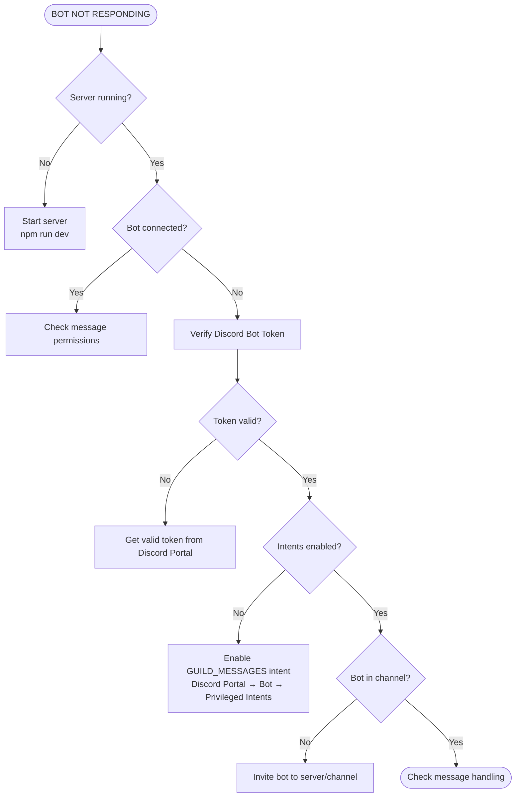
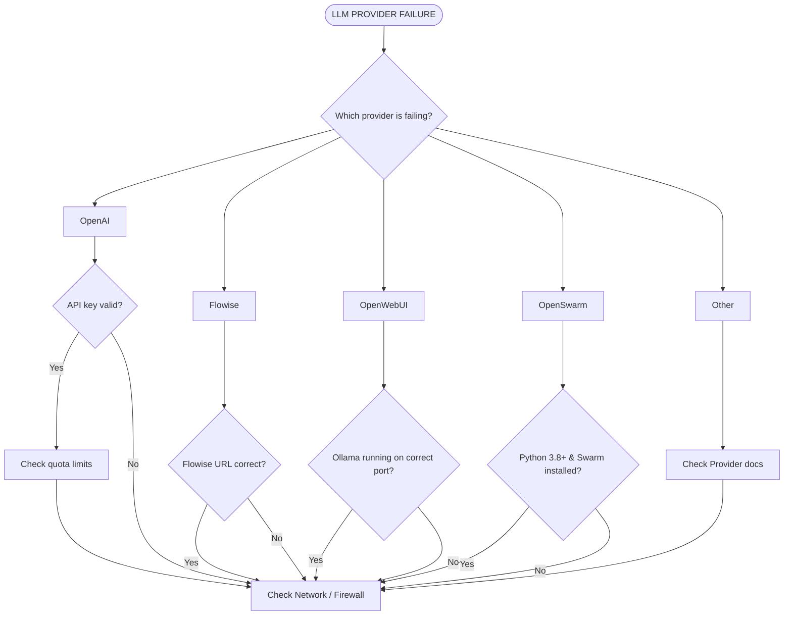
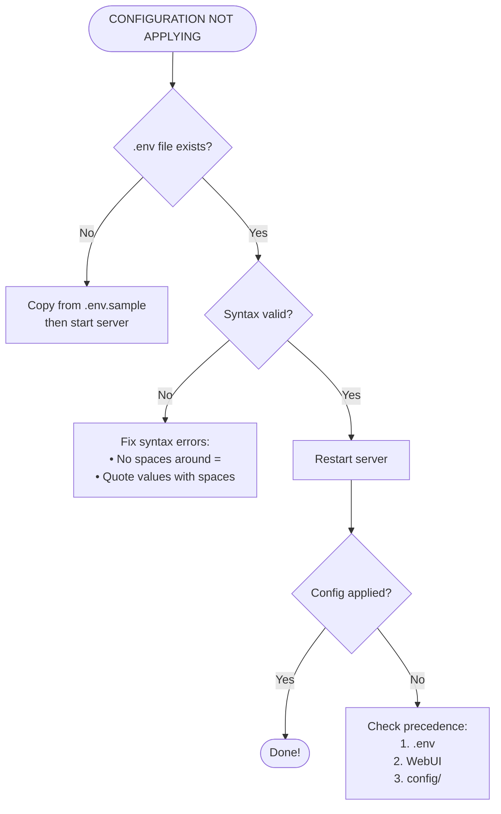
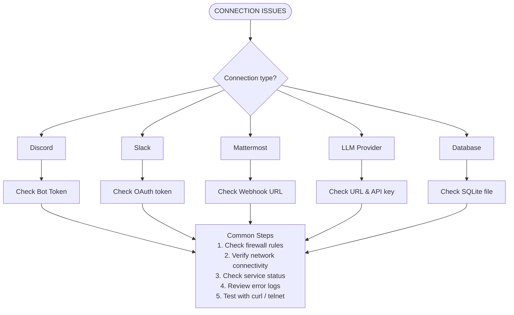
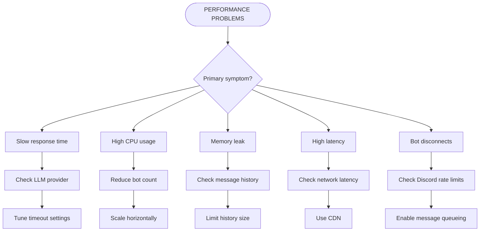

# Troubleshooting Decision Trees

Navigation: [Docs Index](../README.md) | [FAQ](../getting-started/faq.md) | [Swarm Troubleshooting](../configuration/swarm-troubleshooting.md)

---

## Overview

This guide provides interactive decision trees to help diagnose and resolve complex configuration issues. Follow the paths based on your observed symptoms.

---

## Decision Tree 1: Bot Not Responding



---

## Decision Tree 2: LLM Provider Failures



---

## Decision Tree 3: Configuration Issues



---

## Decision Tree 4: Connection Issues



---

## Decision Tree 5: Performance Problems



---

## Quick Reference: Common Fixes

### Bot Won't Start
```bash
# 1. Check token format (no spaces)
DISCORD_BOT_TOKEN=token1,token2

# 2. Verify intents enabled
# Discord Portal → Bot → Privileged Intents

# 3. Check logs
DEBUG=app:discordService npm run dev
```

### LLM Not Responding
```bash
# 1. Verify credentials
echo $OPENAI_API_KEY

# 2. Test connectivity
curl https://api.openai.com/v1/models

# 3. Check provider logs
DEBUG=app:openAiProvider npm run dev
```

### Configuration Not Applying
```bash
# 1. Restart server
# 2. Clear overrides
rm config/user/bot-overrides.json

# 3. Verify env file
cat .env | grep -v "^#"
```

### Rate Limiting
```bash
# 1. Set rate limits
MESSAGE_RATE_LIMIT_PER_CHANNEL=10

# 2. Add delays
MESSAGE_MIN_DELAY_MS=1000
```

---

## Diagnostic Commands

### Check Server Status
```bash
curl http://localhost:3028/api/health
```

### Check Bot Status
```bash
curl http://localhost:3028/api/bots \
  -H "Authorization: Bearer <token>"
```

### Check LLM Status
```bash
curl http://localhost:3028/api/config/llm-status \
  -H "Authorization: Bearer <token>"
```

### Enable Debug Logging
```bash
# All components
DEBUG=app:* npm run dev

# Specific component
DEBUG=app:getLlmProvider,app:discordService npm run dev
```

### Test Provider Connection
```bash
# OpenAI
curl https://api.openai.com/v1/models \
  -H "Authorization: Bearer $OPENAI_API_KEY"

# Flowise
curl http://localhost:3000/api/v1/chatflows

# OpenWebUI
curl http://localhost:8080/api/models
```

---
