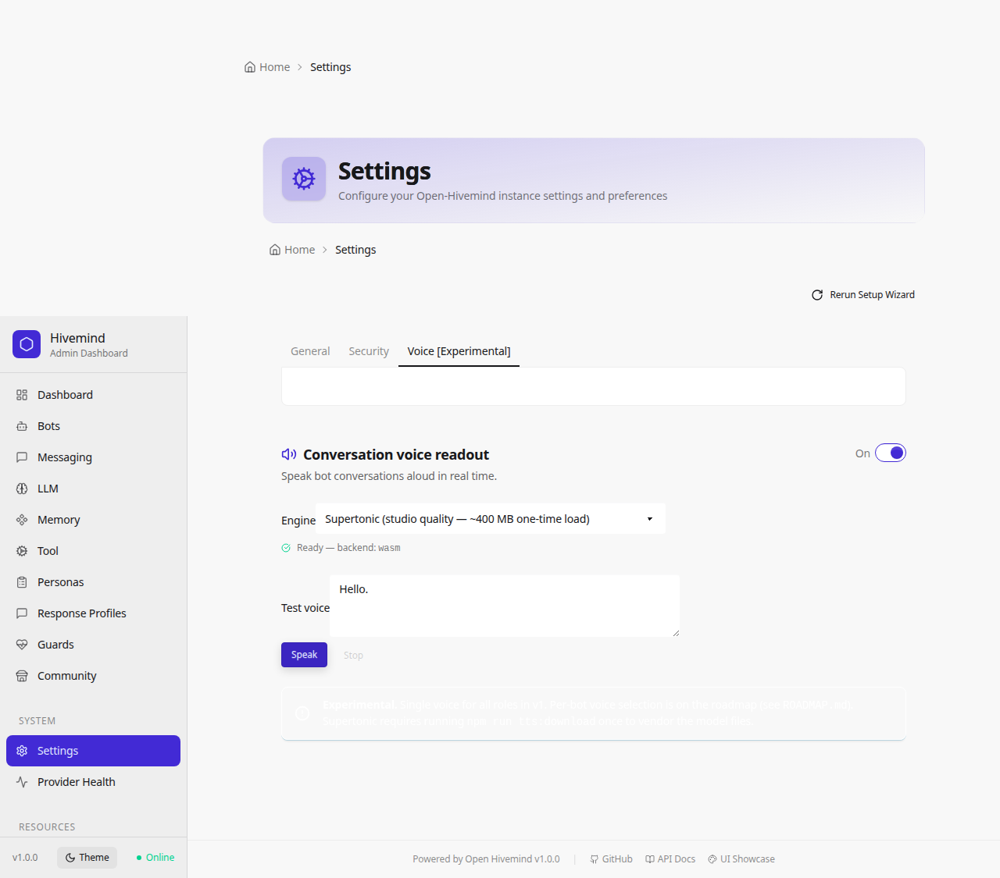
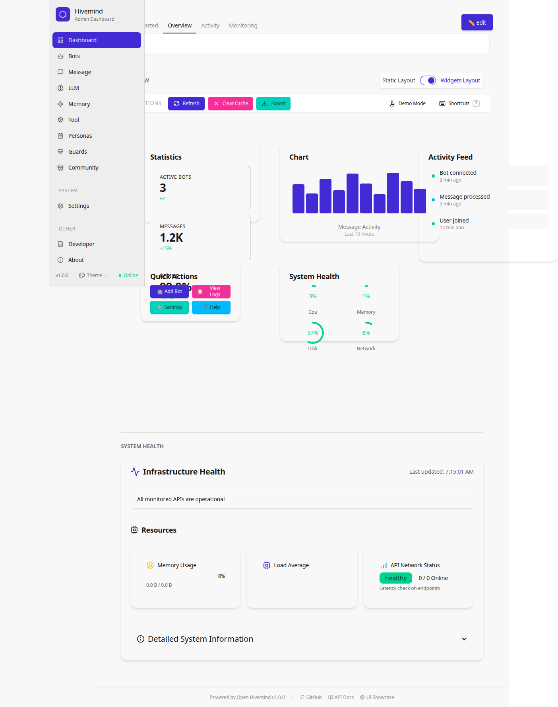

# Screenshots — Current State
This directory contains the canonical (current) screenshots of the Open Hivemind UI.
When a screenshot is updated, the previous version moves to `archive/screenshots/` under the same filename.
See [CLAUDE.md](/CLAUDE.md) for the screenshot naming and archival convention, and
[docs/SCREENSHOTS.md](../SCREENSHOTS.md) for the full tracking index of every screenshot (current + archived) with where each one is used.
## How to Regenerate Screenshots
Screenshots are generated automatically using Playwright:
To add a new screenshot:
1. Create `tests/e2e/screenshot-<feature>.spec.ts`
2. Call `await page.screenshot({ path: 'docs/screenshots/<feature>.png', fullPage: true });`
3. Reference the image in this README and in `docs/USER_GUIDE.md`

---

## Golden Journey

The canonical end-to-end walkthrough — adding providers, wiring a bot, sending a message — as automated by `tests/e2e/golden-journey.spec.ts`.

Run `npm run test:journey:guide` to regenerate the full journey-01…11 set against demo-mode data (`tests/e2e/journey-user-guide.spec.ts`); `npm run test:journey` runs the golden-journey assertion spec. These screenshots are embedded in the [User Guide Quick Tour](../USER_GUIDE.md#quick-tour--your-first-session). See [ROADMAP.md](/ROADMAP.md).

| Step | Screenshot | What / Why / How |
|---|---|---|
| **01 — Onboarding** |  | **What:** the admin dashboard after first sign-in. **Why:** proves the user can reach the admin surface. **How:** with `ALLOW_LOCALHOST_ADMIN=true` the trusted-network bypass auto-authenticates; otherwise the spec clicks the "Login as Admin (Trusted Network)" button. |
| **02 — Add Discord** |  | **What:** the Message Providers page after creating a Discord profile. **Why:** the first messenger adapter is the entry point for receiving messages. **How:** `POST /api/admin/messenger-providers` with `type=discord` and a token; the page then lists the new profile. |
| **03 — Add OpenAI** |  | **What:** the LLM Providers page after creating an OpenAI profile. **Why:** the LLM adapter handles inference for the bot's replies. **How:** `POST /api/admin/llm-providers` with `type=openai` and an `apiKey`. Mocked mode uses the sentinel key `sk-test-mock`. |
| **04 — Create Bot** |  | **What:** the Bots page after wiring a bot to Discord + OpenAI. **Why:** the bot is the runtime object that ties messenger and LLM together. **How:** `POST /api/bots` with `messageProvider=discord` and `llmProvider=openai`. |
| **05 — Bot Chat** |  | **What:** the bot detail drawer open on the Test Drive tab after exchanging a message. **Why:** validates the full request→LLM→response pipeline in the browser. **How:** click the bot card on `/admin/bots` to open the side drawer, switch to the Test Drive tab, type "Hello, bot.", click Send. In mocked mode the SSE handler at `**/api/admin/llm-providers/providers/**/test-stream` returns a canned chunk + done event. |
| **06 — Activity Log** |  | **What:** the Activity page rendering after the exchange. **Why:** closes the loop — what the bot did is observable. **How:** navigate to `/admin/activity`; the page renders without error. Deeper assertions (a row referencing the test bot) are a follow-up. |
| **07 — Personas** |  | **What:** the Personas library with the demo persona presets. **Why:** personas are how one bot token speaks as different characters. **How:** navigate to `/admin/personas` with demo data seeded. |
| **08 — Guards** |  | **What:** the Guards page with guard profiles (rate limit, content filter, tool access). **Why:** demonstrates the safety layer applied per bot. **How:** navigate to `/admin/guards`. |
| **09 — Memory** |  | **What:** the Memory Providers configuration page. **Why:** memory backends give bots cross-conversation context. **How:** navigate to `/admin/memory`. |
| **10 — Monitoring** |  | **What:** the monitoring view with demo-mode metrics. **Why:** shows the observability surface operators rely on. **How:** navigate to the monitoring tab under `/admin/overview`. |
| **11 — Export** |  | **What:** the configuration Export page. **Why:** closes the story — the whole setup can be snapshotted as JSON/YAML/CSV. **How:** navigate to `/admin/export`. |

### Smart mocks (no real keys needed)

The spec auto-detects sentinel API keys (`/^(test\|dummy\|mock\|fake\|sk-test)-/i`). With sentinels it installs a `page.route()` handler that returns a canned LLM reply. With real keys (`npm run test:journey:integration`), no handler installs — the spec becomes an integration test against the real provider.

---

## Activity & Monitoring

| Screenshot | Description |
|---|---|
|  | The hivemind money shot: the Activity page's Conversations view showing one channel (`#community-support`) where a user's question is answered by two demo personas (SupportBot, then DevOpsBot adding the ops angle) over about a minute, with chronological timestamps and per-reply LLM latency — every other persona stays silent (selective engagement). Demo-mode data; regenerate with `npm run test:journey:showcase`. |
|  | Real-time activity monitor showing live system events |
|  | Activity page overview with event timeline |
|  | Activity page with filter controls applied |
|  | Chat monitoring view for live message tracking |
|  | System monitoring dashboard with health metrics |
|  | System health page with service status overview |
|  | Distributed tracing waterfall view for request debugging |

## Analytics & Metrics

| Screenshot | Description |
|---|---|
|  | Analytics dashboard with bot performance metrics |
|  | Audit Log page — audit events table (/admin/audit)|
|  | Audit Log page with a filter applied (/admin/audit) |

## Bot Management

| Screenshot | Description |
|---|---|
|  | Main bots listing page |
|  | Bot creation page |
|  | Bot creation form showing validation errors |
|  | Bot details modal with configuration summary |
|  | Bots page with search filter applied |
|  | Bot templates page for quick bot creation |
|  | Bot creation wizard showing validation state |
|  | Modal dialog for cloning an existing bot |
|  | Modal dialog for creating a new bot |

## Chat

| Screenshot | Description |
|---|---|
|  | Chat page showing latency indicators |
|  | Chat page in offline/disconnected state |
|  | Chat page with optimistic message sending |
|  | Chat page showing message rollback after failure |

## Configuration

| Screenshot | Description |
|---|---|
|  | Main configuration page |
|  | Configuration rollback with available restore points |
|  | Configuration rollback page with no restore points |
|  | Configuration rollback confirmation modal |
|  | Configuration rollback success state |
|  | Configuration test helper utility |
|  | Backup retention settings in baseline state |
|  | Backup retention with enforcement policy active |
|  | Modal for creating a configuration backup |
|  | Environment sample file completeness check |
|  | Template version diff viewer for comparing configs |

## LLM Providers

| Screenshot | Description |
|---|---|
|  | LLM providers list page |
|  | Modal for adding a new LLM profile |
|  | Modal for adding an Ollama LLM profile |
|  | Letta provider instances list |
|  | Letta provider selection interface |
|  | OpenWebUI provider configuration |
|  | LLM integrations overview panel |

## Message Providers

| Screenshot | Description |
|---|---|
|  | Message providers list page |
|  | Modal for adding a new message provider |

## Providers API

| Screenshot | Description |
|---|---|
|  | Memory providers list page (Redis, Pinecone, etc.) |
|  | Tool providers list page (GitHub, Jira, Google Search, etc.) |

## MCP (Model Context Protocol)

| Screenshot | Description |
|---|---|
|  | MCP servers list page |
|  | Modal for adding a new MCP server |
|  | MCP tools list view |
|  | MCP tools detail modal |
|  | Modal for running an MCP tool |
|  | MCP guard UX for tool usage controls |

## Guards & Security

| Screenshot | Description |
|---|---|
|  | Guards page with guardrail profiles |
|  | Guards configuration modal |
|  | Enhanced guards modal with additional options |
|  | Guard profiles coverage report |
|  | API rate limiting configuration |
|  | Plugin security dashboard |
|  | Plugin security dashboard with filters applied |

## Personas

| Screenshot | Description |
|---|---|
|  | Personas management page |
|  | Persona verification view |
|  | Persona copy verification |

## Marketplace

| Screenshot | Description |
|---|---|
|  | Plugin marketplace page |
|  | Plugin installation modal |

## Settings

| Screenshot | Description |
|---|---|
|  | General settings page |
|  | General settings page in loading state |
|  | Messaging settings page |
|  | Messaging settings with debug mode |
|  | Security settings page |

## System Management
| Screenshot | Description |
|---|---|
|  | System management overview |
|  | System management full page |
|  | System management configuration tab |
## UI Components & Accessibility
| Screenshot | Description |
|---|---|
|  | AI assist button component |
|  | AI button hover state |
|  | AI button hover state (full context) |
|  | AI button loading/spinner state |
|  | Generic button loading state |
|  | Button loading state in production context |
|  | Pagination component |
|  | Pagination with accessibility enhancements |
## Voice Readout (Supertonic)

| Screenshot | Description |
|---|---|
|  | **What:** the Voice [Experimental] settings tab with the Supertonic engine loaded and ready (WASM backend shown). **Why:** proves the browser-side ONNX TTS engine initializes against same-origin model files at `/tts/` — no third-party CDN, no CORS bypass. **How:** `npm run tts:download` (one-time, vendors ~400 MB of model weights), then enable the toggle, pick "Supertonic" in the Engine dropdown. The hook loads 4 ONNX models (duration predictor, text encoder, vector estimator, vocoder) and one voice preset (default F1). Test with `npm run test:tts`. |

## Demo Mode & Onboarding
| Screenshot | Description |
|---|---|
|  | Demo mode banner indicating the app is running in demonstration mode |
|  | Dashboard view while running in demo mode |
|  | First-run onboarding flow for new users |

## Widgets
| Screenshot | Description |
|---|---|
|  | Widget-driven dashboard layout with rearrangeable tiles |

## API & Specs
| Screenshot | Description |
|---|---|
|  | Interactive API documentation page |
|  | OpenAPI/spec catalog page |

## Other Pages
| Screenshot | Description |
|---|---|
|  | Data export page |
|  | DaisyUI component showcase page |
|  | Initial loading splash ("Open-Hivemind / Initializing AI Network Dashboard / 30% Complete") shown before the sitemap renders. **Note:** filename is misleading — this is the splash, not the sitemap itself; image needs re-shooting. |
|  | Static pages overview |
|  | Webhook Events page — event log with source/status filters (/admin/webhooks) |
|  | Bot search verification view |
