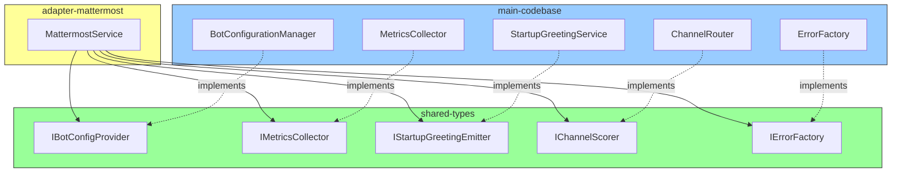

# Fix Circular Dependency Risk in MattermostService.ts

## Problem Analysis

The file [`packages/adapter-mattermost/src/MattermostService.ts`](packages/adapter-mattermost/src/MattermostService.ts) imports from the main codebase, creating a bidirectional dependency:

```mermaid
graph LR
    A[Main Codebase] --> B[@hivemind/adapter-mattermost]
    B --> A
    style A fill:#f9f,stroke:#333
    style B fill:#ff9,stroke:#333
```

### Current Imports from Main Codebase

| Line | Import | Usage |
|------|--------|-------|
| 6 | `BotConfigurationManager` | Get bot configurations for Mattermost bots |
| 7 | `MetricsCollector` | Record metrics: messages, response time, errors |
| 8 | `StartupGreetingService` | Emit 'service-ready' event |
| 9-15 | Error classes | `ApiError`, `ConfigurationError`, `NetworkError`, `ValidationError` |
| 16 | `ErrorUtils` | Convert errors to HivemindError |
| 17 | `createErrorResponse` | Imported but NOT USED - can be removed |
| 18 | `messageConfig` | Check if channel router is enabled |
| 19-20 | `IMessage`, `IMessengerService` | Already in shared-types ✓ |
| 21 | `channelComputeScore` | Score channels for prioritization |

## Solution: Dependency Injection Pattern

We will use constructor-based dependency injection to break the circular dependency:



## Implementation Plan

### Phase 1: Create Interfaces in @hivemind/shared-types

#### 1.1 IBotConfigProvider Interface

```typescript
// packages/shared-types/src/IBotConfigProvider.ts
export interface BotConfig {
  name: string;
  messageProvider: string;
  mattermost?: {
    serverUrl: string;
    token: string;
    channel?: string;
    userId?: string;
    username?: string;
  };
  // ... other fields as needed
}

export interface IBotConfigProvider {
  getAllBots(): BotConfig[];
}
```

#### 1.2 IMetricsCollector Interface

```typescript
// packages/shared-types/src/IMetricsCollector.ts
export interface IMetricsCollector {
  incrementMessages(): void;
  incrementErrors(): void;
  recordResponseTime(time: number): void;
}
```

#### 1.3 IStartupGreetingEmitter Interface

```typescript
// packages/shared-types/src/IStartupGreetingEmitter.ts
export interface IStartupGreetingEmitter {
  emit(event: 'service-ready', service: IMessengerService): boolean;
}
```

#### 1.4 IChannelScorer Interface

```typescript
// packages/shared-types/src/IChannelScorer.ts
export interface IChannelScorer {
  computeScore(channelId: string): number;
  isRouterEnabled(): boolean;
}
```

#### 1.5 IErrorFactory Interface

```typescript
// packages/shared-types/src/IErrorFactory.ts
export interface IErrorFactory {
  createValidationError(message: string, field: string, value: unknown): Error;
  toHivemindError(error: unknown): Error;
}
```

### Phase 2: Modify MattermostService

#### 2.1 Add Dependencies Interface

```typescript
// packages/adapter-mattermost/src/MattermostService.ts
export interface MattermostServiceDependencies {
  botConfigProvider: IBotConfigProvider;
  metricsCollector: IMetricsCollector;
  greetingEmitter?: IStartupGreetingEmitter;
  channelScorer?: IChannelScorer;
  errorFactory: IErrorFactory;
}
```

#### 2.2 Update Constructor

```typescript
export class MattermostService extends EventEmitter implements IMessengerService {
  private static instance: MattermostService | undefined;
  private deps?: MattermostServiceDependencies;
  
  private constructor(deps?: MattermostServiceDependencies) {
    super();
    this.deps = deps;
    // ...
  }
  
  public static getInstance(deps?: MattermostServiceDependencies): MattermostService {
    if (!MattermostService.instance) {
      MattermostService.instance = new MattermostService(deps);
    }
    return MattermostService.instance;
  }
  
  // For testing/reset
  public static resetInstance(): void {
    MattermostService.instance = undefined;
  }
}
```

#### 2.3 Update Methods to Use Injected Dependencies

Replace direct imports with injected dependencies:

```typescript
// Before
const configManager = BotConfigurationManager.getInstance();

// After
const configManager = this.deps?.botConfigProvider;
if (!configManager) {
  throw new Error('BotConfigProvider not initialized');
}
```

### Phase 3: Update Main Codebase Integration

#### 3.1 Create Adapter Implementations

```typescript
// src/integrations/mattermost/adapters.ts

import { BotConfigurationManager } from '@src/config/BotConfigurationManager';
import { MetricsCollector } from '@src/monitoring/MetricsCollector';
import type { IBotConfigProvider, IMetricsCollector, BotConfig } from '@hivemind/shared-types';

class BotConfigProviderAdapter implements IBotConfigProvider {
  getAllBots(): BotConfig[] {
    return BotConfigurationManager.getInstance().getAllBots();
  }
}

class MetricsCollectorAdapter implements IMetricsCollector {
  private metrics = MetricsCollector.getInstance();
  
  incrementMessages(): void {
    this.metrics.incrementMessages();
  }
  
  incrementErrors(): void {
    this.metrics.incrementErrors();
  }
  
  recordResponseTime(time: number): void {
    this.metrics.recordResponseTime(time);
  }
}
```

#### 3.2 Update Re-export with DI Setup

```typescript
// src/integrations/mattermost/MattermostService.ts
import { MattermostService as MattermostServiceImpl, MattermostServiceDependencies } from '@hivemind/adapter-mattermost';
import { BotConfigProviderAdapter, MetricsCollectorAdapter, ... } from './adapters';

// Create dependencies
const deps: MattermostServiceDependencies = {
  botConfigProvider: new BotConfigProviderAdapter(),
  metricsCollector: new MetricsCollectorAdapter(),
  greetingEmitter: StartupGreetingService.getInstance(),
  channelScorer: new ChannelScorerAdapter(),
  errorFactory: new ErrorFactoryAdapter(),
};

// Export singleton with dependencies injected
export const MattermostService = MattermostServiceImpl.getInstance(deps);
export default MattermostService;
```

### Phase 4: Handle Error Classes

Error classes are used extensively. Options:

1. **Move error classes to shared-types** - Best for reusability
2. **Create adapter-specific errors** - Simpler but duplicates
3. **Pass error factory** - Cleanest DI approach

**Recommended**: Create lightweight error classes in shared-types:

```typescript
// packages/shared-types/src/errors.ts
export class ValidationError extends Error {
  constructor(message: string, public field?: string, public value?: unknown) {
    super(message);
    this.name = 'ValidationError';
  }
}

export class NetworkError extends Error {
  constructor(message: string, public statusCode?: number) {
    super(message);
    this.name = 'NetworkError';
  }
}

// ... other error classes
```

## Files to Modify

| File | Changes |
|------|---------|
| `packages/shared-types/src/index.ts` | Export new interfaces |
| `packages/shared-types/src/IBotConfigProvider.ts` | New file |
| `packages/shared-types/src/IMetricsCollector.ts` | New file |
| `packages/shared-types/src/IStartupGreetingEmitter.ts` | New file |
| `packages/shared-types/src/IChannelScorer.ts` | New file |
| `packages/shared-types/src/errors.ts` | New file with error classes |
| `packages/adapter-mattermost/src/MattermostService.ts` | Accept DI, remove direct imports |
| `src/integrations/mattermost/adapters.ts` | New file with adapter implementations |
| `src/integrations/mattermost/MattermostService.ts` | Setup DI and export |

## Verification

After implementation, verify no circular dependencies:

```bash
# Check for circular dependencies
npx madge --circular packages/adapter-mattermost/src/index.ts

# Verify build succeeds
npm run build

# Run tests
npm run test -- --testPathPattern="MattermostService"
```

## Benefits

1. **No Circular Dependencies**: Adapter package only depends on shared-types
2. **Testability**: Easy to mock dependencies in tests
3. **Flexibility**: Can swap implementations without changing adapter
4. **Clean Architecture**: Follows dependency inversion principle

## Risks and Mitigations

| Risk | Mitigation |
|------|------------|
| Breaking existing API | Keep static getInstance() for backward compatibility |
| Missing dependency at runtime | Throw clear error if dependencies not provided |
| Performance overhead | DI only happens once at initialization |
| Test coverage | Add unit tests for new adapter classes |
